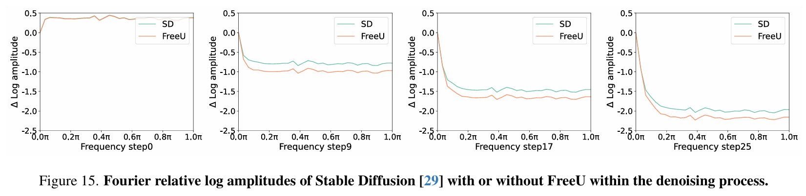

# FreeU: Free Lunch in Diffusion U-Net

> "FreeU: Free Lunch in Diffusion U-Net" CVPR-oral, 2023 Sep 20 :star:
> [paper](http://arxiv.org/abs/2309.11497v2) [code](https://chenyangsi.top/FreeU/) [pdf](./2023_09_CVPR_FreeU--Free-Lunch-in-Diffusion-U-Net.pdf) [note](./2023_09_CVPR_FreeU--Free-Lunch-in-Diffusion-U-Net_Note.md)
> Authors: Chenyang Si, Ziqi Huang, Yuming Jiang, Ziwei Liu

## Key-point

- Task:  improves diffusion model sample quality
- Problems
- :label: Label:

## Contributions

- 猜测 inference 时候 UNet backbone 生成能力减弱，导致出现模糊 or 不合理的细节

- 发现 UNet 残差主要为 Decoder 提供高频信息，UNet backbone 进行去噪；

  >  investigate and uncover the potential of U-Net architectures for denoising within diffusion models and identify that its main backbone primarily contributes to denoising, whereas its skip connections introduce highfrequency features into the decoder module.

- 提出两个 scale factor 去加强 residual 信息的强度，维持 Backbone 特征的强度；不需要训练

> We initially investigate the key contributions of the U-Net architecture to the denoising process and identify that its main backbone primarily contributes to denoising, whereas its skip connections mainly introduce high-frequency features into the decoder module, causing the network to overlook the backbone semantics. 

- **验证上述猜想** & 解决方案，在多个 diffusion 模型上都适用！

  > The proposed FreeU framework is versatile and seamlessly integrates with existing diffusion models.

## Introduction :star:

- Q：motivation?

> Beyond the application of diffusion models, in this paper, we are interested in investigating the effectiveness of diffusion U-Net for the denoising process.

> Existing works focus on utilizing pre-trained diffusion U-Nets for downstream applications, while the internal properties of the diffusion U-Net, remain largely underexplored.

发现低频信息在去噪过程中变化更慢，

1. low-freq 特征代表了 global structure >> **global layouts and smooth color**
2. 高频信息变化很快
3. 去噪过程中，diffusion 加噪的噪声 & 物体细节混杂在一起，难以分辨

> Evident from Fig. 2 is the gradual modulation of lowfrequency components, exhibiting a subdued rate of change, while their high-frequency components display more pronounced dynamics throughout the denoising process
>
> 1. Low-frequency components inherently embody the global structure and characteristics of an image, encompassing **global layouts and smooth color**
> 2. high-frequency components contain the rapid changes in the images, such as **edges and textures.**
> 3. Consequently, denoising processes need to expunge noise while upholding indispensable intricate details.

过度一下分析的原因 -> 引出如何优化

> **In light of these observations** between low-frequency and high-frequency components during the denoising process, **we extend our investigation to ascertain the** specific contributions of the U-Net architecture within the diffusion framework.

**发现 residual 主要为 Decoder 提供高频信息**，UNet backbone 进行去噪

> In each stage of the U-Net decoder, the skip features from the skip connection and the backbone features are concatenated together. 
>
> Our investigation reveals that the main backbone of the U-Net primarily contributes to denoising. Conversely, the skip connections are observed to introduce high-frequency features into the decoder module. 

- Q：**猜测 infer 阶段，Backbone 去噪能力减弱**，导致生成出来不好的细节 :star:

> However, an unintended consequence of this propagation is the potential **weakening of the backbone’s inherent denoising capabilities during the inference phase**. This can lead to the generation of **abnormal image details,** as illustrated in the first row of Fig. 1.

基于上述 inference 阶段 Backbone 变弱的猜测，**去搞一个权重加强 backbone 特征，反而变模糊 or 更多的无关细节。。**

> The first, termed the backbone feature factors, aims to amplify the feature maps of the main backbone, thereby bolstering the denoising process. However, we find that while the inclusion of backbone feature scaling factors yields significant improvements, it can occasionally lead to an undesirable **oversmoothing of textures**

- Q：texture oversmoothing ？？？？ :star:

给残差乘上一个系数，加强频率；看 fig1 确实生成的可信度更好！

> To mitigate this issue, we introduce the second factor, **skip feature scaling factors,** aiming to alleviate the problem of texture oversmoothing.
>
> By employing FreeU during the inference phase, these models indicate a discernible enhancement in the quality of generated outputs. The visualization illustrated in Fig. 1 substantiates the efficacy of FreeU in significantly enhancing both intricate details and overall visual fidelity within the generated images.

**适用多种 diffusion 模型，证明方法确实是公有的** :star:

> Our FreeU framework exhibits seamless adaptability when integrated with existing diffusion models, encompassing applications like text-to-image generation and textto-video generation. We conduct a comprehensive experimental evaluation of our approach, employing Stable Diffusion [29], DreamBooth [30], ReVersion [15], ModelScope [23], and Rerender [39] as our foundational models for benchmark comparisons.

## methods

可视化发现 U-Net Encoder 的**残差主要为 UNet 提供高频信息**，含有较多噪声。因此先用 FFT 和 IFFT 变换降低高频信息，将 UNet decoder 特征乘个系数（加大权重）再 concat

> we conduct a controlled experiment wherein we **introduce two multiplicative scaling factors**—denoted as b and s—to modulate the feature maps generated by the backbone and skip connections, respectively, prior to their concatenation.

原始 UNet 特征乘上一个权值 b，高频 residual 权重 s

1. 如果低频少的太多 b=0.6 s=1 ，OR 低频加多了结构都会变。b 权重不要动
2. 就去补足 diffusion denoising 过程中的高频特征就好

发现 backbone 特征权重越高，**逐渐抑制高频信息**

> Increasing in b correspondingly results in a suppression of highfrequency components in the images

UNet backbone 特征改变会对生成内容改变超级显著

> Our analysis reveals that this quality improvement is **fundamentally linked to an amplified denoising capability imparted by the U-Net architecture’s backbone**
>
> This implies that **enhancing backbone features effectively bolsters the denoising capability of the U-Net** architecture, thereby contributing to a superior output in terms of both fidelity and detail preservation.

### skip connections

residual 对生成结果纹理的影响很大

> Our conjecture, grounded in this observation, posits that during the training of the U-Net architecture, the presence of these high-frequency features may inadvertently expedite the convergence toward noise prediction within the decoder module.
>
> Furthermore, the limited impact of modulating skip features in Fig. 5 also indicates that the skip features predominantly contribute to the decoder’s information.

通过 fig5 来看，**若 residual 影响太少，会减弱 backbone 去噪的能力，降低生成质量**

> This phenomenon, in turn, could result in an **unintended attenuation of the efficacy of the backbone’s intrinsic denoising capabilities during inference**

定义符号

- 对于第 $l$ 个 Unet Decoder Block, $x_l$ 为 backbone 特征，对应得 scale factor 为 $b_l$；

- $h_l$ 为残差，对应得 scale factor 为 $s_l$，

> Unlike a fixed scaling factor applied uniformly to all samples or positions within the same channel, our approach adjusts the scaling factor adaptively based on the specific characteristics of the sample features. 

### backbone factor

#### over-smooth

- Q：发现对所有 channel 都用一个数取平均，会出现平滑

> Then, upon experimental investigation, we discern that indiscriminately amplifying all channels of xl through multiplication with αl engenders an oversmoothed texture in the resulting synthesized images.
>
> The reason is the enhanced **U-Net compromises the image’s high-frequency details while denoising.** Consequently, we confine the scaling operation to the half channels of xl as follows:

backbone 特征对多个通道取平均，得到**单个通道的平均表示 -> 作为权重；**
之后对这个 $\bar{x_l}$ 里面的值做**归一化**

> We first computer the average feature map along the channel dimension:

$\bar{x_l}$ 有 structure 信息 :star:

1. 避免 oversmooth
2. 加强了 structure，提高了高频的保留能力？？？

> This strategic approach serves to **mitigate the issue of oversmoothing.** 

### residual

上面增强了 backbone 特征，这里降低 residual 的低频特征

> we further employ spectral modulation in the Fourier domain to selectively diminish lowfrequency components for the skip features.

### Code

https://github.com/ChenyangSi/FreeU

## setting

## Experiment

> ablation study 看那个模块有效，总结一下

- 结构提升了一丢丢

## Limitations

## Summary :star2:

> learn what

### how to apply to our task

