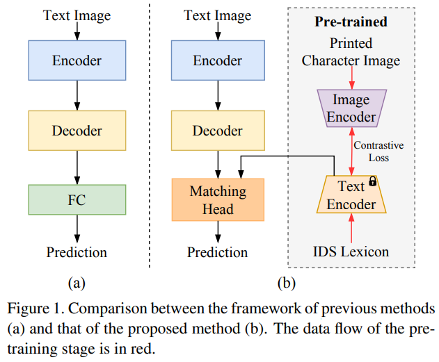
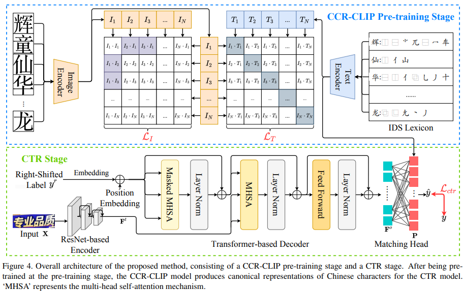
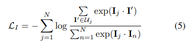
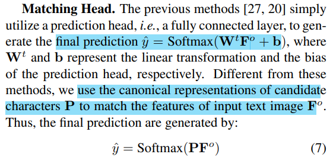
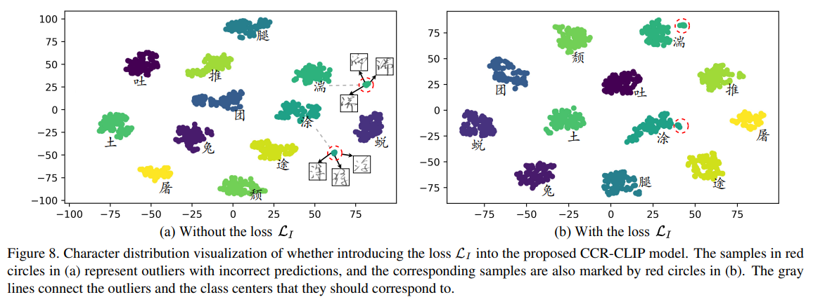

# Chinese Text Recognition with A Pre-Trained CLIP-Like Model Through Image-IDS Aligning

> "Chinese Text Recognition with A Pre-Trained CLIP-Like Model Through Image-IDS Aligning" ICCV, 2023 Sep
> [paper](http://arxiv.org/abs/2309.01083v1) [code](https://github.com/FudanVI/FudanOCR/tree/main/image-ids-CTR) 
> [pdf](./2023_09_ICCV_Chinese-Text-Recognition-with-A-Pre-Trained-CLIP-Like-Model-Through-Image-IDS-Aligning.pdf)
> Authors: Haiyang Yu, Xiaocong Wang, Bin Li, Xiangyang Xue

## Key-point

- Task
- Problems
- :label: Label:

## Contributions

## Introduction

## methods

### Pretrain

模仿 CLIP 构造 Image Encoder, Text Encoder

 Image Encoder 为 Res50 提取图像特征，Text Encoder 则去提取文字偏旁部首（radical sequence）的特征，去做 contrastive loss

给定中文文字的图像 $C$，去匹配已有的图像特征 $I^`$

### CTR Stage

## Experiment

> ablation study 看那个模块有效，总结一下

- LI Loss 有效性

  

## Limitations

## Summary :star2:

> learn what & how to apply to our task

