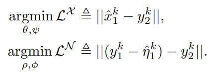
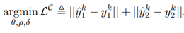
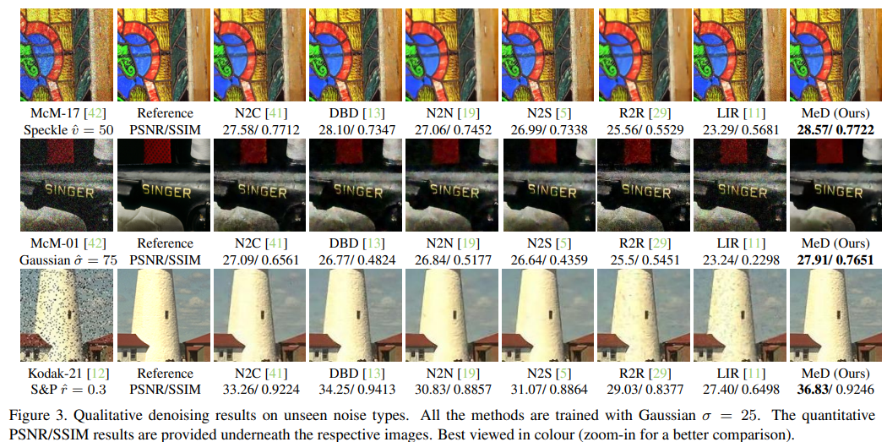
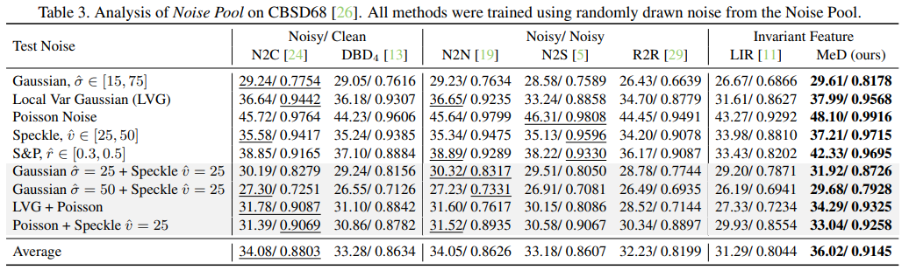
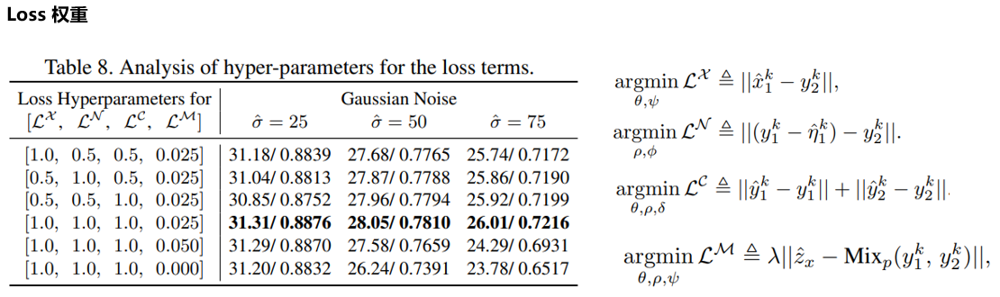

# Multi-view Self-supervised Disentanglement for General Image Denoising

> "Multi-view Self-supervised Disentanglement for General Image Denoising" ICCV, 2023 Sep
> [paper](http://arxiv.org/abs/2309.05049v1) [code](https://github.com/chqwer2/Multi-view-Self-supervised-Disentanglement-Denoising) [website](https://chqwer2.github.io/MeD/)
> [pdf](./2023_09_ICCV_Multi-view-Self-supervised-Disentanglement-for-General-Image-Denoising.pdf)
> Authors: Hao Chen, Chenyuan Qu, Yu Zhang, Chen Chen, Jianbo Jiao

## Key-point

- Task: Image restoration 图像去噪

- 存在的问题

  suffer from generalization to unseen noise types or general and real noise

- Motivation

   3D reconstruction of utilising multiple views to provide a unique estimation of the real scene

  将问题转化为：“what is the shared latent information across these views?”

- :label: Label: 提升去噪模型泛化性

Multi-view Self-supervised Disentanglement (MeD): 使用自监督方法框架，没有 GT 参考，用多张不同退化的图像去学习 clean image's latent；效果比监督方式的模型好 3db

## Contributions

1. new problem: using only noisy examples

   提出了一个新的任务，只用多张退化图像去进行恢复

2. disentangled representation learning framework >> learn shared latent

   提出了一个 representation learning 框架，去提取不同图像之间共享的特征

3. SOTA exp

   实验达到了 SOTA 效果

## Related Work

- 要引入一些额外信息：additional forms of information may not always be practical in real-world
  - ref11 LIR: force feature space to guarantee the admissibility of the output.
  - ref18 prior knowledge of noise as complementary input

### Single-image

- N2N

### multiple-view

mainly focus on sequential data such as **video or burst images**

- "Multi-frame image denoising and stabilization"
- "Learning to see through obstructions"

本文 multiple **static observations** (视频有视角变化)

### self-supervised denoising methods

- UID-GAN
- LIR

> limited to synthetic noise and do not extend well in real-world scenarios due to their reliance on clean images

- "Noise2Noise: Learning Image Restoration without Clean Data" ICML, 2018
  [paper](https://arxiv.org/abs/1803.04189)

  > 仅仅要求目标信号（ground truth）在某些统计值上是“干净”的，而不需要每个目标信号都是“干净”的。

- R2R

- N2S

## methods

分解为 scene 场景特征，退化特征（描述退化）

1. 用编码器 G 提取场景特征 $z_x$

   直接用场景特征 $z_x$ 经过 Decoder 得到干净图像

2. distortion features  $u_n$+ 重建退化图 $\eta_k$

   参考 N2N 方式，capture the common features shared across multiple views. :star:

   还原得到的 "干净图" 去和另一个 view 的图做 Loss（含有的退化不一样，**N2N 要求GT只有部分是干净的就行**）

3. Cross Disentanglement
   两类特征没法区分，不同低质图的 scene + degradation 拼接起来去还原

   

4. Bernoulli Manifold Mixture **加权平均**

同一场景可以对应多个 latent features >> 造成 feature 不明确 ambiguous

从 shared structure within the scene latent 得到 estimation of the true underlying scene feature.
$$
\hat{z}_x^k\triangleq\text{Mix}_p(z_x^{k,1},z_x^{k,2}),\quad\quad\quad(11)\\
\operatorname{Mix}_p(\boldsymbol{m},\boldsymbol{n})\triangleq b_f\odot\boldsymbol{m}+(1-b_f)\odot\boldsymbol{n}.\quad(12)
$$
证明了一下融合的 $\tilde{z}_x^k$ 和单独的特征 $z_k^i$同分布，认为有相似的性质（均值方差）;

最后计算损失时候，将去噪前后的融合特征计算损失
$$
\operatorname{argmin}_{\theta,\rho,\psi}\mathcal{L}^{\mathcal{M}}\triangleq\lambda||\hat{z}_x-\mathbf{Mix}_p(y_1^k,y_2^k)||,\quad(16)
$$

- :question: 如何融合 $z_k$ >> Mixp，损失是和 y1, y2 输入噪声图计算，根据推到发现均值相同

## Experiment

> ablation study 看那个模块有效，总结一下

- unseen noise

  

- Noise Pool on CBSD68

  效果比之前方法好 1db左右

  

## Limitations

## Summary :star2:

> learn what & how to apply to our task

1. 多种输入的形式 && 没有 GT，很适合视频
2. noise 图像可以直接监督，有可以学习的内容
