# Real-World Image Super-Resolution as Multi-Task Learning

> "Real-World Image Super-Resolution as Multi-Task Learning" NIPS, 2023 Sep, `TGSR`
> [paper](https://proceedings.neurips.cc/paper_files/paper/2023/file/42806406dd99e30c3796bc98b2670fa2-Paper-Conference.pdf) [code](https://github.com/XPixelGroup/TGSR) [pdf](./2023_09_NIPS_Real-World-Image-Super-Resolution-as-Multi-Task-Learning.pdf) [note](./2023_09_NIPS_Real-World-Image-Super-Resolution-as-Multi-Task-Learning_Note.md)
> Authors: [Wenlong Zhang](https://openreview.net/profile?id=~Wenlong_Zhang3), [Xiaohui Li](https://openreview.net/profile?id=~Xiaohui_Li2), [Guangyuan SHI](https://openreview.net/profile?id=~Guangyuan_SHI1), [Xiangyu Chen](https://openreview.net/profile?id=~Xiangyu_Chen5), [Yu Qiao](https://openreview.net/profile?id=~Yu_Qiao1), [Xiaoyun Zhang](https://openreview.net/profile?id=~Xiaoyun_Zhang1), [Xiao-Ming Wu](https://openreview.net/profile?id=~Xiao-Ming_Wu1), [Chao Dong](https://openreview.net/profile?id=~Chao_Dong4)

## Key-point

- Task: real-world image super-resolution

- Problems

  **task conflict** in solving multiple distinct degradation tasks

  Real-SR 先前工作可以看作是 **multi-task learning** problem，用一个模型去解决多种退化，但**多种退化对于模型的优化方向可能是相互竞争的**，造成训练出来的模型对于一种退化表现很好，对于其他退化效果差。

- :label: Label:

将 RealSR 中的多种未知退化联系到 multi-task learning 任务，其中有 task conflict 问题；然后作者先验证了一些 real-sr 和 single-sr 的效果差异，发现 task conflict 问题确实存在（一些退化在模型优化过程中占据主导，导致选取的 50/100 大部分退化 realSR 效果都不好）；

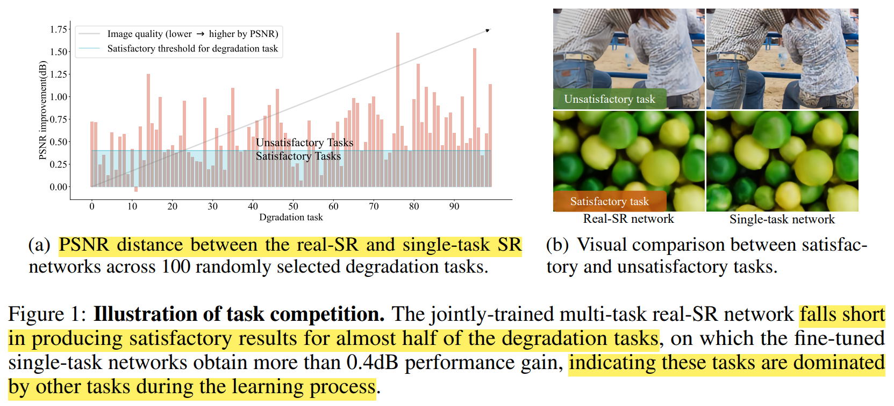

参考 Task grouping 思想，**识别**出用一个模型训练较难的退化任务；将这些任务**整合**起来组成 multiple task groups；再去微调 real-SR model

## Contributions

1. 从 multi-task learning 角度去看 RealSR 问题，验证了确实有 task conflict 问题

   take a new look at real-SR from a multi-task learning perspective

2. propose a task grouping approach and develop a **task grouping based real-SR method (TGSR).**

3. SOTA

## Introduction

先描述了一下 Real-SR 定义、分类介绍先前工作；

从 multi-task learning 角度来看 realSR，将 RealSR 中的多种未知退化联系到 multi-task learning 任务，其中有 task conflict 问题；

- Q：**task conflict** 具体指什么

**多种退化对于模型的优化方向可能是相互竞争的**，造成训练出来的模型对于一种退化表现很好，对于其他退化效果差。

> tasks compete for model capacity, potentially resulting in certain tasks dominating the learning process and adversely affecting the performance of other tasks

- **Q：如何验证 task conflict?**

随机选取100个退化，对于每种退化用一个 realSR 模型和单个退化的singleSR 模型看 PSNR 差距，差距越大就是 realSR 效果较差的退化，是上方 unsatisfactory task

- Q：Task grouping 是啥？

Task grouping 把相似的 task 分组再一起微调一下，用于解决相似任务 negative transfer 问题

> Task grouping [48, 37, 35, 10] is an effective technique in multi-task learning that helps mitigate negative transfer by **training similar tasks together**.

但因为是混合退化，没法直接判断任务之间的相似性，**没法直接把 Task grouping 用于 RealSR**

> This approach typically involves **learning the relationship or relevance between pairs of tasks** through validation or fine-tuning, which becomes impractical in the context of real-SR where there is a large number of tasks to consider.

- Q：realSR 如何间接地去判断相似的退化？

提出从模型角度，间接针对 task 前后的梯度变化 or 指标变化，来判断 task 的相似性

> we introduce a performance indicator based on gradient updates to efficiently identify the degradation tasks that a real-SR model falls short of.

把识别到的 task 根据 performance improvement 整理为新的 group

> propose an algorithm to group these unsatisfactory tasks into multiple groups based on a performance improvement score

### Multi-task learning :star:

Multi-task learning methods can be roughly **divided into three categories: task balancing, task grouping, and architecture design**

Task balancing 调整权重

> Task balancing [16, 20, 47, 27, 34, 15, 8, 7, 19] methods address task/gradient conflicts by re-weighting the loss or manipulating the update gradient.

Task grouping 识别哪些任务有必要在一起学习

> Task grouping [48, 37, 35, 10] methods mainly focus on identifying which tasks should be learned together

Architecture design 类似集成学习

> Architecture design methods can mainly be divided into hard parameter sharing methods [22, 28, 3] and soft parameter sharing methods [30, 33, 12, 11]. 
>
> 1. **Hard parameter sharing methods require different decoders for different tasks.**
> 2. while soft parameter sharing methods **do cross-talk between different task networks**.

## methods

- Q：任务？

解决 real-SR 发现的 task conflict 问题，按照 task conflict 设定选取大量的退化模型

> intends to **solve a large number of different degradation tasks (e.g., N = $10^3$ )** altogether with a single model

使用 Real-ESRGAN 退化模型，其中一些参数例如 50%概率加 blur，高斯噪声的方差，可以采样；因此从中随机采样 100 种退化模型

### performance improvement

根据 real-SR 模型，在 100 个退化模型的每个退化上微调一下，**得到 100 个 single-task model**

> fine-tune the real-SR network on each degradation task independently and obtain 100 fine-tuned models, which we call single-task networks

对每个退化模型，计算 real-SR 和 single-task model 的 PSNR 差异，发现接近一般的 task PSNR 差异超过 0.4db；

选取 PSNR 差异 0.4db 作为阈值，划分 unsatisfactory task & satisfactory task

> nearly half of the degradation tasks, the **PSNR distance** between the real-SR network and single-task network exceeds 0.4dB, indicating that these tasks are not well solved by the real-SR network, which we refer to as **unsatisfactory tasks.** 
>
> From an optimization perspective, the other tasks (those with PSNR distance less than 0.4dB) dominate the learning process and are effectively solved by the real-SR network, which we refer to as **satisfactory tasks**

### TGSR

参考 task grouping 方法，找到能相互促进的 task，在一起再微调一下

> finding groups of tasks that may benefit from training together, the interference among tasks can be minimized

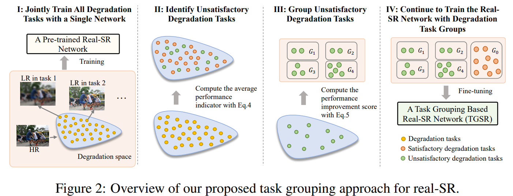

- Q：如何定义 tasks 能相互促进，如何分 group？

提出将 satisfactory tasks 分为一组，认为 task 特征显著，之间不太会 conflict？

> satisfactory tasks should be grouped together. These dominant tasks may share certain characteristics or similarities that lead to minimal task conflicts, making them more prominent in the training process

> - 为什么不是几个 satisfactory task 和一堆 unsatisfactory task？（ablation？）

#### 高效识别 unsatisfactory task

- Q：用前面训练 single-SR model 计算 PSNR 差异的方法，混合退化模型太多，计算量太大没法用？

目标：assess whether a degradation task has been well solved by the real-SR network

在 real-SR 预训练模型基础上，少量微调 100 个 iteration，判断 loss 差异，作为 `performance indicator`

如果 `performance indicator` **值很大，说明微调后的 loss 反而高了（把模型往差了调）**，说明模型已经在这个任务上学的很好了，作为 satisfactory task

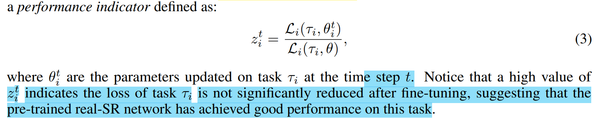

为了选取 task 的稳定性，对 N 个 iteration 计算的 `performance indicator` **取平均**，再选个阈值

- Q：阈值怎么选？看起来也不是很好，少量 iteration 可能是局部最优，并不能说明模型在 task 上好；取决于一开始 pretrained 的 realSR 模型

#### Grouping Unsatisfactory Task

- Q：选出来的 Unsatisfactory tasks 还是很多，有上百个，计算量太大？

> The number of identified unsatisfactory degradation tasks can still be significant, typically in the range of hundreds in our experiments.

Task group 常见方法是基于 tasks 之间的相似度，学习 `pairwise performance indicator`，退化模型太多，再配对一起搞计算量更大了

> A common approach for task grouping in multi-task learning is to learn pairwise performance indicator between tasks

想要用 `performance improvement score (PIS)` 方法，即微调模型，计算 PSNR 等指标的差距的方法，计算量还是大；

**选取一个 trade-off 不去在每个 task 上微调，在全部选出的 Unsatisfactory tasks 上微调得到模型 $\hat{\theta}$，在验证集上看单个退化模型合成数据下，微调前后的指标差距**

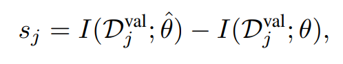

根据设的阈值（如何选阈值？），把 tasks 分组，认为组内的 conflict 会更小一些

> select the tasks with PIS larger than some threshold to form a task group, which should have small conflicts as they dominate the fine-tuning process

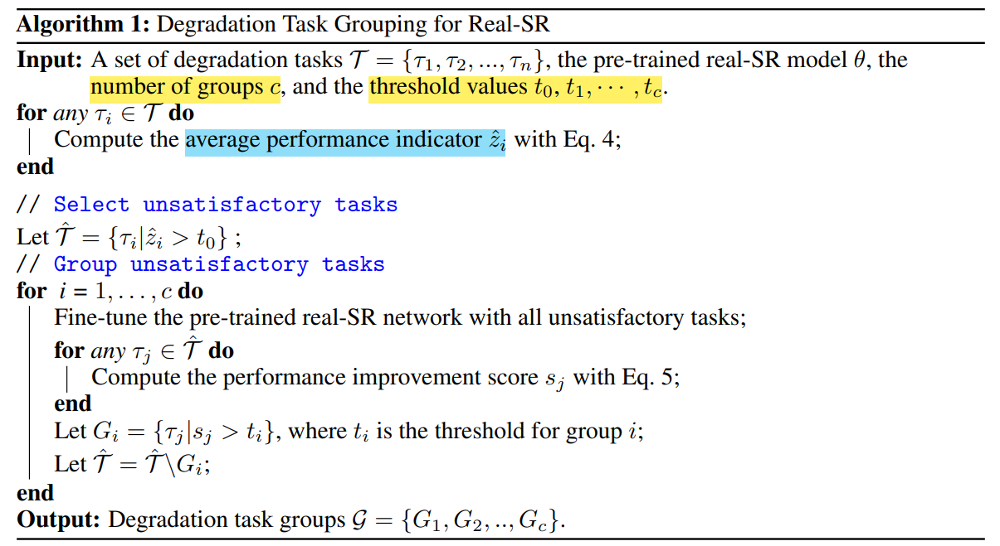

分组效果

> divide the degradation tasks into **five groups** based on the thresholds of [0.8, 0.6, 0.4, 0.2]
>
>  **number of tasks** in each group being [14, 29, 84, 200] as **groups1-4**
>
> label the entire degradation space beyond the four degradation groups as **Group0**

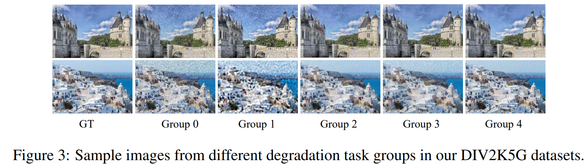

#### Train

unsatisfactory task 得到分组 $G = \{G1, G2, .., Gc\}$，加入 G0 初始退化模型（Real-ESRGAN）组成 $G'^` = \{G0,G1, G2, .., Gc\}$ 防止 catastrophic forgetting 

随机从 G^ 中选取退化模型去微调

> randomly select a group from Gˆ and randomly sample a task from the chosen group for fine-tuning

基于 group 内退化模型数量，提高小 group 被选择的概率；（类似 focal loss）本质上对**难训练的 task 在避免冲突，保证训练有效的前提下，多训练一些**

## Experiment

> ablation study 看那个模块有效，总结一下

### setting

All evaluations are conducted on ×4 SR and **PSNR is computed on the Y channel of YCbCr color space.**

- 预训练模型用 RealESRGAN
- The **single-task network** is fine-tuned from the pre-trained RealESRNet model for 100 iterations.
- performance indicator 对 100 iteration 最后 10 个 iteration 取平均
  - 选取前 40% 的 task 作为 unsatisfactory task

- 选出来难样本后，微调 10^4 iterations ok

  we fine-tune the pre-trained RealESRNet for 1 × 10^4 iterations based on all unsatisfactory tasks.

- 难样本分 5 组，均匀从每个组采样

  > divide the degradation tasks into **five groups** based on the thresholds of [0.8, 0.6, 0.4, 0.2]
  >
  >  uniformly sample degradation tasks from each group to fine-tune the pre-trained real-SR network. Other basic training settings follow RealESRGAN.

**Loss**

使用 L1+perceptual+GANLoss，权重 1：1：0.1

perceptual loss 使用 (conv1, conv2, conv3, conv4, conv5 feature maps)，权重  [0.1, 0.1, 1, 1, 1]

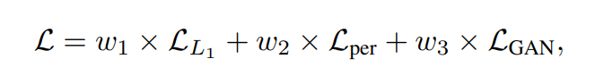

### exp

**比较方法**

RDSR is an **MSE-based method**, so it achieves the **highest PSNR but performs rather poorly** (the second worst) performance

- "Reflash Dropout in Image Super-Resolution"
  [paper](https://arxiv.org/abs/2112.12089)

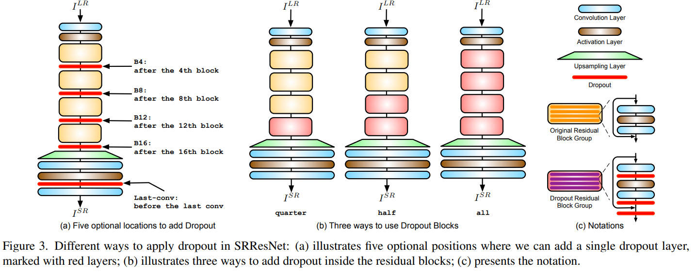

- BSRGAN, RealSwinIR, and DASR employ a **one-order degradation model**. 

sacrifice performance on PSNR for better perceptual quality (reflected in low LPIPS)

- MM-RealSR and RealESRGAN utilize a more complex **high-order degradation**. 

achieve better LPIPS for real-SR evaluation. obtain low PSNR performance due to the great difficulty of optimizing

**RealESRGAN 等方法重复做几次混合退化，能够提升主观感知**；但 PSNR 低一些

基于 group 测试效果

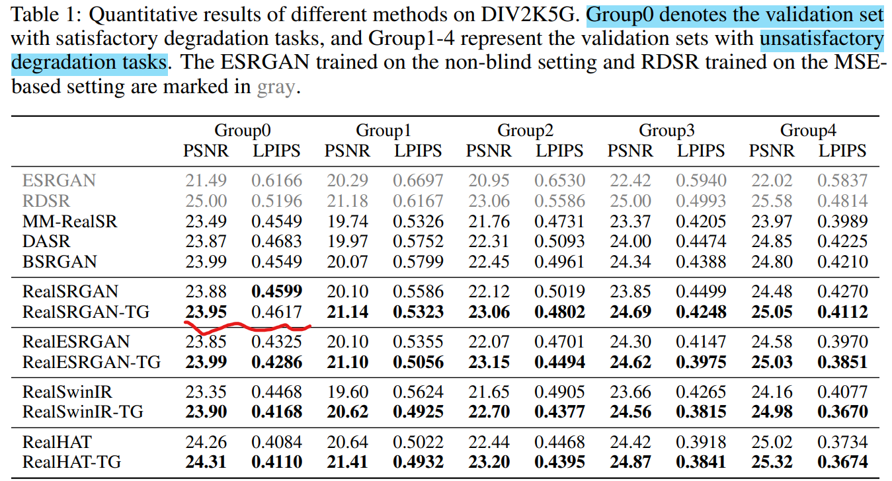

**发现 Task Group 方法，对于难样本能够提升 1 dB PSNR，0.03 in LPIPS，**但是对于整体 validation set LPIPS 反而差了**；至少说明 TG 方法能够对难样本（难训练的退化）提升一些效果**

> can observe a maximum boost of 1 dB in PSNR and 0.03 in LPIPS.

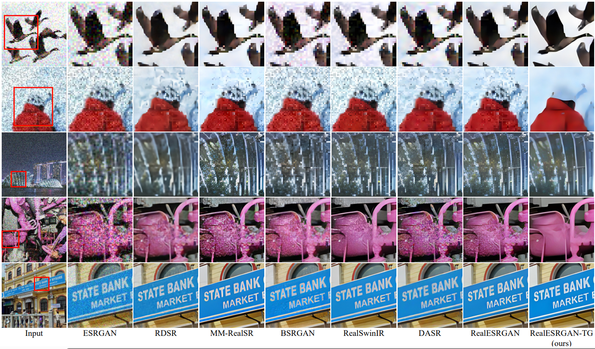

在其他真实数据上测试，**说明能够对其他退化也有泛化性**

PSNR 一般提升 0.2 dB 左右

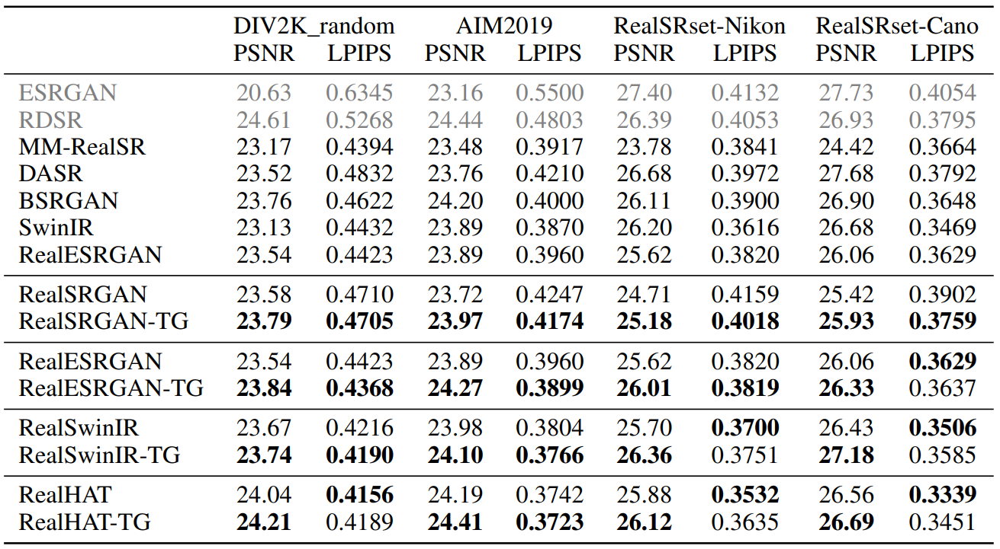

主观效果

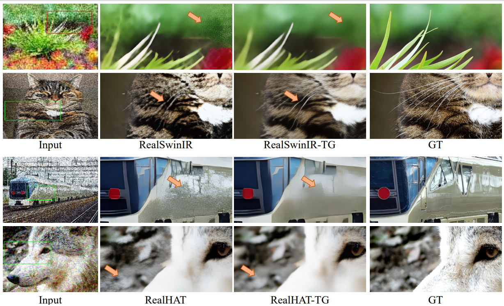

### ablation

**performance indicator 选的约低**（难样本更少），训练出来模型的 PSNR 更高；

本来要每个 task 微调 1w iteration，现在只用 100iteration，快了100倍（跟自己设的简单 baseline 比）

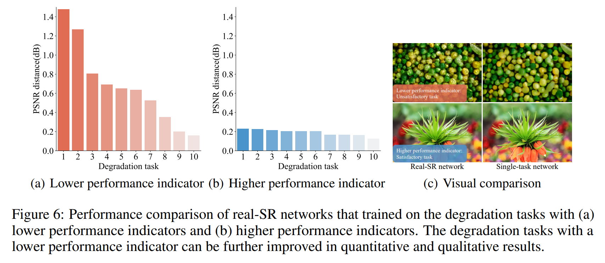

**对比 TG 和 random grouping**

选出的难样本，从主观看确实是难样本；随机分组下的 unsatisfactory task 几乎可以不用动

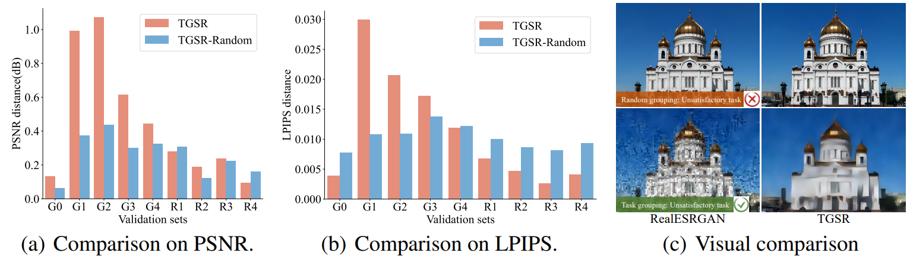

**从 upper-bound 说明 TG 有效**

1. **对退化模型加一点扰动，扩大退化范围**

2. *performance upper bound**

   在每组数据内部  fine-tune RealESRGAN，作为 upper-bound

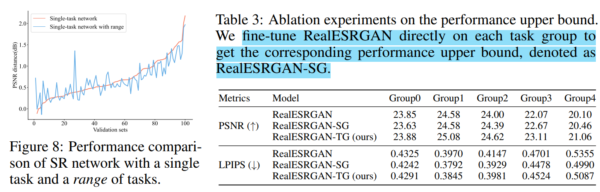

#### **Impact of the number of task groups**

发现分更多组，同样有效

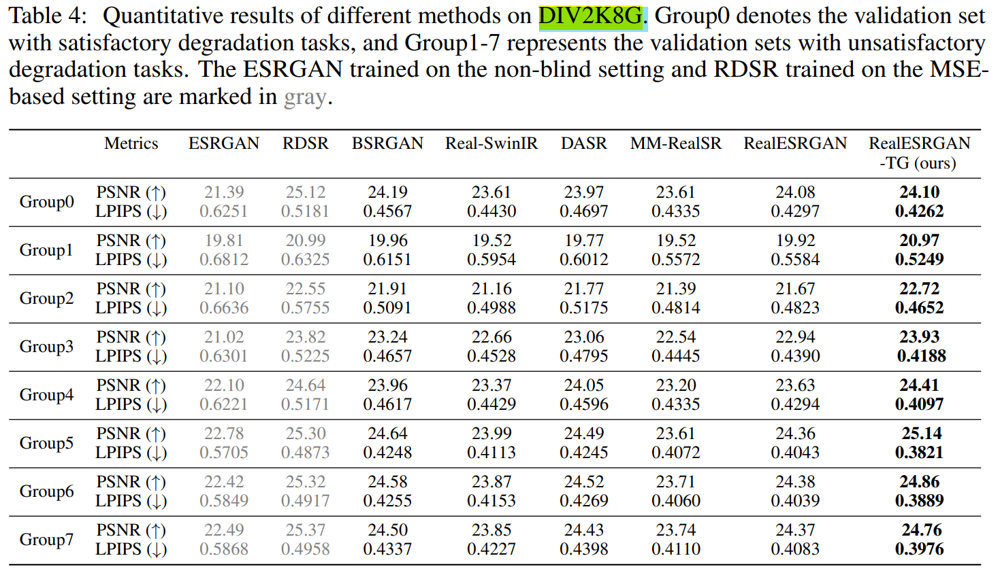

#### 退化模型的数量

在 4K，10K 退化模型上，发现 performance indicator 有着类似的分布;（**RealESRGAN 退化就那么几种，这个 4K，10K 都还是随机取的**）；**指标上差不多，说明退化模型数量 4K->10K 差异不大**（可以减小训练数据量）

> increasing the number of tasks from 4,000 to 10,000 does not lead to significant improvements in performance for TGSR

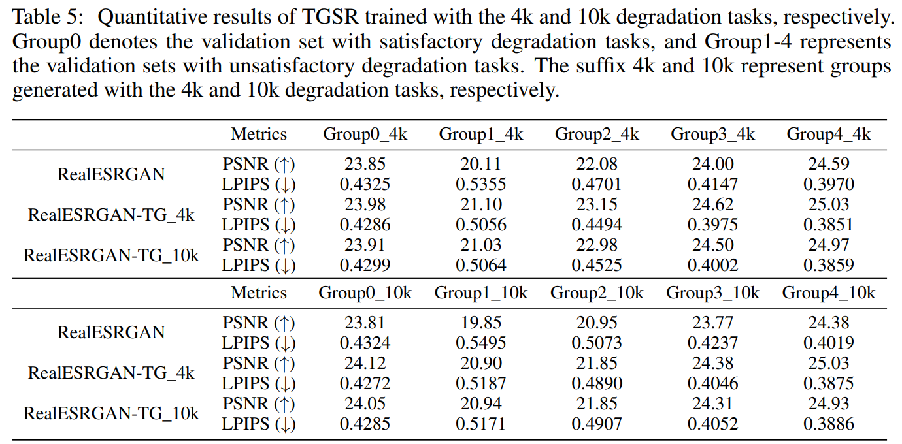

**iterative gourping**

每个 iteration 对剩下的 tasks，重新训练重新 group；

每次迭代完一些 tasks 被去掉之后不再训练用于 group，模型对指定退化 task 的提升差异很大（例如 Degradation5），**说明 task competition 确实存在**

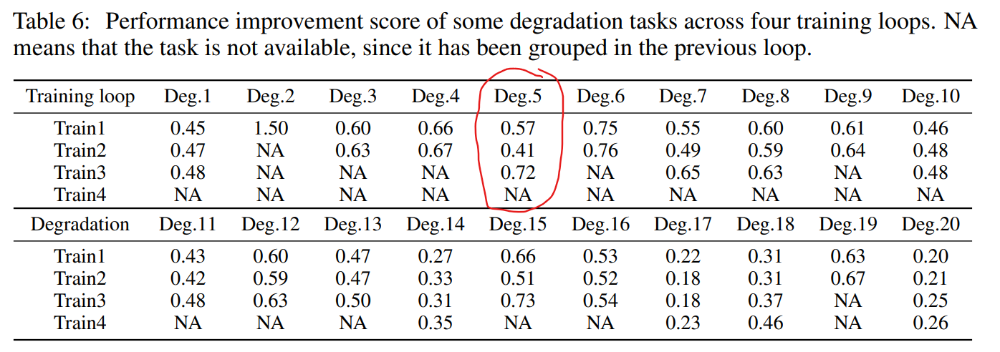

## Limitations

对退化数据分组**很耗时**，分组数据要迭代训练模型，对于 ESRGAN 等轻量模型还好，对于 diffusion 训练时长太久了

## Summary :star2:

> learn what & how to apply to our task

1. 把样本分难易等级分开训练

   发现一些退化 task 难训练，先前 focal loss 是提高权重；**本文发现一些 task 放一起训练会有冲突，分组避免冲突，让训练有效；之后针对难样本在有效训练的前提下去多训练一些**

2. 基于小 group 数据微调，要加入一些原始数据，可以防止 catastrophic forgetting

   退化数据加入 GT，防止模型对 GT 修复不好

3. RealImageSR 任务在图像针对单个 task 微调 1w iteration 即可

4. 使用 L1+perceptual+GANLoss，权重 1：1：0.1；
   perceptual loss 使用 (conv1, conv2, conv3, conv4, conv5 feature maps)，权重  [0.1, 0.1, 1, 1, 1]

5. **RealESRGAN 等方法重复做几次混合退化，能够提升主观感知**；但 PSNR 低一些，在某些指定退化的主观效果很烂，用 TG 方法 or 针对难样本再训一下（可以通过退化模型参数进行简单分类）

6. 训练数据量（退化模型角度）

   退化模型数量 4K->10K 差异不大（可以减小训练数据量，**训练过程中加退化变成固定的退化，有 4K 退化模型基本上ok**）
