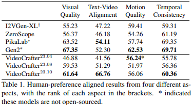

# VideoCrafter1: Open Diffusion Models for High-Quality Video Generation

> "VideoCrafter1: Open Diffusion Models for High-Quality Video Generation" Arxiv, 2023 Oct
> [paper](http://arxiv.org/abs/2310.19512v1) [code](https://ailab-cvc.github.io/videocrafter)  :+1:
> [pdf](./2023_10_Arxiv_VideoCrafter1--Open-Diffusion-Models-for-High-Quality-Video-Generation.pdf)
> Authors: Haoxin Chen, Menghan Xia, Yingqing He, Yong Zhang, Xiaodong Cun, Shaoshu Yang, Jinbo Xing, Yaofang Liu, Qifeng Chen, Xintao Wang, Chao Weng, Ying Shan

## Key-point

- Task: text-to-video (T2V) and image-to-video (I2V) tasks
- Background
- :label: Label:

整理了 Video Diffusion Milestone

Image-to-Video (I2V) model is designed to produce videos that strictly adhere to the content of the provided reference image

first open-source generic I2V foundation model that can preserve the content and structure of the given reference image.

## Contributions

## Related Work

- 评估视频生成结果

  "Benchmarking and Evaluating Large Video Generation Models"
  [website](https://evalcrafter.github.io/)

concatenating frame-wise depth map with input noise sequences for video editing

### Condition

- "VideoComposer: Compositional Video Synthesis with Motion Controllability"
  [paper](https://arxiv.org/abs/2306.02018)

- DragNUWA

  introduce trajectory control

## methods

## Experiment

> ablation study 看那个模块有效，总结一下

对比开源 Text2Video 模型，人去看的结果

1. I2VGen-XL 为 image2Video, 因此用 SD-XL 先根据文本生成一个图
2. Pika Labs: best text-alignment performance but does not always generate the correct style
3. Gen-2 有时候生成视频和文本匹配度不高

> Pika [6] and Gen-2 [1] are well-known text2video generation products developed by commercial

- 本文方法生成的第一帧并不好，但是在开源模型中，一致性和保真度综合最有
- our I2V model still has several limitations such as the successful rate, unsatisfactory facial artifacts, etc, requiring further efforts for im

## Limitations

## Summary :star2:

> learn what & how to apply to our task

