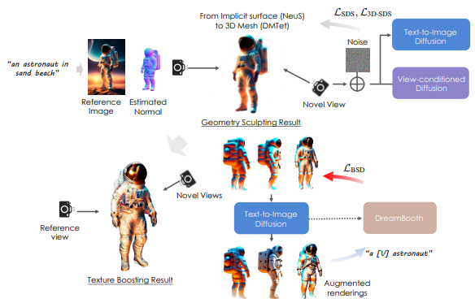

# DreamCraft3D: Hierarchical 3D Generation with Bootstrapped Diffusion Prior

> "DreamCraft3D: Hierarchical 3D Generation with Bootstrapped Diffusion Prior" Arxiv, 2023 Oct
> [paper](http://arxiv.org/abs/2310.16818v2) [code](https://github.com/deepseek-ai/DreamCraft3D) 
> [pdf](./2023_10_Arxiv_DreamCraft3D--Hierarchical-3D-Generation-with-Bootstrapped-Diffusion-Prior.pdf)
> Authors: Jingxiang Sun, Bo Zhang, Ruizhi Shao, Lizhen Wang, Wen Liu, Zhenda Xie, Yebin Liu

## Key-point

- Task: hierarchical 3D content generation
- Background
- :label: Label:‘

1. 训练一个 3D diffusion model 预测新视角图像，辅助生成较为粗糙的3D结构
2. 利用 Stable Diffusion 细化mesh 生成细节

> To sculpt geometries that render coherently, we perform **score distillation sampling via a view-dependent diffusion model**. We train a personalized diffusion model, Dreambooth, on the augmented renderings of the scene, imbuing it with 3D knowledge of the scene being optimized

- 关注

  1. 如何使用 diffusion 先验特征，同时不改变 diffusion 特征？

     使用输出的图像

  2. diffusion 训练如何加速？

     刚开始训练 timesteps 增加 70% > 之后 20%

## Contributions

## Related Work

- SDS Loss
  score distillation sampling (SDS) loss encourages the rendered images to match the distribution modeled by the diffusion model.
  $$
  \nabla_\theta\mathcal{L}_{\mathrm{SDS}}(\phi,g(\theta))=\mathbb{E}_{t,\boldsymbol{\epsilon}}\Big[\omega(t)(\boldsymbol{\epsilon}_\phi(\boldsymbol{x}_t;y,t)-\boldsymbol{\epsilon})\frac{\partial\boldsymbol{x}}{\partial\theta}\Big],
  $$
  

- classifierfree guidance (CFG) 方式加入 condition

  使用 SDS Loss + CFG 容易模糊

- variational score distillation (VSD) loss

  

## methods

leverages a 2D image generated from the text prompt and uses it to guide the stages of geometry sculpting and texture boosting

### Diffusion timestep annealing

- utilize a view-conditioned diffusion model, Zero-1-to-3
  The Zero-1-to-3 is a fine-tuned 2D diffusion model, which **hallucinates the image** in a relative camera pose c given the reference image x. 使用 Diffusion 输出新视角的图像

- Diffusion timestep annealing

  At the start of optimization, prioritize sampling larger diffusion timestep t from the range [0.7, 0.85] when computing Equation 6 to provide the global structure. As training proceeds, we linearly anneal the t sampling range to [0.2, 0.5] over hundreds of iterations

训一个合成新视角的 diffusion 模型，辅助生成 3D 结构。但训练的 diffusion 合成新视角图，细节很平滑模糊，leaves the texture blurry。

###  TEXTURE BOOSTING 

augment the texture realism, we use variational score distillation (VSD) loss,
$$
\nabla_\theta\mathcal{L}_\mathrm{VSD}(\phi,g(\theta))=\mathbb{E}_{t,\boldsymbol{\epsilon}}\left[\omega(t)(\boldsymbol{\epsilon}_\phi(\boldsymbol{x}_t;y,t)-\boldsymbol{\epsilon}_\mathrm{lora}(\boldsymbol{x}_t;y,t,c))\frac{\partial\boldsymbol{x}}{\partial\theta}\right]
$$
使用 Stable Diffusion 细化纹理，3D mesh？

## Experiment

> ablation study 看那个模块有效，总结一下

## Limitations

## Summary :star2:

> learn what & how to apply to our task

