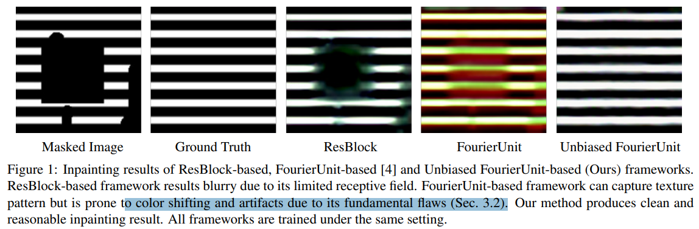
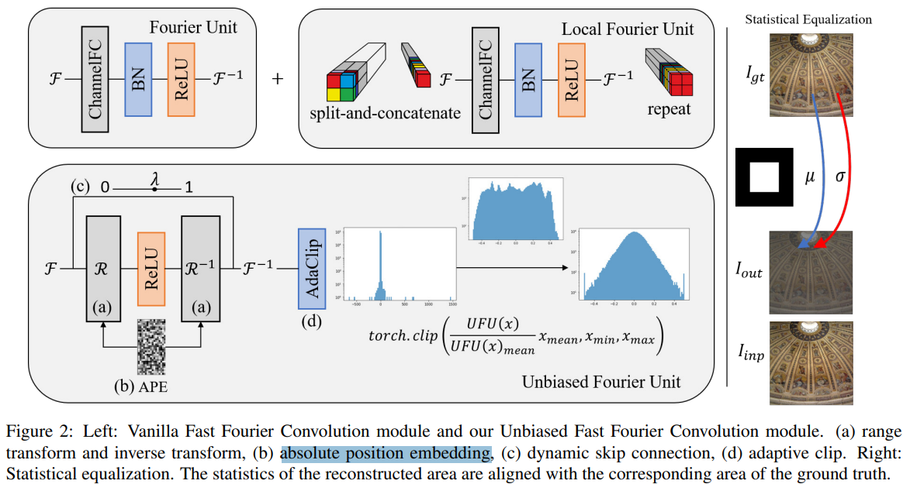
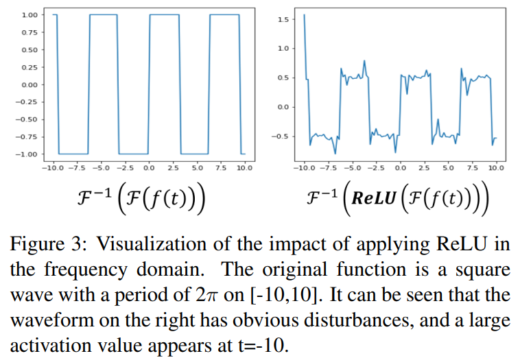

# Rethinking Fast Fourier Convolution in Image Inpainting

> "Rethinking Fast Fourier Convolution in Image Inpainting" ICCV, 2023 Oct 1, `UFFC`
> [paper](https://openaccess.thecvf.com/content/ICCV2023/papers/Chu_Rethinking_Fast_Fourier_Convolution_in_Image_Inpainting_ICCV_2023_paper.pdf) [code](https://github.com/1911cty/Unbiased-Fast-Fourier-Convolution) [pdf](./2023_10_ICCV_Rethinking-Fast-Fourier-Convolution-in-Image-Inpainting.pdf) [note](./2023_10_ICCV_Rethinking-Fast-Fourier-Convolution-in-Image-Inpainting_Note.md)
> Authors: Tianyi Chu, Jiafu Chen, Jiakai Sun, Shuobin Lian, Zhizhong Wang, Zhiwen Zuo

## Key-point

- Task
- Problems
- :label: Label:

## Contributions

- 分析 FFC 提取频率特征为什么会有 artifact
- 提出 UFFC
- 提出两个 perceptual loss

## Introduction

FFT 容易出现色偏，artifact

FFC

> Recently proposed LaMa [25] introduce **Fast Fourier Convolution (FFC)** [4] into image inpainting
>
> FFC empowers the fully convolutional network to have a global receptive field in its early layers, and have the ability to produce robust repeating texture

分析 FFC 在 image inpainting 造成 artifacts 的原因 :star:

> In this paper, we analyze the fundamental flaws of using FFC in image inpainting, which are 1) spectrum shifting, 2) unexpected spatial activation, and 3) limited frequency receptive field

提出 UFFC 模块修正 artifact

> Based on the above analysis, we propose a novel Unbiased Fast Fourier Convolution (UFFC) module. UFFC is constructed by modifying the vanilla FFC module with 1) range transform and inverse transform, 2) absolute position embedding, 3) dynamic skip connection, and 4) adaptive clip, to overcome the above flaws. 

提出两个 perceptual loss 辅助生成

> we propose two novel perceptual losses for better generation quality and more robust training

- Q：FFC 用于 High Level 任务，不适合 Low-level?

FFC 模块的设计用于 High Level 任务，会过滤掉高频细节，对 low-level 有害

> Recall that **high level vision tasks** are to convert high-dimensional input into low-dimensional output, thus requiring the model to **filter out irrelevant information** while retaining principal components representing classification labels. **FFC [4] was first designed for high-level vision tasks** (classification) and has achieved SOTA performance. On the contrary, lowlevel vision tasks have to preserve semantic information and achieve accurate pixel-level reconstruction, which is difficult for FFC

**使用 Relu 过滤掉了负数，损坏了频谱**

> Therefore, it is inappropriate to directly apply FFC to low-level vision tasks without any specific adaptation. **Specifically, simply filtering out all negative values via ReLU operation by FFC in the frequency domain will damage the statistics of the spectrum**, causing artifacts and unexpected extremely large values in the spatial feature after the inverse Fourier transform. 

channelFC 只能用于单一频率？？

> In addition, the channelFC (conv1x1) applied on the frequency feature only **calculate among features with the same frequency, while ignoring the relationship between different frequencies,** which makes FFC difficulty to capture complex content.

## methods

- Q：FFC 用于 High Level 任务，不适合 Low-level?

FFC 模块的设计用于 High Level 任务，会过滤掉高频细节，对 low-level 有害

高频特征在 norm 之后归到负数区间，再过一层激活曾，被抑制

> Recalling classical algorithms such as PCA [20], it is not difficult to find that the essence of high-level vision tasks can be summarized as dimensionality reduction. From the perspective of signal analysis, **the noise-like “highfrequency” information should be filtered out,** and only the base frequency that represents the classification label is retained. In most of the current deep learning models, such a function is accomplished by the combination of the learnable linear layer (Fully connected layer, convolution layer, etc.), the normalization function, and the activation function. **The high activation value of label features makes the unnecessary information fall into negative values after the normalization function.**
>
> The negative values will be suppressed or eliminated by the activation function after.

## setting

## Experiment

> ablation study 看那个模块有效，总结一下

## Limitations

## Summary :star2:

> learn what

### how to apply to our task

