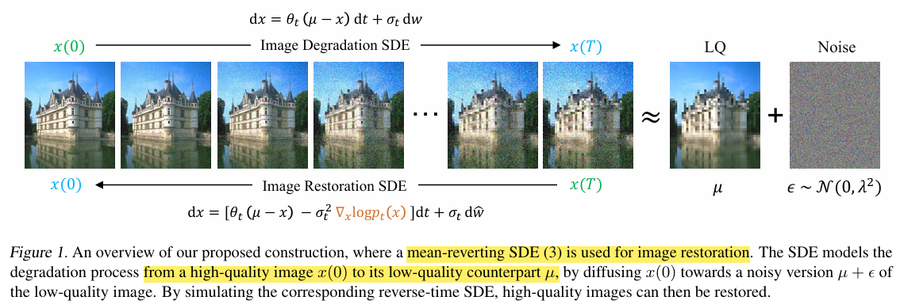
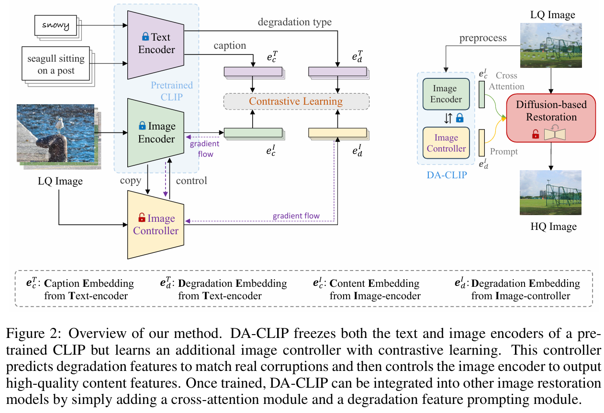
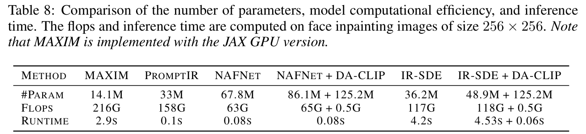

# Controlling Vision-Language Models for Multi-Task Image Restoration

> "Controlling Vision-Language Models for Multi-Task Image Restoration" ICLR, 2023 Oct 2, `DA-CLIP `
> [paper](http://arxiv.org/abs/2310.01018v2) [code](https://github.com/Algolzw/daclip-uir) [pdf](./2023_10_ICLR_Controlling-Vision-Language-Models-for-Multi-Task-Image-Restoration.pdf) [note](./2023_10_ICLR_Controlling-Vision-Language-Models-for-Multi-Task-Image-Restoration_Note.md)
> Authors: Ziwei Luo, Fredrik K. Gustafsson, Zheng Zhao, Jens Sjölund, Thomas B. Schön

## Key-point

- Task: CLIP for Image restoration
- Problems
  - However, when it comes to low-level vision such as image restoration their performance deteriorates dramatically due to corrupted inputs
  -  the existing VLMs often misalign image features to degradation texts

- :label: Label:

此片论文效果不稳定，后续加强版

- "Photo-Realistic Image Restoration in the Wild with Controlled Vision-Language Models" Arxiv, 2024 Apr 15
  [paper](http://arxiv.org/abs/2404.09732v1) [code]() [pdf](./2024_04_Arxiv_Photo-Realistic-Image-Restoration-in-the-Wild-with-Controlled-Vision-Language-Models.pdf) [note](./2024_04_Arxiv_Photo-Realistic-Image-Restoration-in-the-Wild-with-Controlled-Vision-Language-Models_Note.md)
  Authors: Ziwei Luo, Fredrik K. Gustafsson, Zheng Zhao, Jens Sjölund, Thomas B. Schön

是在 ViT-L-14 上做的！！和 SDv1.5 一样哦！

## Contributions

- we present a degradation-aware visionlanguage model (DA-CLIP) to better transfer pretrained vision-language models to low-level vision tasks as a multi-task framework for image restoration.

- image encoder 学习一个 controlnet 修正一下！

  > DA-CLIP trains an additional controller that adapts the fixed CLIP image encoder to predict high-quality feature embeddings.

- 修正的 CLIP image feature 可以指示退化类型

  > The controller itself will also output a degradation feature that matches the real corruptions of the input, yielding a natural classifier for different degradation types. 

- mixed degradation dataset with synthetic captions for DA-CLIP training

  > we construct a large mixed-degradation dataset for ten different image restoration tasks based on BLIP

- SOTA

## Introduction

CLIP 提取特征用于退化类型分类，准确率很低

> As shown in Figure 1, our DA-CLIP accurately classifies the ten different degradation types and can readily be integrated into existing restoration models, helping produce visually appealing results across the different degradations.

- Q： the existing VLMs often misalign image features to degradation texts？

image restoration 训练数据往往都很少

> This is not surprising, considering that VLMs are generally trained on diverse, web-scale datasets, in contrast to most image restoration models which are trained on comparatively small datasets that are curated for a specific task without corresponding image-text pairs

- Q：先前每个修复任务都要单独训练一个模型，unified image restoration？

没利用好 VLMs 的信息

> While the results are impressive, they are still limited to a small number of degradation types and the specific datasets that go with them.

- Q：motivation？

1. 解决 clean text & degraded image feature 特征不对齐问题

   > Specifically, aiming at addressing feature mismatching be tween corrupted inputs and clean captions, we propose an Image Controller that adapts the VLM’s image encoder to output high-quality (HQ) content embeddings aligned with clean captions.

2. 训练的 Controlnet 能出一个特征代表退化类型，实现 unified restoration

   > Mean while, the controller itself also predicts a degradation embedding to match the real degradation types.

提出 DA-CLIP，利用 VLM 先验信息去做 unified 图像修复

> This novel framework, which we call degradation-aware CLIP (DA-CLIP), incorporates the human level knowledge from VLMs into general networks that improve image restoration performance and enable unified image restoration.

### baseline

- "Image Restoration with Mean-Reverting Stochastic Differential Equations" ICML, 2023 Jan, **IR-SDE** :star:
  [Ziwei Luo](https://algolzw.github.io/), [Fredrik K. Gustafsson](https://www.fregu856.com/), [Zheng Zhao](https://zz.zabemon.com/), [Jens Sjölund](https://jsjol.github.io/), [Thomas B. Schön](https://user.it.uu.se/~thosc112/index.html)
  [paper](https://arxiv.org/abs/2301.11699) [code](https://github.com/Algolzw/image-restoration-sde) [website](https://algolzw.github.io/ir-sde/index.html?utm_source=catalyzex.com) [pdf](./2023_01_ICML_Image-Restoration-with-Mean-Reverting-Stochastic-Differential-Equations.pdf) [note](./2023_01_ICML_Image-Restoration-with-Mean-Reverting-Stochastic-Differential-Equations_Note.md)

- "Exploiting Diffusion Prior for Real-World Image Super-Resolution" Arxiv, 2023 May, **StableSR**
  [paper](https://arxiv.org/abs/2305.07015) [website](https://iceclear.github.io/projects/stablesr/?utm_source=catalyzex.com) [code](https://github.com/IceClear/StableSR) [pdf](./2023_05_Arxiv_Exploiting-Diffusion-Prior-for-Real-World-Image-Super-Resolution.pdf) [note](./2023_05_Arxiv_Exploiting-Diffusion-Prior-for-Real-World-Image-Super-Resolution_Note.md) 
  Authors: [Jianyi Wang](https://arxiv.org/search/cs?searchtype=author&query=Wang,+J), [Zongsheng Yue](https://arxiv.org/search/cs?searchtype=author&query=Yue,+Z), [Shangchen Zhou](https://arxiv.org/search/cs?searchtype=author&query=Zhou,+S), [Kelvin C.K. Chan](https://arxiv.org/search/cs?searchtype=author&query=Chan,+K+C), [Chen Change Loy](https://arxiv.org/search/cs?searchtype=author&query=Loy,+C+C)

## methods

- Q：训练好的 DA-CLIP 怎么用到现在修复模型里面？

> We use cross-attention to in tegrate the content embedding into restoration networks to improve their performance. Moreover, we introduce a prompt learning module to better utilize the degradation context for unified image restoration.

- Q: base model?

> We use IR-SDE (Luo et al., 2023a) as the base framework for image restoration. It adapts a U-Net architecture similar to DDPM (Ho et al., 2020) but removes all self-attention layers.

训练

> Given state xt and low-quality image µ, our final diffusion network is conditioned on the time t and additional embeddings eI c and eI d, as ϵθ(xt,µ,t,eI c,eI d), which can be trained with either noise matching loss (Ho et al., 2020) or maximum likelihood loss

### dataset

使用 BLIP 生成 clean caption

## setting

- We experimentally evaluate our method on **two types of tasks**: degradation-specific image restora tion and unified image restoration

###  degradation-specific

>  The base CLIP model uses **ViT-B-32** as the backbone for its image encoder, with weights pretrained on the LAION-2B dataset (Schuhmann et al., 2022). Built upon it, we fine-tune the DA-CLIP on the mixed degradation dataset with a batch size of 3136 (784 × 4) and learning rate 3 × 10−5.

-  all inputs are normalized in the range [0,1] and resized to 224 × 224 with bicu bic interpolation
- DA:  For the restoration model, we use a batch size of 16 and randomly crop images to 256 × 256 for data augmentation.

居然只要训练 3 hours

> We train the DA-CLIP model on four NVIDIA A100 GPUs for 50 epochs, in approximately 3 hours.

## Experiment

> ablation study 看那个模块有效，总结一下

使用优化的 CLIP-image feature 能够加速训练 & 提升性能

参数量

### unified restoration

在 IR-SDE 基础上加 DA-CLIP 四个指标都高了

> More importantly, by simply integrating DA-CLIP into the network, we significantly outperform the IR-SDE baseline in terms of all four metrics.

IR-SDE 加上了 CLIP 特征效果好了很多，但没有比较加原始的 CLIP？

- Q：原始 CLIP 和 DA-CLIP 对于修复的差异？ :star:

对比分类准确率。。

对比 MSE-BASEDMETHOD 的提升，IR-SDE 对比的是 diffusion！

差异不是贴别显著。。。

> Table6 provides two ablation experiments on NAFNet(Chenetal.,2022) and Restormer(Zamiretal.,2022). Note that Promp tIR is built upon Restormer but with additional degradation prompt modules.

## Limitations

## Summary :star2:

> learn what

### how to apply to our task

- Q：调整 CLIP 的影响？

