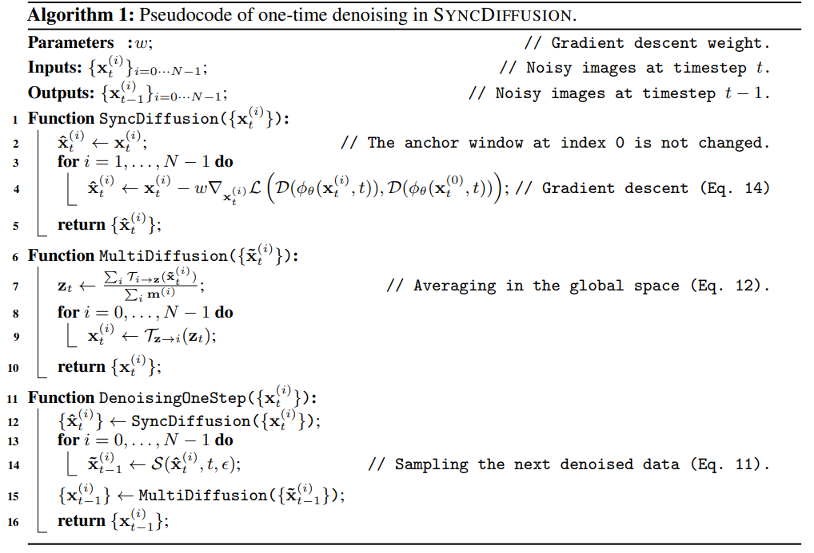

# ScaleCrafter: Tuning-free Higher-Resolution Visual Generation with Diffusion Models

> "ScaleCrafter: Tuning-free Higher-Resolution Visual Generation with Diffusion Models" ICLR, 2023 Oct 11
> [paper](http://arxiv.org/abs/2310.07702v1) [code]() [pdf](./2023_10_ICLR_ScaleCrafter--Tuning-free-Higher-Resolution-Visual-Generation-with-Diffusion-Models.pdf) [note](./2023_10_ICLR_ScaleCrafter--Tuning-free-Higher-Resolution-Visual-Generation-with-Diffusion-Models_Note.md)
> Authors: Yingqing He, Shaoshu Yang, Haoxin Chen, Xiaodong Cun, Menghan Xia, Yong Zhang, Xintao Wang, Ran He, Qifeng Chen, Ying Shan

## Key-point

- Task: 现有 SD 生成超高分辨率图像
- Problems
- :label: Label:

## Contributions

- 发现 SD 出现重复物体的原因在于 Conv 感受野太小，提出 re-dilated 方案

## Introduction

- Q：直接生成高分辨率图像，有很多物体重复

> When generating images directly at a higher resolution, 1024×1024, with the pre-trained Stable Diffusion using training images of resolution 512 × 512, we observe per sistent problems of object repetition and unreasonable object structures.
>
> Existing works for higher-resolution generation, such as attention-based and joint-diffusion approaches, cannot well address these issues. 

发现因为 Conv 感受野有限

> As a new perspective, we examine the structural components of the U-Net in diffusion models and identify the crucial cause as the limited perception field of convolutional kernels.

- Q：怎么发现的？怎么做实验？:star:

> - "SyncDiffusion: Coherent Montage via Synchronized Joint Diffusions" NIPS, 2023 Jun 8
>   [paper](http://arxiv.org/abs/2306.05178v3) [code](https://syncdiffusion.github.io.) [pdf](./2023_06_NIPS_SyncDiffusion--Coherent-Montage-via-Synchronized-Joint-Diffusions.pdf) [note](./2023_06_NIPS_SyncDiffusion--Coherent-Montage-via-Synchronized-Joint-Diffusions_Note.md)
>   Authors: Yuseung Lee, Kunho Kim, Hyunjin Kim, Minhyuk Sung

SyncDiffusion 的实现，增加了一个 LPIPS loss，**把每个 patch 特征都和第一个 patch 去计算 LPIPS loss 保持一致**

-  re-dilation
- dispersed convolution and noise-damped classifier-free guidance

> Based on this key observation, we propose a simple yet effective re-dilation that can dynamically adjust the convolutional perception field during inference.
>
> We further propose the dispersed convolution and noise-damped classifier-free guidance, which can enable ultra-high-resolution image generation (e.g., 4096 × 4096).

提出 dilation 方案，**不需要训练！发现现有 SD 有能力直接生成高分辨率图像**

> Notably, our approach does not require any training or optimization.
>
> Our work also suggests that a pre-trained diffusion model trained on low-resolution images can be directly used for high-resolution visual gener ation without further tuning, which may provide insights for future research on ultra-high-resolution image and video synthesis. 

## methods

## setting

## Experiment

> ablation study 看那个模块有效，总结一下

## Limitations

## Summary :star2:

> learn what

### how to apply to our task

