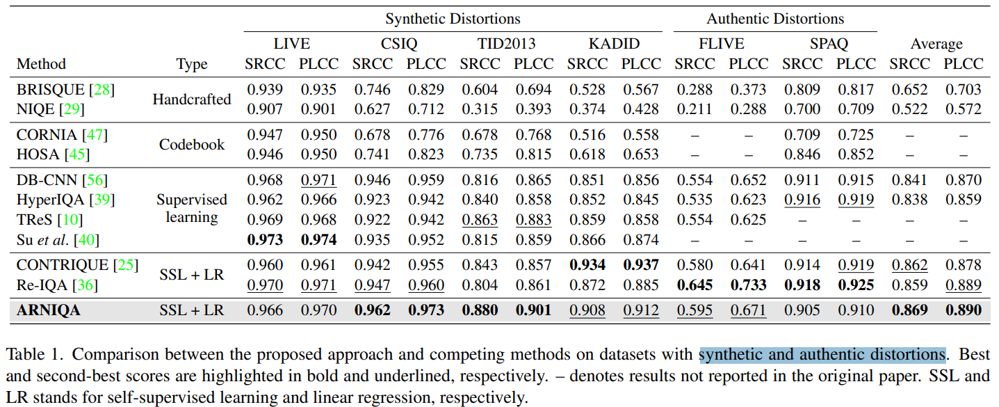

# ARNIQA: Learning Distortion Manifold for Image Quality Assessment

> "ARNIQA: Learning Distortion Manifold for Image Quality Assessment" WACV-oral, 2023 Oct 20
> [paper](http://arxiv.org/abs/2310.14918v2) [code](https://github.com/miccunifi/ARNIQA.) [pdf](./2023_10_WACV-oral_ARNIQA--Learning-Distortion-Manifold-for-Image-Quality-Assessment.pdf) [note](./2023_10_WACV-oral_ARNIQA--Learning-Distortion-Manifold-for-Image-Quality-Assessment_Note.md)
> Authors: Lorenzo Agnolucci, Leonardo Galteri, Marco Bertini, Alberto Del Bimbo

## Key-point

- Task
- Problems
- :label: Label:

## Contributions

## Introduction

## methods

## setting

## Experiment

> ablation study 看那个模块有效，总结一下

- 相比本文指标，Re-IQA 在合成数据上性能接近 & 真实数据上更优
- BRISQUE, NIQE 就完全不准了。。。

## Limitations

## Summary :star2:

> learn what

### how to apply to our task

