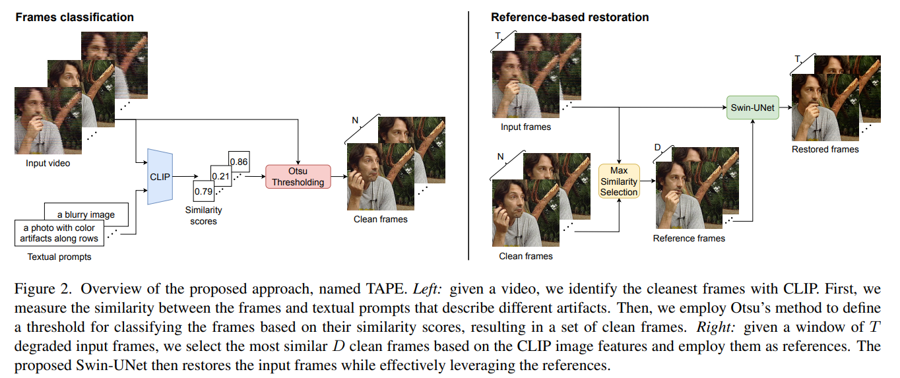
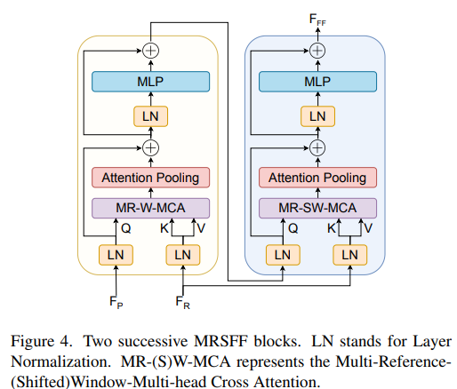
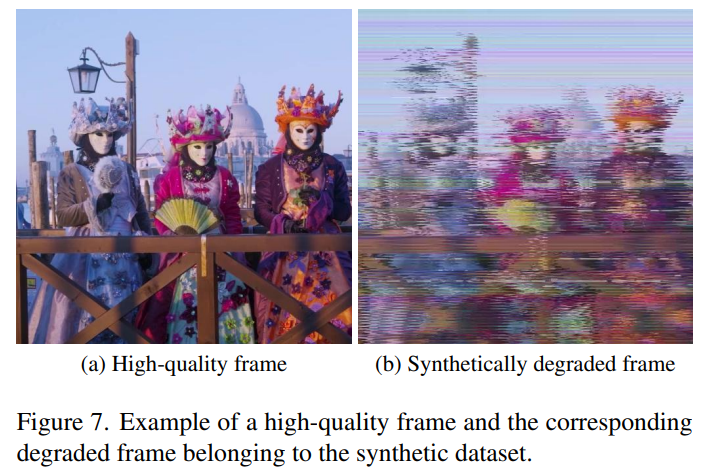
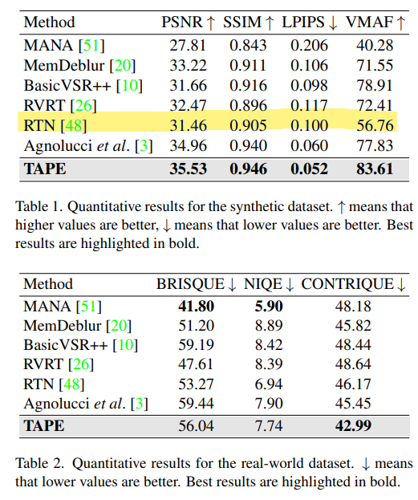
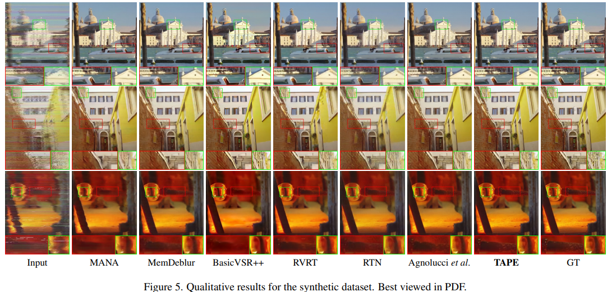
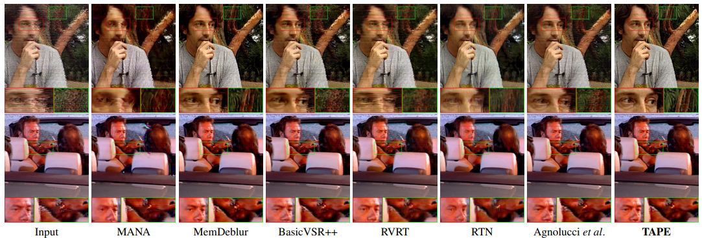
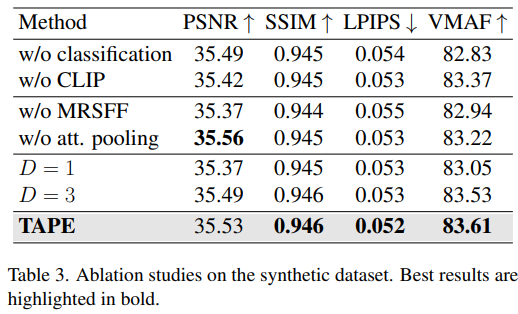

# Reference-based Restoration of Digitized Analog Videotapes

> "Reference-based Restoration of Digitized Analog Videotapes" WACV, 2023 Oct
> [paper](http://arxiv.org/abs/2310.14926v2) [code](https://github.com/miccunifi/TAPE) [pdf](./2023_10_WACV_Reference-based-Restoration-of-Digitized-Analog-Videotapes.pdf)
> Authors: Lorenzo Agnolucci, Leonardo Galteri, Marco Bertini, Alberto Del Bimbo

## Key-point

- Task: Analog magnetic tapes Restoration 录像带修复
- Problems
  1. digital video 修复方法处理的退化类型不同，不适用 VHS 录像带的噪声
  2. 老视频修复方法主要针对划痕，等结构性损伤，不适用 VHS 退化
- :label: Label:


## Contributions

1. referenced-based approach 使用 CLIP 去与描述退化的 prompt 计算相似度，筛选干净的帧作为参考帧

   identify the cleanest frames of a video with CLIP and then leverage them as references

2. 提出 Swin-UNet 架构，并提出 MRSFF 模块去对齐相邻和参考帧

3. 构建 VHS 合成数据集


## Introduction

### Tape degradation

> 调研退化种类及原因
>
> - "Detection and correction of mistracking in digitalized analog video"
> - "What can go wrong with magnetic media?"

The aging of recording supports and the malfunctioning of reader devices 造成退化；

- Motivation

  影响录像带的传播；目前方法逐帧去修复，时间成本很大，不现实


### digital videos

- "Vrt: A video restoration transformer"
- RVRT
- "Flow-guided sparse transformer for video deblurring"
- "Memory-augmented non-local attention for video super-resolution"

designed for digital videos and do not address artifacts due to media issues typical of old ones.


### Old Video Restoration

- "Image processing for restoration of old film sequences" ICIAP, 1999
- "Digital image processing techniques for the detection and removal of cracks in digitized paintings" TIP, 2005
- "An efficient scratches detection and inpainting algorithm for old film restoration" ICITC, 2009
- "Multi-scale memory-based video deblurring" CVPR, 2022
- "DeOldify" 开源软件
- "Deepremaster" 2019
- RTN, 2022

impressive results are observed for structured defects, 但没法处理 VHS 大面积损伤


### analog video

- "Detection and correction of mistracking in digitalized analog video"
- "Tracking error in digitized analog video: automatic detection and correction"
- "Restoration of analog videos using Swin-UNet"


- 小结
  1. Analog Video 的退化类型更为独特
  2. 退化损坏了 temporal 信息，大多使用 optical flow-based frame alignment 
  3. Old video restoration 方法针对 structured defects，没有利用 analog video 特点


### Otsu Threshold

> [scikit-image Threshold doc](https://scikit-image.org/docs/stable/auto_examples/applications/plot_thresholding_guide.html#id4) 使用场景：图像二值化，获取阈值
> [Otsu's method Wiki](https://en.wikipedia.org/wiki/Otsu's_method)

按灰度直方图去理解，每个灰度的像素个数


Otsu’s method [[2\]](https://scikit-image.org/docs/stable/auto_examples/applications/plot_thresholding_guide.html#id4) calculates an “optimal” threshold (marked by a red line in the histogram below) by **maximizing the variance between two classes of pixels,**

> The algorithm exhaustively searches for the threshold that minimizes the intra-class variance

```python
from skimage.filters import threshold_otsu
thresh = threshold_otsu(image)
```

对于背景变化很大的时候，Global Otsu 用一个全局的阈值效果不好！ 改为 Local Otsu 方式，对每个小区域单独使用 Otsu 方法计算阈值。

> if there is large variation in the background intensity, adaptive thresholding (a.k.a. local or dynamic thresholding) may produce better results. 
>
> **calculates thresholds in regions** with a characteristic size *block_size* surrounding each pixel (i.e. local neighborhoods).


## methods

> - `Otsu` methods 决定阈值



### Reference Selection

构造描述退化的 prompt，使用 CLIP 计算相似度来检测视频帧的质量，筛选出干净帧；在筛选出的"干净帧"中，选取最相似的 D 个作为 reference

> 可以学习下讲故事，先讲简单想法，分析问题，再引出提出方法

最简单想法直接训一个分类器，然后分析这种方式缺点：需要一个预定的阈值很难取值，很可能分类所有帧都为低质量，从而没有 referece

> employ CLIP for zero-shot artifact detection by **measuring the similarity between each frame and a textual prompt describing some kind of artifact** (e.g. “an image with color artifacts along rows”).
>
> 在整个画面角度来看，CLIP+prompt 作为 IQA 指标是否可行？

图像去和**描述画面退化的文本**，计算相似度 >> 解释说文本更能描述退化情况；

在得到相似度后，碰到阈值如何选取的问题 >> Otsu’s method 子监督方式（类内距离），选取 CLIP 相似度小于这个阈值的图作为 reference，因此**这个 reference 图像数目根据视频退化程度变化**

> 缺陷：一些图像只在部分区域存在类似 VHS wave edge 退化，其余区域仍有可利用的信息，直接没考虑


### Swin-UNet


- Motivation

  参考先前 VHS 修复方法 ref3

  1. 注意力机制复杂度太大， global atten 不太可行，因此使用 SwinTransformer 优点：local window attn + shifted-window 降低复杂度
  2. 由于退化的存在，破坏了时序性，image warping 很难做。**先前 VRT 和 RTN 方法验证了 transformer 可以解决非对齐问题**

验证了 input, output 加跳连的有效性；

使用 SwinTransformer 3D blocks 同时考虑 spatial-temporal 特征，但只能适用前后同一区域某些帧没有噪声的情况。


### MRSFF



- Motivation

  if a given region is severely degraded in all the input frames, some details will be permanently lost. 因此使用 "干净的" reference （通过 CLIP 筛选），用有噪声的还不行

使用 Transformer 做非对其特征融合，低质帧作为 Q，干净的参考帧作为 KV，就是**去参考帧提取有用的特征再加到低质帧上面**

1. 将输入特征分为 $M \times M$ 个窗口，attention 后得到特征尺寸 $T \times D \times M^2 \times C$

2. **需要将 D 个 reference 维度给消掉**，使用 attention pooling 代替简单的平均


- Q：reference 特征怎么来？

对于筛选出来的帧，用预训练的 SwinTransformer 提取特征

> We extract multi-scale features from the **reference frames** through a pre-trained Swin Transformer feature extractor


- Q：如何筛选干净的帧？

用 CLIP + text "image with color artifacts" 预测图像 & 文本特征相似度，再加一个阈值


## Synthetic Dataset

> [Adobe After Effect 安装](https://www.bilibili.com/read/cv15301648/)

`Archivio Storico Luce` >> The curators provided us with some degraded analog archival videos. 

博物馆馆长给了几个视频，作为 real-world 视频，但没有 GT，没法监督训练；>> 合成数据

参考先前工作，使用 Adobe After Effects 去合成退化；start with 4K videos: Harmonic dataset & crop center 788 × 576

> 1. AV Artifact Atlas.
> 2. [blog](https://www.thepixelfarm.co.uk/identifying-common-tape-defects/)

1. `Hue/Saturation Effect` 让颜色更暗沉
2. tape dropout:  overlay with artifacts typical of VHS tapes && `Wiggle Effect`
3. tape noise: adding Gaussian noise with the `Noise Effect`
4. tape mistracking and VHS edge waving: `Displacement Map Effect`
5. `CC Toner Effect` 水平划痕
6. randomize all the effects we apply to the synthetic videos



ref3 也有合成数据，但没有 release 出来；


## Experiment

> ablation study 看那个模块有效，总结一下

- SOTA 方法比较
  :question: RTN 怎么做彩色图？尺寸怎么设置

  For a fair comparison, we **trained all the baselines from scratch on our training dataset** using the official repositories.

  RTN 有针对划痕专门的操作，效果差一些正常，对比先前 ref3 




- 合成数据上主管结果差不多

  

真实数据上主管结果




### Ablation Study

先前方法 PSNR 34.96

MRSFF 影响大一些（正常，特征对齐模块融合了 reference 信息），0.2db 其余模块差异不是很大，说明使用 Transformer 做特征对齐有效。但 attention pooling 方法不是很好，去掉效果反而升了




## Limitations

1. 合成 VHS 数据，退化类型很少
2. 监督方式训练，没法用真实数据
3. 缺陷：一些图像只在部分区域存在类似 VHS wave edge 退化，其余区域仍有可利用的信息，直接没考虑


## Summary :star2:

> learn what & how to apply to our task

1. 可以学习下讲故事，先讲简单想法，分析问题，再引出提出方法
2. 参考 Multi-view 方式改进下框架
