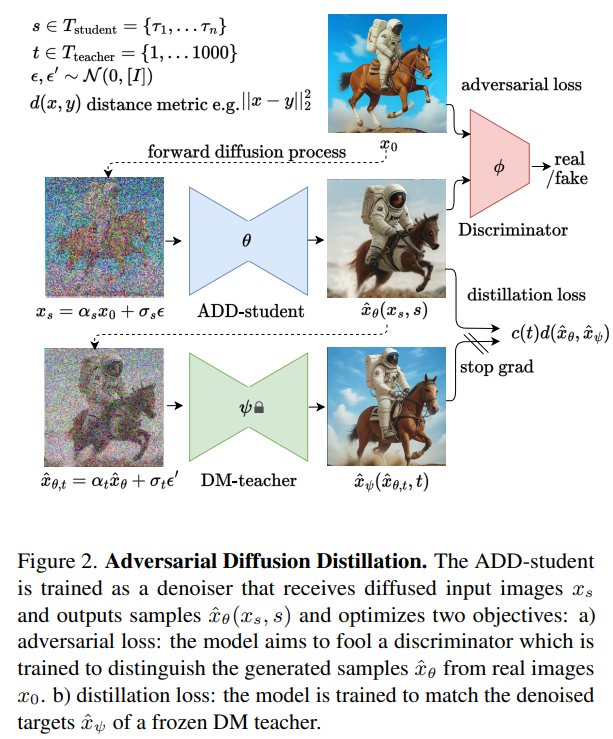
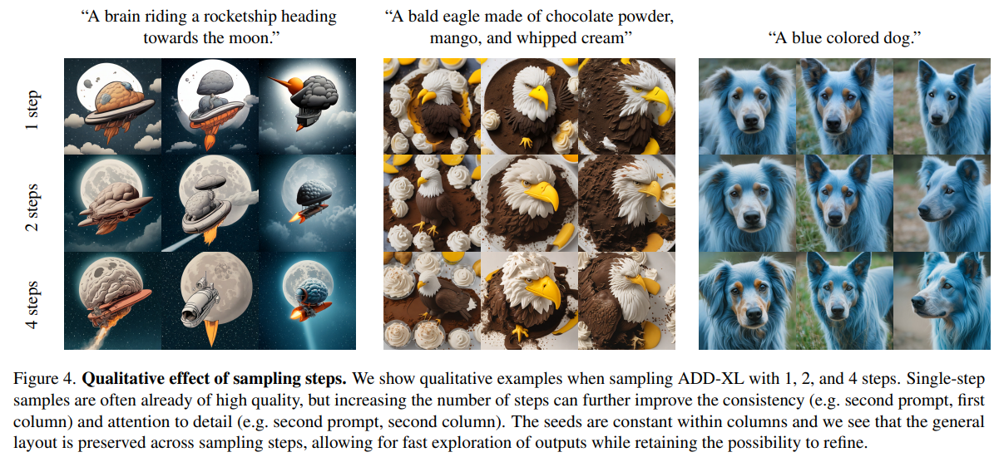
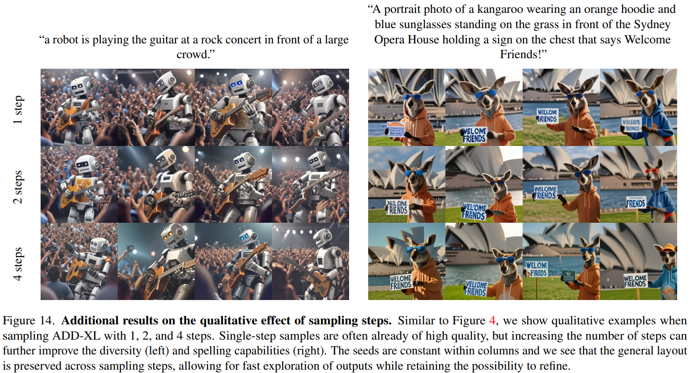

# Adversarial Diffusion Distillation

> "Adversarial Diffusion Distillation" Arxiv, 2023 Nov 28
> [paper](http://arxiv.org/abs/2311.17042v1) [code](https://github.com/Stability-AI/generative-models) [pdf](./2023_11_Arxiv_Adversarial-Diffusion-Distillation.pdf) [note](./2023_11_Arxiv_Adversarial-Diffusion-Distillation_Note.md)
> Authors: Axel Sauer, Dominik Lorenz, Andreas Blattmann, Robin Rombach

## Key-point

- Task: Diffusion 加速，蒸馏
- Problems
- :label: Label:

提出 Adversarial Diffusion Distillation (ADD) 对 SDXL 蒸馏

> **Adversarial Diffusion Distillation (ADD)**, a novel training approach that efficiently samples large-scale foundational image diffusion models in **just 1–4 steps while maintaining high image quality**

> We **use score distillation** to leverage large-scale off-the-shelf image diffusion models as a teacher signal in combination with an adversarial loss to ensure high image fidelity even in the low-step regime of one or two sampling steps

效果：1step 比 GAN 优秀，4step 比 SDXL 优秀

>  Our analyses show that our model clearly outperforms existing few-step methods (GANs, Latent Consistency Models) in a single step and reaches the performance of state-of-the-art diffusion models (SDXL) in only four steps.

## Contributions

- 第一个实时生成的 diffusion 模型；

> ADD is the first method to unlock single-step, real-time image synthesis with foundation models

- 提出 ADD，融合 adversarial loss & score distillation
- 效果好

## Introduction

- Q: loss?

**使用两个 loss：adversarial loss & score distillation sampling (SDS)**

> we introduce a combination of two training objectives: (i) an adversarial loss and (ii) a distillation loss that corresponds to score distillation sampling (SDS) 

adversarial loss 用于避免模糊

>  The adversarial loss forces the model to directly generate samples that lie on the manifold of real images at each forward pass, avoiding blurriness and other artifacts typically observed in other distillation methods [43]

score distillation sampling (SDS) 从预训练的 DM 学习

> The distillation loss uses another pretrained (and fixed) DM as a teacher to effectively utilize the extensive knowledge of the pretrained DM and preserve the strong compositionality observed in large DMs

为了进一步降低现存，没使用 classifier guidance

> During inference, our approach does not use classifier-free guidance [19], further reducing memory requirements

## methods

- Q: ADD-student 的 Unet 是一样的模型？

ADD-student 的 Unet 模型一样，用预训练的 DM 中的 unet 参数初始化

> Our training procedure is outlined in Fig. 2 and involves three networks: The ADD-student is initialized from a pretrained UNet-DM with weights θ, a discriminator with trainable weights ϕ, and a DM teacher with frozen weights ψ

- Q：加噪过程？推理步数？

> The noised data points are produced from a dataset of real images x0 via a forward diffusion process xs = αsx0 + σsϵ. In our experiments, we use the same coefficients αs and σs as the student DM and sample s uniformly from a set Tstudent = {τ1, ..., τn} of N chosen student timesteps. 
>
> In practice, we choose N = 4. Importantly, we set τn = 1000 and enforce zero-terminal SNR [33] during training, as the model needs to start from pure noise during inference.

## Experiment

> ablation study 看那个模块有效，总结一下

1-step 效果很炸裂。如果给定大量先验，例如 LQ 图像，1step 生成能力看起来足够，例如狗狗能够生成细节的毛发

## Limitations

- 生成文字能力很烂

## Summary :star2:

> learn what & how to apply to our task

