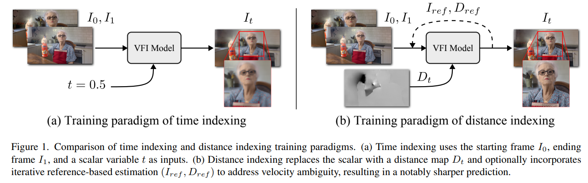
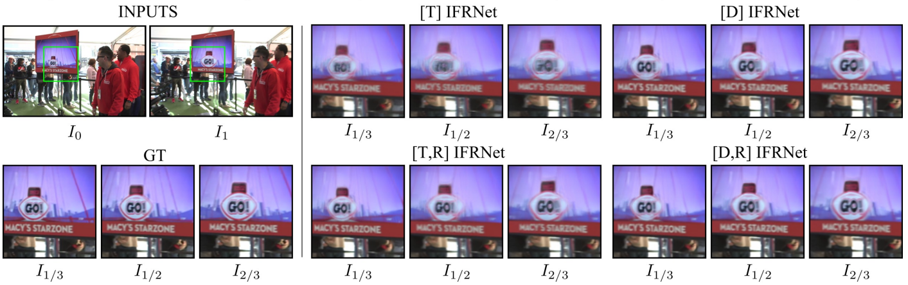

# Clearer Frames, Anytime: Resolving Velocity Ambiguity in Video Frame Interpolation

> "Clearer Frames, Anytime: Resolving Velocity Ambiguity in Video Frame Interpolation" Arxiv, 2023 Nov :+1:
> [paper](http://arxiv.org/abs/2311.08007v1) [code]() [website](https://zzh-tech.github.io/InterpAny-Clearer/)
> [pdf](./2023_11_Arxiv_Clearer-Frames--Anytime--Resolving-Velocity-Ambiguity-in-Video-Frame-Interpolation.pdf)
> Authors: Zhihang Zhong, Gurunandan Krishnan, Xiao Sun, Yu Qiao, Sizhuo Ma, Jian Wang

## Key-point

- Task: VFI, video editing(re-timing)

- Problems

  velocity ambiguity in video frame interpolation：struggles to predict precise object movements. 

- :label: Label:

addressed velocity ambiguity in video frame interpolation, leading to: Clearer anytime frame interpolation & Manipulated interpolation of anything

实现插帧后的视频在任意时刻均保持清晰；改动物体在插帧视频中的轨迹

1. distance indexing 代替先前 time-indexing 方法（让模型预测 timestep 与位置的对应）
2. propose an iterative reference-based estimation strategy that breaks down a long-range prediction into several short-range steps.
   plug-and-play strategies

提出的方法都可以 plug&play 直接移植到现有方法

## Contributions

1. 发现现有 VFI 方法预测运动存在模糊的原因 velocity ambiguity

2. 提出 distance-indexing

3. 使用先前预测结果作为 referenced 降低累计误差

   提出的 2 个模块可以移植到现有方法上

## Introduction

## methods

### velocity ambiguity 

探索先前方法模糊的原因，两帧之间插帧，但可能物体在这两帧之间运动的速度有变化，因此插帧可以有多个对应。而先前模型无法学习到这种速度差异，只是在平均，从而导致了模糊。

先前方法对比

> calculating a path distance ratio map �� to replace the time � for index-based learning

### Iterative reference-based estimation

类似视频 recurrent setup，用先前一小段的预测作为输入，降低累计误差

### Editing

有了输入的 distance，可以修改这个 distance 实现物体运动轨迹的编辑

## Experiment

> ablation study 看那个模块有效，总结一下

提出的方法都可以 plug&play 直接移植到现有方法

## Limitations

1. 提出的方法要有轨迹作为输入，但本文中轨迹输入是认为指定的
2. 提出的方法没有办法预测 possible trajectory
3. 本文使用的 distance map 为固定匀速的，实际不是

## Summary :star2:

> learn what & how to apply to our task

1. 学习科研思路，如何从问题着手进行改进
   分析先前方法存在模糊的原因，再进行改进 >> 两帧之间运动的速度可能有差异，训练时候同一时刻 t 对应到了不同细分位置的图，导致了预测的模糊

