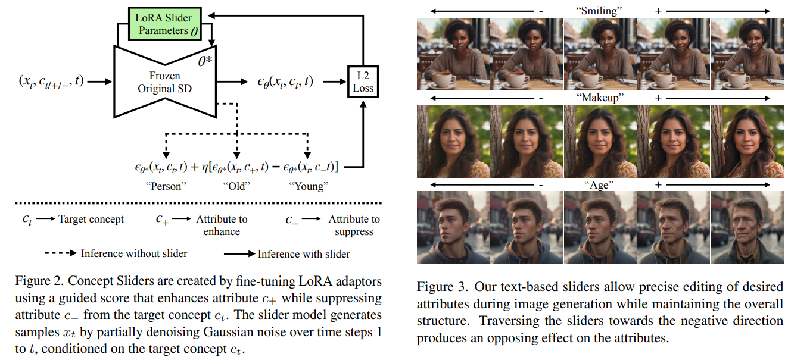
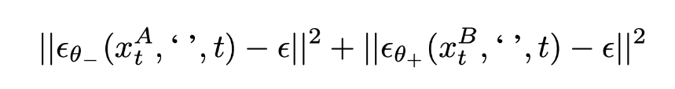

# Concept Sliders: LoRA Adaptors for Precise Control in Diffusion Models

> "Concept Sliders: LoRA Adaptors for Precise Control in Diffusion Models" Arxiv, 2023 Nov 20 :star:
> [paper](http://arxiv.org/abs/2311.12092v2) [web](https://sliders.baulab.info/) [code](https://github.com/rohitgandikota/sliders) [pdf](./2023_11_Arxiv_Concept-Sliders--LoRA-Adaptors-for-Precise-Control-in-Diffusion-Models.pdf) [note](./2023_11_Arxiv_Concept-Sliders--LoRA-Adaptors-for-Precise-Control-in-Diffusion-Models_Note.md)
> Authors: Rohit Gandikota, Joanna Materzynska, Tingrui Zhou, Antonio Torralba, David Bau

## Key-point

- Task: image controllable edit
- Problems
- :label: Label:

## Contributions

探索对 Diffusion Model Weights **模型权重进行编辑**，找到类似 StyleGAN 特征空间的空间，实现可控编辑；

## Introduction

## methods

- Q:How to control concepts in a model?

reducing the probability of an attribute *c**-* and boost the probability of attribute *c**+* in an image when conditioned on *t*

用文本对去微调模型

 using the ideas of [classifier-free guidance](https://arxiv.org/pdf/2207.12598.pdf) at training time rather than inference. 

We find that fine-tuning the slider weights with this objective is very effective, producing a plug-and-play adaptor that directly controls the attributes for the target concept

- Q：文本如何设计？

**发现只替换 adj，找到的方向是耦合的！加上更多限定词**

> The arrow in the red is the original age direction trained **using just "old" and "young" prompts. However, the direction is entangled with race**. Instead we build a new disentangled direction (in blue) using multiple prompts to exclusively make the new vector invariant in those directions. For example, "asian old person" and "asian young person". We do that with all the races for race disentanglement.

To avoid undesired interference with the edits and allow precise control, we propose finding directions that preserve a set of **protected concepts**. For example instead of finding the direction from "young person" to "old person", we find a direction that preserves race by particularly mentioning a set of protected attributes to preserve, like "Asian young person" to "Asian old person".

- Q：有场景只加上文本不是很好！train the image based on gradient difference ？？ 怎么做

> To train sliders for concepts that can not be described with text prompts alone, we propose **image pair based training.**

### Sliders to Improve Image Quality

Stable Diffusion XL is that, although their image output can often suffer from distortions such as warped or blurry objects

### Controlling Textual Concepts

## setting

## Experiment

> ablation study 看那个模块有效，总结一下

## Limitations

## Summary :star2:

> learn what & how to apply to our task

- **发现只替换 adj，找到的方向是耦合的！加上更多限定词**

### how to apply to our task

- 视频修复，多张图物体是一样的，解耦一下
  1. 生成物体纹理图
  2. 去匹配

- 细节修复！

  https://github.com/rohitgandikota/sliders/issues/76#issuecomment-2099766893 :star:

