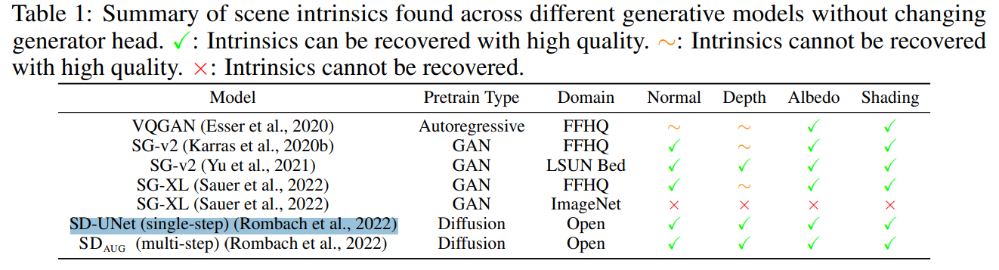

# Generative Models: What Do They Know? Do They Know Things? Let's Find Out!

> "Generative Models: What Do They Know? Do They Know Things? Let's Find Out!" Arxiv, 2023 Nov 28
> [paper](http://arxiv.org/abs/2311.17137v3) [code]() [pdf](./2023_11_Arxiv_Generative-Models--What-Do-They-Know--Do-They-Know-Things--Let's-Find-Out-.pdf) [note](./2023_11_Arxiv_Generative-Models--What-Do-They-Know--Do-They-Know-Things--Let's-Find-Out-_Note.md)
> Authors: Xiaodan Du, Nicholas Kolkin, Greg Shakhnarovich, Anand Bhattad

## Key-point

- Task
- Problems
- :label: Label:

## Contributions

- 最少需要多少参数量去生成图像？

> a small Low-Rank Adaptators (LoRA) can recover intrinsic images—depth, normals, albedo and shading—across different generators (Autoregressive, GANs and Diffusion) while using the same decoder head 

- 需要多少数据，250个图像

> we find that as few as 250 labeled images are enough to generate intrinsic images with these LoRA modules

- positive correlation between the generative model’s quality and the accuracy of the recovered intrinsics through control experiments.

## Introduction

- Q：diffusion 会学习到哪些属性？

> Zhan et al. (2023) showed that diffusion models can understand 3D scenes in terms of geometry and shadows.
>
> Chen et al. (2023) found that Stable Diffusion’s internal activations encode depth and saliency maps that can be extracted with linear probes.

> Instead of blindly scaling up with more data and parameters, we could focus on enhancing the model’s ability to capture and recover intrinsic properties.

## methods

## setting

## Experiment

> ablation study 看那个模块有效，总结一下

## Limitations

## Summary :star2:

> learn what

### how to apply to our task

