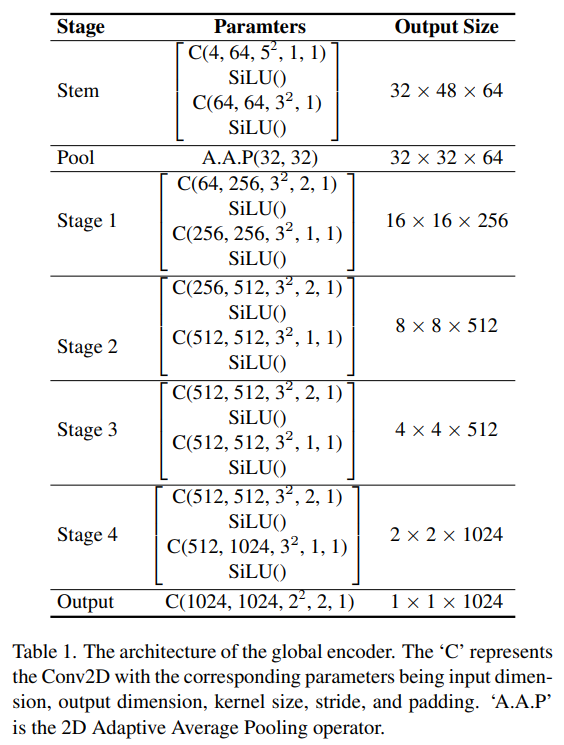

# I2VGen-XL: High-Quality Image-to-Video Synthesis via Cascaded Diffusion Models

> "I2VGen-XL: High-Quality Image-to-Video Synthesis via Cascaded Diffusion Models" Arxiv, 2023 Nov 7
> [paper](http://arxiv.org/abs/2311.04145v1) [code](https://i2vgen-xl.github.io) [pdf](./2023_11_Arxiv_I2VGen-XL--High-Quality-Image-to-Video-Synthesis-via-Cascaded-Diffusion-Models.pdf) [note](./2023_11_Arxiv_I2VGen-XL--High-Quality-Image-to-Video-Synthesis-via-Cascaded-Diffusion-Models_Note.md)
> Authors: Shiwei Zhang, Jiayu Wang, Yingya Zhang, Kang Zhao, Hangjie Yuan, Zhiwu Qin, Xiang Wang, Deli Zhao, Jingren Zhou

## Key-point

- Task
- Problems
- :label: Label:

## Contributions

## Introduction

## methods

> “D.Enc.” and “G.Enc.” denote the detail encoder and global encoder, respectively.

训练分为2阶段，refinement stage 微调进行细节提升；3DUnet 基于 VideoComposer

### **Base stage**

> Based on a VLDM, we design the first stage at low resolutions (i.e., 448×256), which primarily focuses on incorporating multi-level feature extraction, including highlevel semantics and low-level details learning

- Q：text condition 如何提取特征？

> Stable diffusion [35] and DALL-E 2 [34] apply CLIP [32] text encoder, and Imagen [36] applies the T5 to improve text-image alignment and image quality

-  Q：image 如何作为 condition 输入？

> embedded into each spatial layer of the 3D UNet using cross-attention

**High-level semantics learning** 对 CLIP image feature 优化

使用 CLIP-image encoder 效果不行，细节缺失

> apply the visual encoder of CLIP to extract the semantic features.
>
> However, we observed that this approach resulted in poor preservation of the content and structure of the input image in the generated videos. The main reason is that **CLIP’s training objective is to align visual and language features, which leads to learning high-level semantics but disregards the perception of fine details** in the images

再训练一个 Encoder 提取细节特征

> To alleviate this issue, we incorporate an additional trainable global encoder (i.e, G.Enc.) to learn complementary features with the same shape, whose architecture is shown in Tab. 1.

### **Refinement stage**

>  From the base model, we can obtain a low-resolution video with diverse and semantically accurate motions. However, these videos may suffer from various issues such as noise, temporal and spatial jitter, and deformations. Thus the refinement model has two main objectives: i) to enhance the video resolution, increasing it from 448 × 256 to 1280 × 720 or higher;

发现在更高分辨率上微调能够大幅降低 artifact 

`class I2VGenXLUNet`

> https://vscode.dev/github/HL-hanlin/Ctrl-Adapter/blob/main/i2vgen_xl/models/unets/unet_i2vgen_xl.py#L104
>
> https://huggingface.co/ali-vilab/i2vgen-xl/blob/main/unet/config.json

## Setting

- Dataset

  Web-10M, LAION-400M

3亿个视频，60亿个图像

> 35 million videos and 6 billion images, with resolutions ranging from 360p to 2k.

数据筛选预处理

> sorted them based on aesthetic score, motion intensity, and proportion of the main subject. This facilitates training with balanced samples.

## Experiment

> ablation study 看那个模块有效，总结一下

- 对比当前商用 SOTA

reference 图像的细节还是丢失了，例如鱼鳞没了，**说明再训练一个 image encoder 也没能很好解决 CLIP-image feature 特征不够细致的问题**

- 多种类别推理效果展示

**验证了前面再训练一个 Image Encoder 提升 CLIP feature 的意义不大，从预训练的特征上着手不好搞**

- 人体生成结果

- Frequency spectrum analysis??

## Limitations

## Summary :star2:

> learn what & how to apply to our task

- Frequency spectrum analysis??
- 验证了前面再训练一个 Image Encoder 提升 CLIP feature 的意义不大，从预训练的特征上着手不好搞
