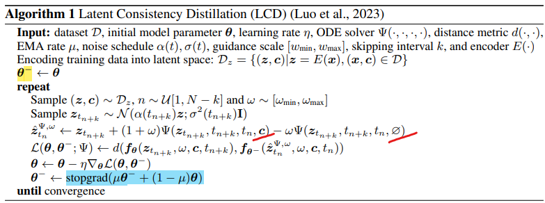
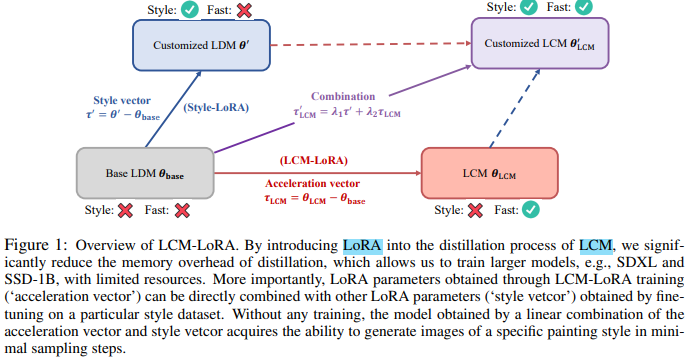
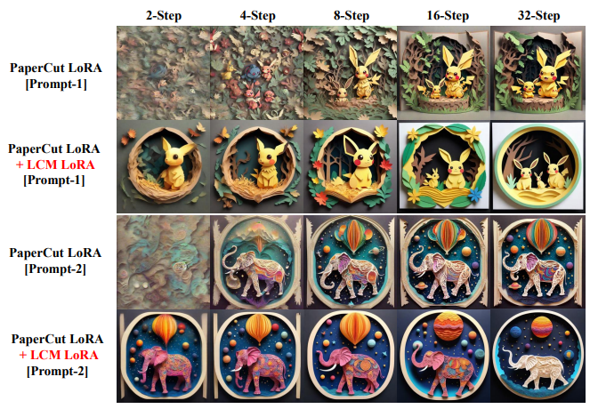

# LCM-LoRA: A Universal Stable-Diffusion Acceleration Module

> "LCM-LoRA: A Universal Stable-Diffusion Acceleration Module" Arxiv, 2023 Nov
> [paper](http://arxiv.org/abs/2311.05556v1) [code](https://github.com/luosiallen/latent-consistency-model) 
> [pdf](./2023_11_Arxiv_LCM-LoRA--A-Universal-Stable-Diffusion-Acceleration-Module.pdf)
> Authors: Simian Luo, Yiqin Tan, Suraj Patil, Daniel Gu, Patrick von Platen, Apolinário Passos, Longbo Huang, Jian Li, Hang Zhao

## Key-point

- Task: Diffusion 加速
- 现有问题：Diffusion 推理太慢
- :label: Label:

类似 DDIM 等 PF-ODE solver, LCM-LoRA 可以看作 plug-in neural PF-ODE solver

## Contributions

1. 提出 universal **training-free** acceleration module that can be directly **plugged into** various Stable-Diffusion (SD) 实现加速

## Related Work

> - :question: classifier-free guidance ?
> - DDIM?
> - CM?
> - LoRA?
> - PF-ODE? [Probability flow ODE与DDIM](https://zhuanlan.zhihu.com/p/645665386)

问题：针对 Diffusion 推理太慢；

Efforts to accelerate LDMs generally fall into two categories: **ODE-Solvers** ；**distillation of LDM**

- PF-ODE Solvers

  例如 DDIM 等方法，目的减少推理步数。计算仍然很大，尤其当使用 classifier-free guidance 时候

- 蒸馏方法

  Guided-Distill 计算量太大。仍然需要一种方法平衡速度 & 生成质量

### Consistency Models

TODO

### Latent Consistency Models (LCMs)

> "Latent Consistency Models: Synthesizing High-Resolution Images with Few-Step Inference"
> [paper](https://arxiv.org/abs/2310.04378) [website](https://latent-consistency-models.github.io/)

将反向去噪视为 augmented probability flow ODE (PF-ODE) problem；
predict the solution in the latent space, bypassing the need for iterative solutions through numerical ODE-Solvers. This results in a remarkably efficient synthesis of high-resolution images, taking only 1 to 4 inference steps；推理效率高 & distillation 只要 32h A100 hour；
**Motivation：对 LDM 微调，实现在小数据集上能够又 few steps 生成的效果**

LCF: fine-tune pre-trained LCMs without starting from the teacher diffusion model; 缺点需要针对数据集 finetune

LCM-LoRA, a universal training-free acceleration module that can be directly plugged into various Stable-Diffusion (SD) ；类比 DDIM，可以看作 neural-based PF-ODE solver

### Parameter-Efficient Fine-Tuning

> "LoRA: Low-Rank Adaptation of Large Language Models"
> [paper](https://arxiv.org/abs/2106.09685) [code](https://github.com/microsoft/LoRA)
> [blog](https://zhuanlan.zhihu.com/p/646791309) [苏剑林老师 LoRA 博客](https://spaces.ac.cn/archives/9590)
>
> 调整所有参数的称为 full-finetuning

LoRA 用一个 Low Rank Matrix 表示需要 finetune 的部分模型参数，**LORA**是一种低资源微调大模型方法，训练参数仅为整体参数的万分之一、GPU显存使用量减少2/3且不会引入额外的推理耗时。

## methods

- LCD（LCM 论文）
  理解为对 Stable Diffusion 进行微调的过程

  

### LoRA Distillation for LCM

将需要更新的 $\triangle{W}$ 进行低秩分解，降低需要更新的参数量，降低显存

> SD-v1.5 需要微调的参数量从 980M -> 67.5M

$$
h=W_0x+\Delta Wx=W_0x+BAx
$$

### universal acceleration Moudle

employing LoRA for the distillation process

针对指定数据集微调，实现只合成指定风格图像下，大幅提速生成速度

效果：比直接用 LoRA 速度更快 & 效果更好

> R1C5 和 R2C2 很相似，**是否可以理解成去噪为 latent-space 的一条路径**，只不过 LCM-LoRA 能够直接到关键节点？

从向量的角度融合，**acceleration vector 和 Full-finetune 向量加权融合一下**得到一个 trade-off 质量和速度的向量

## Experiment

> ablation study 看那个模块有效，总结一下

## Limitations

## Summary :star2:

> learn what & how to apply to our task

