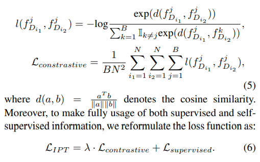

# SeeSR: Towards Semantics-Aware Real-World Image Super-Resolution

> "SeeSR: Towards Semantics-Aware Real-World Image Super-Resolution" Arxiv, 2023 Nov
> [paper](http://arxiv.org/abs/2311.16518v1) [code]() 
> [pdf](./2023_11_Arxiv_SeeSR--Towards-Semantics-Aware-Real-World-Image-Super-Resolution.pdf)
> Authors: Rongyuan Wu, Tao Yang, Lingchen Sun, Zhengqiang Zhang, Shuai Li, Lei Zhang

## Key-point

- Task: Diffusion Prior based Real-ISR

- Problems(Motivation)

  heavy quality degradation of input low-resolution (LR) images, the destruction of local structures can lead to ambiguous image semantics

  present a semantics-aware approach to better preserve the semantic fidelity of generative real-world image super-resolution

- :label: Label: generative priors

present a semantics-aware approach to better preserve the semantic fidelity of generative real-world image super-resolution.
generate accurate soft and hard semantic prompts

针对严重的退化，生成不同的内容都可以。**先去生成语义信息，通过理解图像场景，来固定生成什么内容，明确地去生成**

例如针对网格，处理的更好

## Contributions

## Introduction

> 按文章找文章

### simple and known degrade ISR

> often yield over-smoothed outcomes due to their fidelity-focused learning objectives

- "Pre-trained image processing transformer" CVPR, 2022, `IPT`

utilize a task-specific embedding as an additional input of the decoder. These task-specific embeddings $E^i_t \in \mathbb{R}^{P^2 \times C} , i = \{1, . . . , N_t\}$ are learned to decode features for different tasks

对于 Transformer Decoder，输入图像经过 encoder 的特征 $f_{Ei}$ 作为 z0, 额外针对每个任务学习 $E_t$ 可学习参数；每次先用 decoder 上一层特征 $z_{i-1}$ 和加上 task 参数的特征做 cross attention，将结果再加上 task 参数，再和原始 decoder 输入 $z_0$ 做 cross attention

- 对比学习 loss
  aims to minimize the distance between patched features from the same images while maximize the distance between patches from different images

  每一项是 $loss=-\log\{p\}$, 当概率接近 1, loss 接近0，概率p接近 0, loss 正无穷；当同一张图的 patch 之间余弦相似度=1（最相似），不同图之间的 patch 相似度很小，概率 p=1 满足需求 （N 为图像 patch 个数，B 为样本个数l）

  

### GAN ISR

> use adversarial loss to generate perceptually realistic details
>
> 1. 数据少&不好 degradations are much more complex: **domain gap** between the synthetic training data and the real-world test data
> 2. GAN loss 训练不稳定，有 artifact

- "Learning a deep convolutional network for image super-resolution" ECCV, 2014, SRCNN
  [website]([Learning a Deep Convolutional Network for Image Super-Resolution (cuhk.edu.hk)](http://mmlab.ie.cuhk.edu.hk/projects/SRCNN.html))
  Chao Dong1, Chen Change Loy1, Kaiming He2, and Xiaoou Tang1 

  "Image Super-Resolution Using Deep Convolutional Networks" TPAMI, 2014 Dec, SRCNN
  [paper](https://arxiv.org/abs/1501.00092)

  图像超分的开山之作，提出了基于深度学习的单图超分方法

- "Photo-Realistic Single Image Super-Resolution Using a Generative Adversarial Network" CVPR, 2016 Sep, `SRGAN, SRResNet`
  [paper](https://arxiv.org/abs/1609.04802)

- "ESRGAN: Enhanced Super-Resolution Generative Adversarial Networks" ECCV, 2018 Sep, **ESRGAN(Enhanced SRGAN)** :star:
  [paper](https://arxiv.org/abs/1809.00219) [code](https://github.com/xinntao/ESRGAN)

关注 RRDB 模块 >> 图中的 “basic blocks” (e.g., residual block [18], dense block [34], RRDB)

### 收集 HR-LR Real-ISR 数据

- "Toward Real-World Single Image Super-Resolution: A New Benchmark and A New Model" ICCV, 2019 Apr
  [paper](https://arxiv.org/abs/1904.00523)

  > 最优化方式去学习 alignment 怎么实现？

collect real-world LR-HR image pairs using long-short camera focal lens
**有一个最优化公式实现 alignment**，迭代去计算仿射变换矩阵，亮度，从 LR 图像扣除 GT 对应 LR 区域；由于是优化变换矩阵得到的 LR，存在不对齐！

Laplacian Pyramid based Kernel Prediction Network  >> [Laplacian blog](https://blog.csdn.net/qq_45832961/article/details/122429117)

使用 Laplacian 算子提取边缘作为全局残差跳连 ，图像边缘检测大幅度地减少了数据量，并且剔除了可以认为不相关的信息，**保留了图像重要的结构属性**；
Laplacian pyramid, using small kernels can leverage rich neighborhood information for super-resolution.

- "Component divide-and-conquer for real-world image super-resolution." ECCV, 2020 Aug, `CDC`
  [paper](https://arxiv.org/abs/2008.01928)

 three attentive masks learnt by our CDC which well predict the confidence of flat, edges and corner region；
分解为 Flat, edge, Corner Point 特征顺序处理

Framework: 用关键点检测网络 Hourglass Block 去分别检测 Flat, edge, corner 区域特征，相加；

Each CAB branch produces an attentive mask and an intermediate SR. This mask regularizes the produced intermediate SR; HGSR replaces RBs with Residual Inception Blocks (RIBs)

- hourglass (HG) architecture: capture information at every scale and has a superior performance for keypoint detection

  "Stacked hourglass networks for human pose estimation" [paper](https://arxiv.org/pdf/1603.06937.pdf)

  CDC 里面的 HG blocks 之间没有循环的使用上一个 block 预测的输出，增加各个 backbone 特征差异性

  

1. $L_{is}$ : Me is the component guidance mask extracted from HR images
2. Gradient-Weighted Loss 类似 Sobel 边缘，针对边缘区域计算 loss
   Inspired by Focal loss [15], we propose to suppress a large number of simple regions while emphasizing the hard ones
   

### 合成真实退化

> simulate the complex real-world image degradation process using **random combinations of basic degradation operations**

- "Real-esrgan: Training real-world blind super-resolution with pure synthetic data" ICCV, 2021

- "Designing a practical degradation model for deep blind image super-resolution" ICCV, 2021
  [paper](https://arxiv.org/pdf/2203.09195.pdf)

- "Desra: Detect and delete the artifacts of gan-based real-world super-resolution models" Arxiv, 2023

- "Efficient and degradation-adaptive network for real-world image super-resolution." ECCV, 2022

- "Human guided ground-truth generation for realistic image super-resolution" CVPR, 2023

有了更好的合成数据，more realistic synthetic training pairs, GAN-based Real-ISR still tend to introduce many unpleasant visual artifacts due to the unstable adversarial training

- "Details or artifacts: A locally discriminative learning approach to realistic image super-resolution" CVPR, 2022, LDL 
  [paper](https://arxiv.org/abs/2203.09195) [code](https://github.com/csjliang/LDL)

> The LDL [29] can suppress much the visual artifacts by **detecting the problematic pixels using local image statistics** :star:

对 GAN 合成的效果归类总结，含有更多细节的 patch PSNR 更低 >> 按 PSNR 衡量 SR 难度等级合理

 left is an LR patch and the right is its ESRGAN result

1. Type A patches represent regions that are easy to super-resolve

2. type B patches are perceptually realistic despite the pixel-wise differences to the ground-truth 

   type B and type C are with fine-scale details, which are hard to be faithfully restored due to the **signal aliasing** in the LR inputs

   合成很真实，但合成的内容和 GT 里面差异很大，PSNR 出来不是很准

   原因： patterns are naturally irregular with **weak priors for observers** 没有足够信息，直接去猜测

3. type C patches exhibit perceptually unpleasant visual artifacts since the overshoot pixels and distorted structures are sensitive to human perception

   合成很多虚假噪点，人眼很容易分辨，这些 artifact 导致 PSNR 低

> Type B, C 可以用 IQA 指标衡量区分一下？

分析上述 Type ABC 合成结果的原因，看看就好；
Though the pixels in texture-like type B patch are not faithfully reconstructed, the perceptual quality of the reconstructed patch is not bad due to the **random distribution of pixels in HR patch**

MAD 也可以区分不同 SR 难度等级

**Framework**：使用 ESRGAN 作为 backbone，outputs of two GAN-SR models >> $R_i = I_{HR} − I_{SR}$

对 SR 结果，设置 kernel 计算窗口内方差，将这个统计量当作平滑系数

设计原因：可视化了一下 loss，发现 $\abs{R_1} < |R_2|$ 含有很多高频噪声，将这部分 loss 权重设置低一点，**让模型主要去学另一部分平滑区域的 loss**

**将 reconstruction loss 增加一个平滑系数** $M_{refine}$ ，这个 map 时是统计出来的

### Diffusion ISR

Limitation: assuming simple downsampling degradation

- "Denoising diffusion restoration models" NIPS, 2022, `DDRM`
  [paper](https://arxiv.org/abs/2201.11793) [code](https://ddrm-ml.github.io/)

  

- "Image super-resolution via iterative refinement." TPAMI, 2022

- "Zero-shot image restoration using denoising diffusion null-space model." Arxiv, 2022

### Diffusion-prior  ISR

> they still have some limitations: 
>
> 1. StableSR & DiffBIR overlooking the role of semantic text information
> 2. PASD [59] attempts to utilize off-the shelf high-level models to extract semantic prompts as additional control conditions 
>    与本文方法很类似，encounters difficulties when dealing with scenes containing a variety of objects or severely degraded images

- "Exploiting diffusion prior for real-world image super-resolution." Arxiv, 2023 May, StableSR :star:
  [paper](https://arxiv.org/pdf/2305.07015.pdf) [code](https://github.com/IceClear/StableSR)

Features are combined with trainable spatial feature transform (SFT) layers.
introduce a controllable feature wrapping (CFW) module to obtain a tuned feature Fm in a residual manner.

 proposed aggregation sampling 解决原始图 crop patch 做 SR 各个 patch 之间存在不一致现象

- "DiffBIR: Towards Blind Image Restoration with Generative Diffusion Prior" Arxiv, 2023 Aug :statue_of_liberty:
  [paper](https://arxiv.org/abs/2308.15070) [code](https://github.com/xpixelgroup/diffbir) [website](https://0x3f3f3f3fun.github.io/projects/diffbir/)
  [note](./2023_08_Arxiv_DiffBIR--Towards-Blind-Image-Restoration-with-Generative-Diffusion-Prior_Note.md)

两阶段方法，模仿 Real-ESRGAN 针对 real-world 模拟数据用 SwinIR 预修复出图；将图过 Stable Diffusion 用 ControlNet 方式加入 decoder 中实现控制。

- "Pixel-aware stable diffusion for realistic image super-resolution and personalized stylization" Arxiv, 2023 Aug, PASD 
  [paper](https://arxiv.org/abs/2308.14469) [code](https://github.com/yangxy/PASD)

captions generated by BLIP struggle to comprehensively describe the semantic information in images；

融入语义信息，例如文本 tag；增加控制性，针对严重退化，合成多种情况都可以的时候，固定一种增加确定性

simply adding the feature maps from the two networks may fail to pass pixel-level precise information, leading to structure inconsistency between the input LQ and output HQ images

问题：直接用 ControlNet 把特征直接相加，会有内容不一致问题

StableSR 直接再 decoder 外面加残差跳连处理一下，再加入到 decoder>> However, this introduces additional training in image feature domain, limits the application of the trained network to tasks performed in latent space

就是需要一个非对齐特征融合模块》》直接上 Transformer 做对齐，latent code 作为 x，输入 LR 的特征 y 作为 KV

**Ablation Study**

- "CoSeR: Bridging Image and Language for Cognitive Super-Resolution" Arxiv, 2023 Nov
  [paper](https://arxiv.org/abs/2311.16512) [code](https://github.com/VINHYU/CoSeR) [website](https://coser-main.github.io/)

#### Off-the-shelf Feature

- "Blip: Bootstrapping language-image pre-training for unified vision-language understanding and generation" PMLR, 2022

  提取 caption

- "Towards Robust Blind Face Restoration with Codebook Lookup Transformer" NeurIPS, 2022 Jun, CodeFormer :statue_of_liberty:
  [paper](https://arxiv.org/abs/2206.11253) [code](https://github.com/sczhou/CodeFormer) [website](https://shangchenzhou.com/projects/CodeFormer/)

## methods

1. 提取描述图像的 tag 文本
2. DiffBIR 类似方式，使用 ControlNet 方式融入文本引导

### Image Encoder

- Q：Image Encoder 结构？

  Image Encoder 结构使用 ControlNet 原文中的 image encoder " Adding conditional control to text-to-image diffusion models"

> we use a **tiny network E(·) of four convolution layers with 4 × 4 kernels and 2 × 2 strides** (activated by ReLU, using 16, 32, 64, 128, channels respectively, initialized with Gaussian weights and trained jointly with the full model) to encode an image-space condition ci into a feature space conditioning vector cf

### Tagging Model

### finetune :star:

finetune the entire DAPE module from RAM [71] using LORA (r = 8) [22] for 20k iterations

### LR embedding

去除虚假噪声

## Experiment

> ablation study 看那个模块有效，总结一下

- The training process is conducted on 512×512 resolution images with 8 NVIDIA Tesla 32G-V100 GPUs

## Limitations

## Summary :star2:

> learn what & how to apply to our task

1. 针对文字 or 经典的图标，利用 “素材库” 辅助 SR，去噪

   素材库可以是指定时期的素材，例如 90年代老电话，减少搜索范围，不太可能出现的 iphone15 就不需要；

   针对老电影，结合 LoRA 在指定时期的素材库上微调 stable diffusion，提速 + 指定时期的细节；弄出来多个年代版本的 stable diffusion. （多个模型之间蒸馏一下？）
   
2. 
