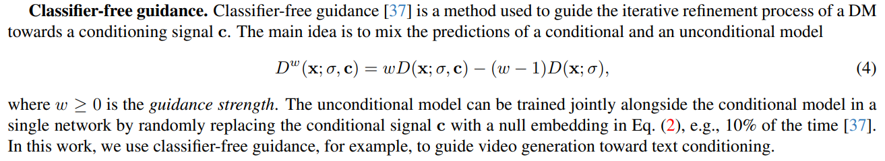
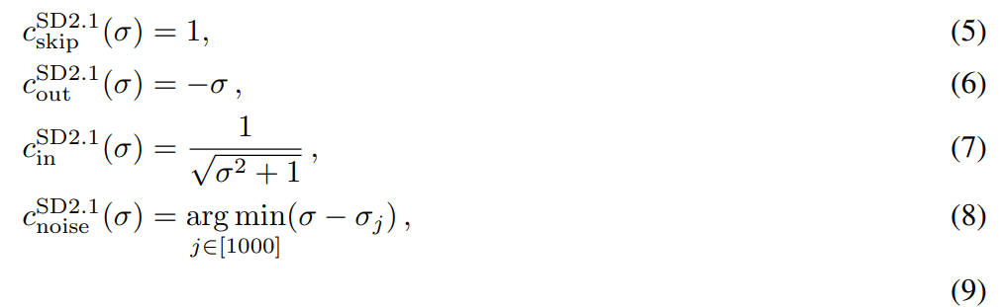
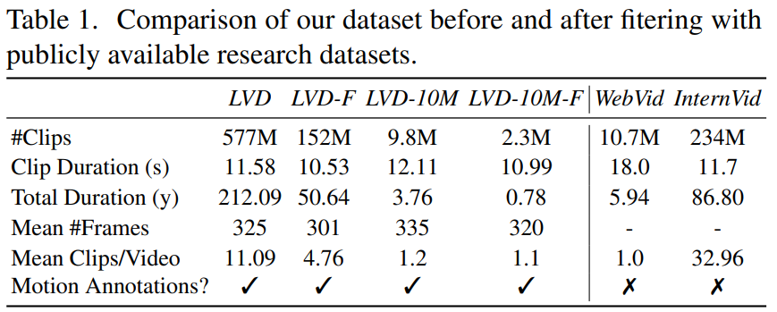
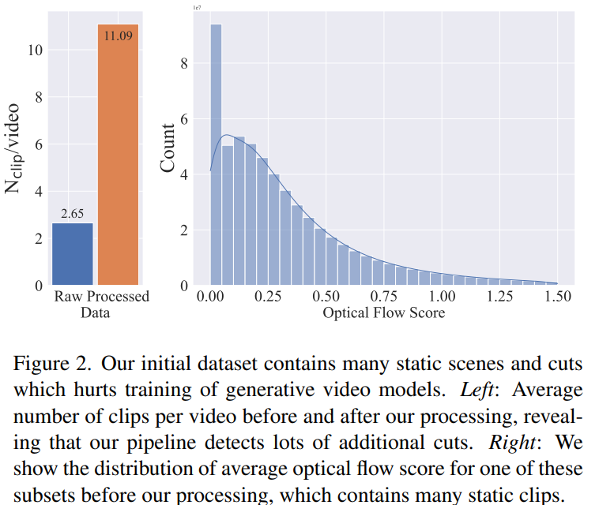
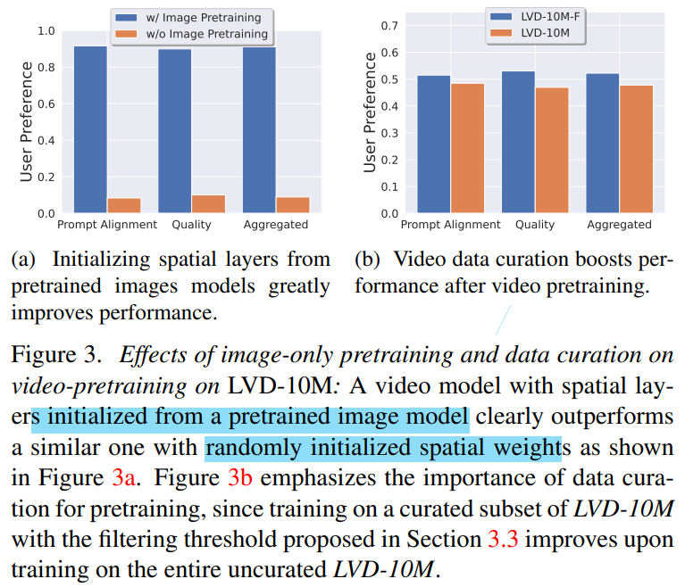

# Stable Video Diffusion: Scaling Latent Video Diffusion Models to Large Datasets

> "Stable Video Diffusion: Scaling Latent Video Diffusion Models to Large Datasets" Arxiv, 2023 Nov 25
> [paper](http://arxiv.org/abs/2311.15127v1) [code](https://github.com/Stability-AI/generative-models) [pdf](./2023_11_Arxiv_Stable-Video-Diffusion--Scaling-Latent-Video-Diffusion-Models-to-Large-Datasets.pdf) [note](./2023_11_Arxiv_Stable-Video-Diffusion--Scaling-Latent-Video-Diffusion-Models-to-Large-Datasets_Note.md)
> Authors: Andreas Blattmann, Tim Dockhorn, Sumith Kulal, Daniel Mendelevitch, Maciej Kilian, Dominik Lorenz, Yam Levi, Zion English, Vikram Voleti, Adam Letts, Varun Jampani, Robin Rombach
>
> third party training code: https://github.com/pixeli99/SVD_Xtend

## Key-point

- Task
- Problems
- :label: Label:


we dub Large Video Dataset (LVD), consists of 580M annotated video clip pairs, forming 212 years of content.


## Contributions

## Introduction

### CFG




### EDM

> https://zhouyifan.net/2024/06/05/20240405-SVD/

- "Elucidating the Design Space of Diffusion-Based Generative Models"

> 这篇论文用一种概括性较强的数学模型统一表示了此前各种各样的扩散模型结构，并提出了改进版模型的训练及采样策略。简单来说，EDM 把扩散模型不同时刻的噪声强度表示成 $\sigma_t$，它表示在 $t$ 时刻时，对来自数据集的图像加了标准差为 $\sigma_t$ 的高斯噪声 $\mathcal{N}(\mathbf{0}, \sigma_t^2\mathbf{I})$。一开始，对于没加噪声的图像，$\sigma_0=0$。对于最后一个时刻 $T$ 的图像，$\sigma_T$ 要足够大，使得原图像的内容被完全破坏。

仅关注其中最重要的一条改进：**将离散噪声改进成连续噪声**

> EDM 论文指出，**$t$ 实际上表示了噪声强度 $\sigma_t$，应该把 $\sigma_t$ 输入进模型**。与其用离散的 $t$ 训练一个只认识离散噪声强度的去噪模型，不如训练一个认识连续噪声强度 $\sigma$ 的模型。这样，在采样 $n$ 步时，我们不再是选择离散去噪时刻`[timestep[n], timestep[n - 1], ..., 0]`，而是可以**选择连续噪声强度**`[sigma[n], sigma[n - 1], ..., 0]` 。这样采样更灵活，效果也更好。

在第一个训练阶段中，SVD 照搬了 EDM 的这种训练方法，改进了原来的 DDPM。

> 见 Appendix D.2




> One issue with the training of SD 2.1 (and in particular its noise distribution p(σ)) is that even for the maximum discrete noise level σ1000 the signal-to-noise ratio [53] is still relatively high which results in issues when, for example, generating very dark images [34, 56].


## methods

> 模型结构看 Appendix D
>
> https://zhouyifan.net/2024/06/05/20240405-SVD/

**训练的三个阶段**：文生图预训练、视频预训练、高质量视频微调

- Stage I: image pretraining, i.e. a 2D text-to-image diffusion model [13, 64, 71]. 

  先不加 temporal layer 在图像数据上训练

- Stage II: video pretraining, which trains on large amounts of videos. 

  插入 temporal layer （VideoLDM 中的） 在 14 帧 256x384 提出的数据集 LVD 上训练

- Stage III: video finetuning, which refines the model on a small subset of high-quality videos at **higher resolution**

  Next, we finetune the model to generate 14 320 × 576 frames for 100k iterations using **batch size 768.**


### Data

> 这一阶段的目标是得到一个过滤后的高质量数据集 LVD-F。为了找到这样一种合适的过滤方案，开发团队先用排列组合生成了大量的过滤方案：对每类指标（文本视频匹配度、美学分数、帧率等）都设置 12.5%, 25% 或 50% 的过滤条件，然后不同指标的条件之间排列组合。之后，开发团队抽取原数据集的一个子集 LVD-10M，用各个方案得到过滤后的视频子集 LVD-10-F。最后，用这样得到的子数据集分别训练模型，比较模型输出的好坏，以决定在完整数据集上使用的最优过滤方案。

WebVid-10M 用于 image,video 联合训练，训出来的视频模型可能没法区分图像 or 视频数据

> WebVid-10M [7] dataset has been a popular choice [9, 82, 115] despite being watermarked and suboptimal in size.
>
> Additionally, WebVid-10M is often used in combination with image data [80], to enable **joint image-video training**. This amplifies the diffculty of separating the effects of image and video data on the final model.

提出 Large Video Dataset (LVD) 数据集，5亿个视频片段

> Large Video Dataset (LVD), consists of **580M annotated video clip pairs, forming 212 years of content.**




- Q：避免切片不准？

用 pySceneDetect 在 3 个不同的 FPS 上切片，避免切片不准；长视频有很多 clips



- Q：caption 方法？

> we use the image captioner **CoCa** [108] to annotate the mid-frame of each clip and use **V-BLIP** [109] to obtain a video-based caption.Finally, we generate a third description of the clip via an **LLM-based summarization** of the first two captions.

- Q：发现一开始收集的部分数据，会降低模型训练效果？

总结是以下数据导致效果变差 :star:

> clips with less motion, excessive text presence, or generally low aesthetic value

预测光流去去除掉上面效果较差的数据

> We therefore additionally annotate our dataset with dense optical flow [24, 48], which we calculate at 2 FPS and with which we **filter out static scenes** by removing any videos whose average optical flow magnitude is below a certain threshold

去除含有大量文字的图

> Moreover, we apply optical character recognition [5] to weed out clips containing large amounts of written text.

计算 text-image 相似度，美学分数（LAION-5B 中使用）

> Lastly, we annotate the first, middle, and last frames of each clip with CLIP [66] embeddings from which we **calculate aesthetics scores [80] as well as text-image similarities.**


####  Video pretrain


>  we start from an unfiltered, randomly sampled 9.8M-sized subset of LVD, LVD-10M, and systematically remove the bottom 12.5, 25 and 50% of examples.


### image pretrain $\to$ LVDM

基础模型使用 SD 2.1，参考 VideoLDM 方式加入 temporal conv & attention; **整个模型全部微调**，而不是只微调 temporal layer; 实验结果证明这么改能够拥有 motion prior，能做到 text2video

> In this work, we follow the architecture proposed in Blattmann et al. [9] and insert temporal convolution and attention layers after every spatial convolution and attention layer.
>
> In contrast to works that only train temporal layers [9, 32] or are completely training-free [52, 114], we finetune the full model.

还有其他几个修改：增加 FPS condition；noise scheduler 换为 EDM


- Q：FPS 如何作为 condition 加入？


- Q：为什么要用 EDM？:star:

EDM 能够将噪声值变得更高，实验发现对于高分辨率 finetune 很重要

> We also employ the EDM-framework [51] and significantly shift the noise schedule towards higher noise values, which we find to be essential for high-resolution finetuning


先参考 score based 方式在图像数据上**微调 EDM 中提出的连续噪声**

- "Score Based Generative Modeling through Stochastic Differential Equations"

- "simple diffusion: End-to-end diffusion for high resolution images"

> Recent works [44] show that it is crucial to adopt the noise schedule when training image diffusion models, shifting towards more noise for higher-resolution images.


- Q：image-pretrain 基础模型有用，肯定比 random initialized 的好

> To analyze the effects of image pretraining, we train and compare two identical video models as detailed in App. D on a 10M subset of LVD




### Video finetune


- Q：如何到视频上训练？

**SVD Video pretrain** 在 SDv2.1 text2image 基础上，加入 656M 参数量的 temporal layer(总共 1521M 参数)，T=14 256x384 上训练 15w iteration; 看文章是整个 UNet 都训练？

> use the resulting model as the image backbone of our video model. We then insert temporal convolution and attention layers. In particular, we follow the exact setup from [9], inserting a total of 656M new parameters into the UNet bumping its total size (spatial and temporal layers) to 1521M parameters. We then train the resulting UNet on 14 frames on resolution 256 × 384 for 150k iters using AdamW [59] with learning rate 10−4 and a batch size of 1536.

**增加分辨率**，85% 概率使用文本，增加 noise 程度，再调 10w iteration

> increase the spatial resolution to 320 × 576 and train for an additional 100k iterations,


### video-VAE

Video LDM 仅微调了新加入的模块，而 SVD 在加入新模块后对模型的所有参数都进行了重新训练。


### train I2V

> https://github.com/Stability-AI/generative-models/tree/main?tab=readme-ov-file#training
>
> https://huggingface.co/stabilityai/stable-video-diffusion-img2vid
>
> https://github.com/pixeli99/SVD_Xtend?tab=readme-ov-file#comparison  训练代码

Appendix D 部分, **换到 image2video 进行微调**；不使用文本，**把文本换成 CLIP-Image feature**; 把 condition frame 加噪，复制 T 帧 和 UNet 原始输入 concat

> We do not use text-conditioning but rather replace text embeddings fed into the base model with the CLIP image embedding of the conditioning frame. Additionally, we concatenate a noise-augmented [39] version of the conditioning frame channel-wise to the input of the UNet [73]. In particular, we add a small amount of noise of strength log σ ∼ N (−3.0, 0.5 2 ) to the conditioning frame and then feed it through the standard SD 2.1 encoder.

只微调 5w iteration 够了，batch size of 768

> We train two versions: one to generate 14 frames and one to generate 25 frames. We train both models for 50k iterations at a batch size of 768, learning rate 3 × 10−5


- Q： Image2Video 如何训练，**GT 视频帧如何用于 Loss？**

使用 `EulerDiscreteScheduler`

```
{
  "_class_name": "EulerDiscreteScheduler",
  "_diffusers_version": "0.24.0.dev0",
  "beta_end": 0.012,
  "beta_schedule": "scaled_linear",
  "beta_start": 0.00085,
  "clip_sample": false,
  "interpolation_type": "linear",
  "num_train_timesteps": 1000,
  "prediction_type": "v_prediction",
  "set_alpha_to_one": false,
  "sigma_max": 700.0,
  "sigma_min": 0.002,
  "skip_prk_steps": true,
  "steps_offset": 1,
  "timestep_spacing": "leading",
  "timestep_type": "continuous",
  "trained_betas": null,
  "use_karras_sigmas": true
}

```


Image condition 处理

```python
from transformers import CLIPImageProcessor, CLIPVisionModelWithProjection


feature_extractor = CLIPImageProcessor.from_pretrained(
args.pretrained_model_name_or_path, subfolder="feature_extractor", revision=args.revision
)
image_encoder = CLIPVisionModelWithProjection.from_pretrained(
args.pretrained_model_name_or_path, subfolder="image_encoder", revision=args.revision, variant="fp16"
)
    
    def encode_image(pixel_values):
        # pixel: [-1, 1]
        pixel_values = _resize_with_antialiasing(pixel_values, (224, 224))
        # We unnormalize it after resizing.
        pixel_values = (pixel_values + 1.0) / 2.0

        # Normalize the image with for CLIP input
        pixel_values = feature_extractor(
            images=pixel_values,
            do_normalize=True,
            do_center_crop=False,
            do_resize=False,
            do_rescale=False,
            return_tensors="pt",
        ).pixel_values

        pixel_values = pixel_values.to(
            device=accelerator.device, dtype=weight_dtype)
        image_embeddings = image_encoder(pixel_values).image_embeds
        return image_embeddings
```


## Setting

48 * 8 A100 需要训练 21 天；一台 8 卡 A100 机器需要训练 ` 200000 / 8 / 24/ / 30==34.72 months`

> Training the SVD checkpoints required a total of approximately 200,000 A100 80GB hours. 

Evaluation 由第三方完成，人员评估成本很高

> The evaluations were performed with third-party contractor platforms (Amazon Sagemaker, Amazon Mechanical Turk, Prolific) with fluent English-speaking contractors from various countries, primarily from the USA, UK, and Canada. Each worker was paid $12/hr for the time invested in the evaluation.

XL 版本推理时间翻倍

>  With the default settings at the time of release, SVD takes ~100s for generation, and SVD-XT takes ~180s on an A100 80GB card.
>
>  Several optimizations to trade off quality / memory / speed can be done to perform faster inference or inference on lower VRAM cards


## Experiment

> ablation study 看那个模块有效，总结一下

- setting

  train all our models for 12k steps (∼16 hours) with 8 80GB A100 GPUs using a total batch size of 16, with a learning rate of 1e-5.


### img2video

 found that standard vanilla **classifier-free guidance [36] can lead to artifacts**: too little guidance may result in inconsistency with the conditioning frame while too much guidance can result in oversaturation

found it helpful to linearly increase the guidance scale across the frame axis (from small to high). Details can be found in App. D

## Limitations

## Summary :star2:

> learn what & how to apply to our task

- Q：发现一开始收集的部分数据，会降低模型训练效果？

  总结一下数据导致效果变差 :star:

  > clips with less motion, excessive text presence, or generally low aesthetic value

  预测光流去去除掉上面效果较差的数据

  > We therefore additionally annotate our dataset with dense optical flow [24, 48], which we calculate at 2 FPS and with which we filter out static scenes by removing any videos whose average optical flow magnitude is below a certain threshold

  

