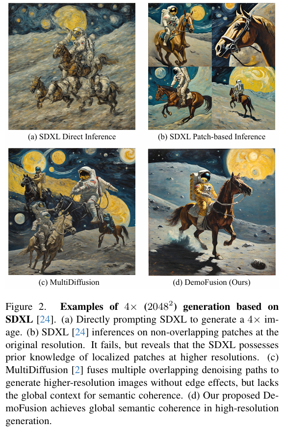
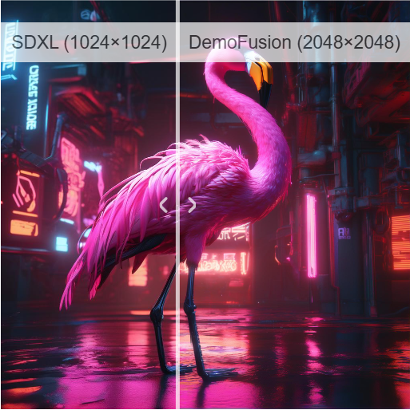

# DemoFusion: Democratising High-Resolution Image Generation With No $$$

> "DemoFusion: Democratising High-Resolution Image Generation With No" CVPR, 2023 Nov 24
> [paper](http://arxiv.org/abs/2311.16973v2) [code](https://github.com/PRIS-CV/DemoFusion) [web](https://ruoyidu.github.io/demofusion/demofusion.html) [pdf](./2023_11_CVPR_DemoFusion--Democratising-High-Resolution-Image-Generation-With-No.pdf) [note](./2023_11_CVPR_DemoFusion--Democratising-High-Resolution-Image-Generation-With-No_Note.md)
> Authors: Ruoyi Du, Dongliang Chang, Timothy Hospedales, Yi-Zhe Song, Zhanyu Ma

## Key-point

- Task: 超大分辨率 SR（x16）依靠 one 24G 3090 GPU
- Problems
- :label: Label:

## Contributions

> We demonstrate that existing Latent Diffusion Models (LDMs) possess untapped potential for higher resolution image generation
>
> Our novel DemoFusion framework seamlessly extends open-source GenAI models, employing **Progressive Upscaling, Skip Residual, and Dilated Sampling** mechanisms to achieve higher-resolution image generation.

## Introduction

- Q：SD 训练算力要求太多

> Training high-resolution image gen eration models requires substantial capital investments in hardware, data, and energy that are beyond the reach of in dividual enthusiasts and academic institutions

SDv1.5 要用 256 A100 训练 20 天

>  Stable Diffusion 1.5, at a resolution of 5122, entails over 20 days of training on 256 A100 GPUs

本工作目标实现 4090^2 生成

> DemoFusion, which pushes the frontier of high-resolution image synthesis from 10242 in SDXL[24], Midjourney [19], DALL-E [22], etc to 40962 or more. 

用 3090 实现

> DemoFusion requires no additional training and runs on a single consumer-grade RTX 3090 GPU (hard ware for the “working class” in the GenAI era), as shown in Fig. 1. The only trade-off? A little more patience.

- 发现 fig2 b) 能够偶尔出来一些局部物体，**有一些潜力的（训练数据里面见过类似 cropped 数据）**

> However, we observe that text-to-image LDMs encounter many cropped photos during their training process. These cropped photos either exist inherently in the training set or are intention ally cropped for data augmentation. Consequently, models like SDXL occasionally produce outputs that focus on lo calised portions of objects [24], as illustrated in Fig. 2 (b)

- MultiDiffusion 出现patch 一致性问题

作者猜测是缺少全局一致性的信息

> Yet, when directly applying this approach to generate specific high resolution object-centric images, results are repetitive and distorted without global semantic coherence [41], as illus trated in Fig. 2 (c).
>
> **We conjecture** the underlying reason is that overlapped patch denoising merely reduces the seam issue without a broad perception of the global context re quired for semantic coherence.

DemoFusion 把 z0 做 bilinear 插值搞到目标的大尺寸，加噪返回去得到 zT（这里插值 noise inversion 得到的作为 residual），再做去噪;相当于用 z0 插值一下返回去作为一个更优秀的 initial noise

- Progressive Upscaling，先搞一个低分辨率的 -> 逐步到高分辨。

缺陷：要迭代更久。。。但能降低显存

> **The caveat is that** generating high-resolution images does require more runtime (users need to exercise more patience).
>
> Nevertheless, the memory cost is low enough for consumer-grade GPUs, and progressive generation allows the users to preview low-resolution re sults rapidly, facilitating rapid iteration on the prompt until satisfaction with the general layout and style, prior to wait ing for a full high-resolution generation.

- Skip Residual 作为全局信息

> Within the same iteration, we additionally utilise the **intermediate noise-inversed representations as skip residuals,** maintaining global consistency between high and low-resolution images.

- Dilated Sampling

> We extend MultiDiffusion to increase global semantic coherence by using dilated sampling of denoising paths.

### related

- "SyncDiffusion: Coherent Montage via Synchronized Joint Diffusions" NIPS, 2023 Jun 8
  [paper](http://arxiv.org/abs/2306.05178v3) [code](https://syncdiffusion.github.io.) [pdf](./2023_06_NIPS_SyncDiffusion--Coherent-Montage-via-Synchronized-Joint-Diffusions.pdf) [note](./2023_06_NIPS_SyncDiffusion--Coherent-Montage-via-Synchronized-Joint-Diffusions_Note.md)
  Authors: Yuseung Lee, Kunho Kim, Hyunjin Kim, Minhyuk Sung

- "ScaleCrafter: Tuning-free Higher-Resolution Visual Generation with Diffusion Models" ICLR, 2023 Oct 11
  [paper](http://arxiv.org/abs/2310.07702v1) [code]() [pdf](./2023_10_ICLR_ScaleCrafter--Tuning-free-Higher-Resolution-Visual-Generation-with-Diffusion-Models.pdf) [note](./2023_10_ICLR_ScaleCrafter--Tuning-free-Higher-Resolution-Visual-Generation-with-Diffusion-Models_Note.md)
  Authors: Yingqing He, Shaoshu Yang, Haoxin Chen, Xiaodong Cun, Menghan Xia, Yong Zhang, Xintao Wang, Ran He, Qifeng Chen, Ying Shan

提出 dilated 卷积，乍一看很复杂。。

## methods

先用低分辨率生成的 z0 插值得到高分辨率 z0，在做 **noise inversion 得到高分辨率的 zT，去初始化每个 patch 的 noise**

> taking the low-resolution generated results as the initialization for the higher resolution through noise inversion. 

提出 dilated sampling 去建立 global 去噪路径，促使全局一致性

> To improve the local denoising paths of MultiDiffusion, we introduce dilated sampling to establish global denoising paths, promoting more globally coherent content generation

### dilated sampling

在去噪过程中引入全局信息

> Beyond the explicit integration of global information as a residual, we introduce dilated sampling to give each denois ing path moreglobal context.

参考可变形卷积

> The technique of dilating con volutional kernels to expand their receptive field is conven tional in various dense prediction tasks [38]

- "ScaleCrafter: Tuning-free Higher-Resolution Visual Generation with Diffusion Models" ICLR, 2023 Oct 11
  [paper](http://arxiv.org/abs/2310.07702v1) [code]() [pdf](./2023_10_ICLR_ScaleCrafter--Tuning-free-Higher-Resolution-Visual-Generation-with-Diffusion-Models.pdf) [note](./2023_10_ICLR_ScaleCrafter--Tuning-free-Higher-Resolution-Visual-Generation-with-Diffusion-Models_Note.md)
  Authors: Yingqing He, Shaoshu Yang, Haoxin Chen, Xiaodong Cun, Menghan Xia, Yong Zhang, Xintao Wang, Ran He, Qifeng Chen, Ying Shan

## setting

## Experiment

> ablation study 看那个模块有效，总结一下

## Limitations

- 两张图细节的结构不一致，但 text2img 要求不高

主体接近，但不是一个东西了

## Summary :star2:

> learn what

### how to apply to our task

- Q：VAE latent feature 重叠区域咋办？

