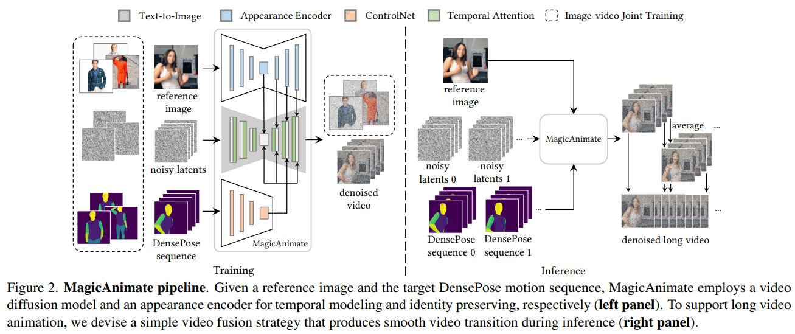

# MagicAnimate: Temporally Consistent Human Image Animation using Diffusion Model

> "MagicAnimate: Temporally Consistent Human Image Animation using Diffusion Model" CVPR, 2023 Nov
> [paper](http://arxiv.org/abs/2311.16498v1) [code](https://github.com/magic-research/magic-animate) [website](https://showlab.github.io/magicanimate/)
> [pdf](./2023_11_CVPR_MagicAnimate--Temporally-Consistent-Human-Image-Animation-using-Diffusion-Model.pdf)
> Authors: Zhongcong Xu, Jianfeng Zhang, Jun Hao Liew, Hanshu Yan, Jia-Wei Liu, Chenxu Zhang, Jiashi Feng, Mike Zheng Shou

## Key-point

- Task
- Problems
- :label: Label:

## Contributions

## Introduction

## methods

> 问题：多帧闪烁

**temporal layer 参考**

- "Animatediff: Animate your personalized text-to-image diffusion models without specific tuning"
- "Tune-a-video: One-shot tuning of image diffusion models for text-to-video generation"
- "Magicvideo: Efficient video generation with latent diffusion models"

1. Within temporal modules, we reshape the features into R (NHW)×K×C to compute cross-frame information
2. add sinusoidal positional encoding

> CLIP feature is too sparse 无法含有丰富的细节

introduce a novel appearance encoder Fa (Sec. 3.2) to encode $I_{ref}$ into appearance embedding $y_a$ and condition our model on it

creates another trainable copy of the base UNet; 
pass these features to the spatial self-attention layers in the UNet blocks by **concatenating each feature** in ya with the original UNet self-attention hidden states

**整体 Animation Pipeline**

> major body keypoints are sparse and not robust to certain motions, such as rotation.

DensePose

> unnatural transitions and inconsistent details across segments may occur because temporal attention blocks cannot model long-range consistency across different segments
>
> 显存限制，需要逐 patch 处理视频，造成轻微闪烁

按 T 维度重叠取 patch，重叠区域取平均

**发现 sharing the same initial noise z 1:K for all the segments improves video quality**

> 训练策略，多阶段训练

1. 先忽略掉 temporal atten，先训练 appearance encoder & poseControlNet
2. 2 stage，优化 temporal layers
3.  **image-video joint training strategy** to further enhance the reference-preserving capability and single-frame fidelity

## Code

`python3 -m magicanimate.pipelines.animation --config configs/prompts/animation.yaml`

- :question: 参考图像分辨率很大 1024^2 咋办？

## Experiment

> ablation study 看那个模块有效，总结一下

针对细节信息，使用 CLIP 编码器不太好。**验证了 CLIP 特征保留不了太多细节的想法**

## Limitations

## Summary :star2:

> learn what & how to apply to our task

1. 发现 sharing the same initial noise z 1:K for all the segments improves video quality

   大概是因为视频变化不大，随机取反而会影响性能；分 patch 的时候根据物体来选取 noise？上一个 patch 里面发现了猫，获取到一组 noise，下面的 patch 直接在这个 patch 上继续做，而不是重新随机取一组新的？

2. SD Encoder 不一定要用 VAE or CLIP 提取特征，换为另一个 UNet 去训练提取特征也行

   尝试：去掉 VAE Encoder，换为自己的 Encoder 作为 Condition

3. 维持时序一致性

   1. TuneAVideo 方式的 temporal layer
   2. temporal 分重叠 patch 再取平均

