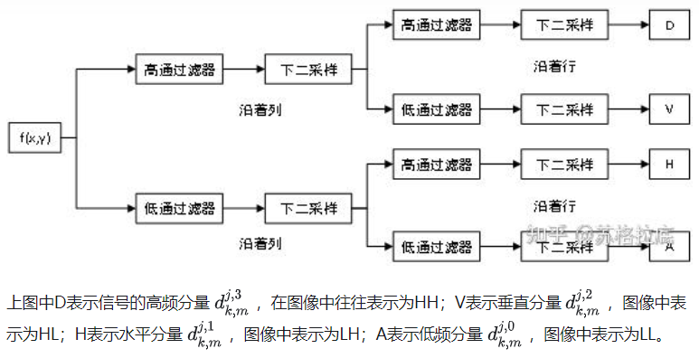
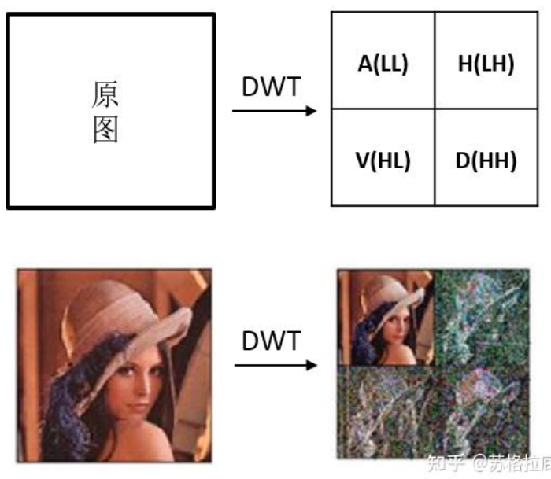
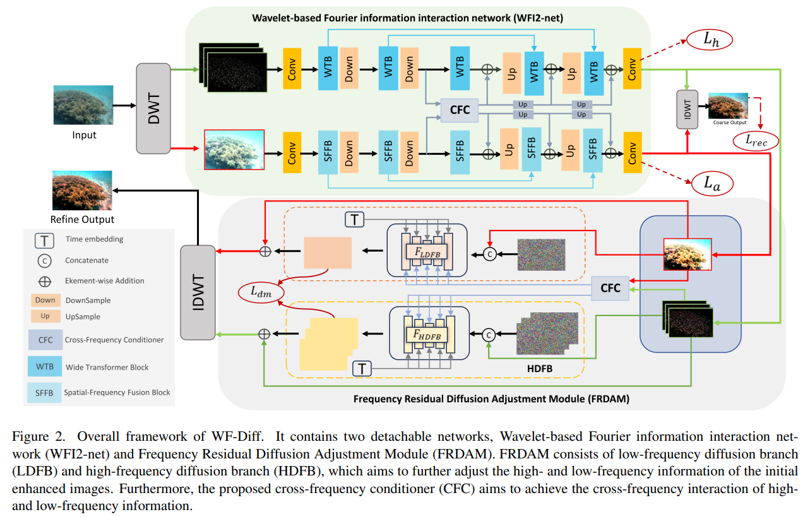
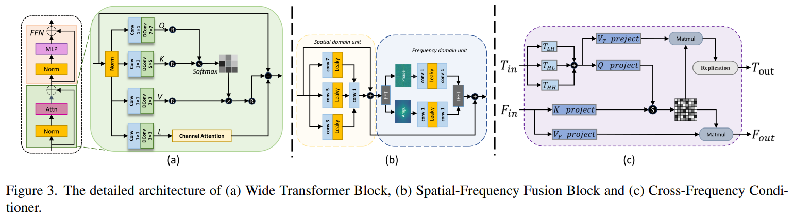

# Wavelet-based Fourier Information Interaction with Frequency Diffusion Adjustment for Underwater Image Restoration

> "Wavelet-based Fourier Information Interaction with Frequency Diffusion Adjustment for Underwater Image Restoration" CVPR, 2023 Nov 28
> [paper](http://arxiv.org/abs/2311.16845v1) [code]() [pdf](./2023_11_CVPR_Wavelet-based-Fourier-Information-Interaction-with-Frequency-Diffusion-Adjustment-for-Underwater-Image-Restoration.pdf) [note](./2023_11_CVPR_Wavelet-based-Fourier-Information-Interaction-with-Frequency-Diffusion-Adjustment-for-Underwater-Image-Restoration_Note.md)
> Authors: Chen Zhao, Weiling Cai, Chenyu Dong, Chengwei Hu

## Key-point

- Task
- Problems
- :label: Label:

## Contributions

## Introduction

之前没有频域的方法，强行做一波看看效果

> However, most previous methods are based on the spatial domain, with limited exploration of the frequency space for underwater images, which results in an inability to effectively harness the representation power of the deep models.

### freq 方法

> https://zhuanlan.zhihu.com/p/572380084

- Q：FFT vs DWT?

FFT 把信号波拆解为不同频率的正弦波

#### DWT

DWT 可输出 4 个分量

## methods

搞了两个频域，低频 diffusion 分支，高频 diffusion 分支

## setting

## Experiment

> ablation study 看那个模块有效，总结一下

## Limitations

## Summary :star2:

> learn what

### how to apply to our task

