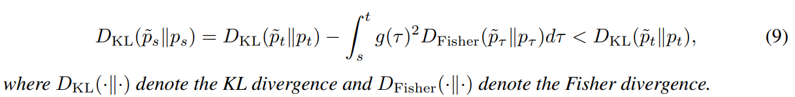
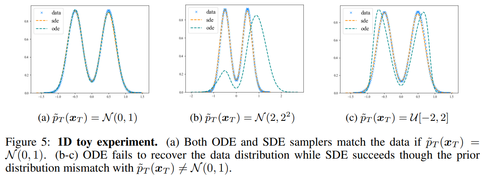

# The Blessing of Randomness: SDE Beats ODE in General Diffusion-based Image Editing

> "The Blessing of Randomness: SDE Beats ODE in General Diffusion-based Image Editing" ICLR, 2023 Nov 2
> [paper](http://arxiv.org/abs/2311.01410v2) [code](https://github.com/ML-GSAI/SDE-Drag) [web](https://ml-gsai.github.io/SDE-Drag-demo/) [pdf](./2023_11_ICLR_The-Blessing-of-Randomness--SDE-Beats-ODE-in-General-Diffusion-based-Image-Editing.pdf) [note](./2023_11_ICLR_The-Blessing-of-Randomness--SDE-Beats-ODE-in-General-Diffusion-based-Image-Editing_Note.md)
> Authors: Shen Nie, Hanzhong Allan Guo, Cheng Lu, Yuhao Zhou, Chenyu Zheng, Chongxuan Li
>
> https://github.com/SiatMMLab/Awesome-Diffusion-Model-Based-Image-Editing-Methods

## Key-point

- Task: Diffusion edit

- Problems

  先前没有工作分析 SDE, ODE 去噪方式对于图像编辑任务的影响

- :label: Label:

## Contributions

- 发现能用 SDE 用于图像编辑，提出一个用 SDE/ODE 做图像编辑的框架

> present a unified probabilistic formulation for diffusion-based image editing，
>
> defines a corresponding SDE or ODE for editing. In the formulation, we prove that the KullbackLeibler divergence between the marginal distributions of the two SDEs gradually decreases while that for the **ODEs remains as the time approaches zero**

- propose SDE-Drag – a simple yet effective method built upon the SDE formulation for point-based content dragging

- 提出验证集 DragBench，with open-set natural, art, and AI-generated images for evaluation

- SOTA

  > A user study on DragBench indicates that SDE-Drag significantly outperforms our ODE baseline, existing diffusion-based methods, and the renowned DragGAN.

## Introduction

预训练的 Diffusion 自身就定义了一个 SDE/ODE

> Starting from it, a stochastic differential equation (SDE) or a probability flow ordinary differential equation (ODE) is defined by a pretrained diffusion model.

发现多个 SDE 边际概率计算 KL 散度接近于 0，但 ODE 保持不变

> the Kullback-Leibler (KL) divergence between marginal distributions of the SDEs decreases as the time tends to zero while that of the ODEs remains the same.

- "Drag Your GAN: Interactive Point-based Manipulation on the Generative Image Manifold"
  [paper](https://arxiv.org/abs/2305.10973)

- Q：使用 copy-and-paste manner 编辑？

> Distinct from the prior work (Pan et al., 2023; Shi et al., 2023; Mou et al., 2023a), SDE-Drag manipulates the latent variable in a straightforward copy-and-paste manner

### SDE

$x_t~as~q_t(_xt)$

stochastic differential equation (SDE)

- Q：wt is a standard Wiener process？

**VP type SDE**

> backward process referred to as the reverse-time SDE, which recovers q0(x0) from qT (xT )

- $∇xt log qt(xt)$ is the score function of qt(xt)
- $\bar{w_t}$ is a standard Wiener process with backward time

使用网络作为  noise prediction model $ϵθ(xt, t)$

- **Q：dxt 怎么对应到 p(xt) ?**

- Q：发现 ODE 的概率分布和 p(xt) 一样？

> there exists a probability flow ordinary differential equation (ODE), whose marginal distribution for any given t matches pt(xt) 

**DDIM 采样**，用此公式实现去噪 :star:

由于图像编辑需要一个很好的图像特征，最好能还原；

- Q：SDE 由于加入了随机噪声不好还原，因此使用 **DDIM inversion**，当 $\eta=1$ 能实现确定的去噪 ？？具体去噪公式见 Appendix

> We present more details and algorithms of both reconstruction processes, as well as preliminary experiments on their reconstruction ability in Appendix A

## methods

### **GENERAL PROBABILISTIC FORMULATION**

Section3.1 用同一个框架整理 diffusion image edit 方法

> we formulate a broad family of image-editing methods in diffusion models from a unified probabilistic perspective in Sec. 3.1

- first stage 加噪得到图像特征
- 对图像特征进行编辑，不同方法见 Appendix

> Here we omit the detail that some existing methods manipulate the latent in multiple steps (see details in Appendix F

- 对编辑完的特征 $\tilde{x_0}$ 进行去噪

> The second stage starts from x˜t0 and produces the edited image x˜0 following either an ODE solver (e.g., Eq. (6) with η = 0), an SDE Solver (e.g., Eq. (6) with η = 1), or a Cycle-SDE process (e.g., Eq. (6) with η = 1 and w¯ ′ s from Eq. (8))

- Q：编辑完的特征 $\tilde{x_0}$ 不符合 $x_0 \to p(x0)$?

> the edited image x˜0 does not follow p0(·) in general because the marginal distributions at time t0 mismatch, making the editing process distinct from the well-studied sampling process

- Q：先前方法基于经验，没有理解为什么能做到编辑？

> absence of attempts to comprehend and expound upon the editing process precisely.

- Q：Is there any guarantee on the sample quality of the edited image (i.e., the gap between its distribution and the data distribution)? Do the SDE and ODE formulations make any difference in editing?

> - 假设 SDE，ODE 能够将图像映射到特征空间，再逆回去
>
> ODE, SDE, and Cycle-SDE can recover the data distribution without editing
>
> - . Formally, we assume that they characterize the same marginal distribution pt and pt = qt for any t ∈ [0, T].

#### **Theorem 3.1 (Contraction of SDEs**

两个 SDE 的概率分布，对于 0<S<T 的 KL 散度式子，在不同时间步下，编辑前后的概率分布不同

> Let p˜t and pt be the marginal distributions of two SDEs (see Eq. (4)) at time t

#### Theorem 3.2 (Invariance of ODEs,

两个 ODE下的概率分布，在不同时间步下，编辑前后的概率分布是一致的

**假设 SDE 的概率分布 KL 散度计算是线性收敛的**

> with a stronger yet standard assumption：n obtain a linear convergence rate in the SDE formulation.

做了一个 **Toy Exp** 验证了上述几个 theorem

GT 概率分布用 a binary mixture of Gaussian distribution

选取 3 种概率分布，随机取值作为 pT

发现虽然编辑完的特征 pT~ 和 pT 分布不一致（不是高斯分布），**SDE 还是能找到类似的 P0~; ODE 则不行**

ODE 只要采样时候换了一个分布，由于 theorem3.2 分布在任意 T 时刻是一样的，所以还原不回去

> though the prior mismatch, the SDE sampler can find p˜0 that is similar to q0. However, in terms of the ODE sampler, Theorem 3.2 guarantees that DKL(˜pt∥pt) remains unchanged during the sampling process, which means that the ODE sample can never find p˜0 that is similar to q0.

#### **Theorem 3.3 (Contraction of Cycle-SDEs**

DDIM inversion 可以完全还原的 SDE

**小结**

- 从理论分析 & toy exp 验证了 **SDE 随机噪声的加入，能够缓解了在编辑后 pt 概率分布于原始分布不匹配的问题**；因此 noise 是有用的，**blessing of randomness**

> we show that the additional noise in the SDE formulation (including both the original SDE and Cycle-SDE) provides a way to reduce the gap caused by mismatched prior distributions, while the gap remains invariant in the ODE formulation, suggesting the blessing of randomness in diffusion-based image editing.

### SDE-DRAG

> we manipulate the latent variable in a straightforward copy-and-paste manner (see Fig. 1a, right panel) instead of performing optimization in the latent space

**Stage1 映射到特征**

In the first stage, we first add noise to obtain the intermediate representation xt0 and obtain a series of “noise” w¯ ′ s according to Eqs. (7-8)

 **copy & paste 编辑**

拖动信号 S 和 T 为两个正方形区域，S 代表起始点，T 为重点；

- 目标区域 T 直接把 S 区域的特征 copy 过去 & 增强
- 原始区域 S 加噪声，防止生成重复的内容

>  SDE-Drag directly copies the noisy pixels from the source to the target and amplifies them by a factor α.
>
> Besides, SDE-Drag perturbs the source with a Gaussian noise by a factor β to avoid duplicating the content.

- Q：长距离移动不好搞

> When the target point is far from the source point, it is challenging to drag the content in a single operation (Pan et al., 2023)

长距离的两个点，拆分成 m 个小的移动，去噪 N 步；m n 为超参

> we divide the process of Drag-SDE into m steps along the segment joining the two points and each one moves an equal distance sequentially.

**Stage2 去噪**

> In the second stage, we directly produce x˜0 by a Cycle-SDE process defined by Eq. (6) with η = 1

可选：可以提供一个 mask，对应到加噪过程中的 zt

> an optional binary mask is provided, the unmasked area of the latent representation x˜t at every step t is replaced by the corresponding unmasked area of the latent representation xt 3 in the noise-adding process

流程图：

> For more implementation details, please refer to Appendix F.6

- **根据上述公式验证，SDE-drag 比 ODE 方法要好很多（DragGAN, DragDiff)**
- Q：公式 12，7-8 有一些超参用 default 值？

Section5.3 验证 SDE-Drag 对超参不敏感

> SDE-Drag is not sensitive to the hyperparameters

### Dataset

- Q：existing benchmarks (DragGAN 数据集 Pan et al., 2023) are restricted to specific domains like human faces.

DragGAN 数据集，数据类别只有人脸一些，类别太少

> To this end, we introduce DragBench, a challenging benchmark consisting of 100 image-caption pairs from the internet that cover animals, plants, art, landscapes, and high-quality AI-generated images

100 images, spanning 5 distinct categories 每张图有多个移动点 S,T, mask

>  Each image has one or multiple pairs of source and target points and some images are associated with binary masks.
>
> consists of an open set of 100 images, spanning 5 distinct categories, as detailed in Table

## Setting

- For fairness, we employ DDPM (Ho et al., 2020) as the SDE sampler in our experiment, which is also given by Eq. (6) with η = 1

## Experiment

> ablation study 看那个模块有效，总结一下

on various tasks including inpainting (see Sec. 5.1), image-to-image (I2I) translation (see Sec. 5.2), and dragging (see Sec. 5.3) & hyperparameters and time efficiency

### inpaint

- Stable Diffusion 1.5
- Places dataset
- LPIPS, FID

唯一要调整的参数是去噪步数

> most of the hyperparameters remain the same as the ODE baseline (Rombach et al., 2022). The only tuned hyperparameter is the number of sampling steps n and we conduct systematical experiments with 25, 50, and 100 steps.

**SDE 25 步效果超过 ODE 100 步的结果**

- Q：对比的 ODE 使用 SD 开源的（只是引用）？
- Q：使用 sampler 来区分 ODE, SDE?

### I2I

### Drag

-  Drag your gan

**user-study**

**真实图像，SD 生成图像的编辑** & 多点编辑

> We further highlight that SDE-Drag is able to deal with multiple points simultaneously or sequentially on open-domain images and improve the alignment between the prompt and sample from the advanced AI-painting systems like DALL·E 3 and Stable Diffusion

SD 生成的图

对比 dragdiffusion

对比 DragGAN

## Limitations

超参数 M （移动小的距离大一些就不行）

不同 seed 很不稳定，开源数据上效果不行

> Such results suggest that dragging open-set images is still a significant challenge

## Summary :star2:

> learn what & how to apply to our task

- 根据数据类型进行补充，100张图像就能当作一个数据集作为 contribution

