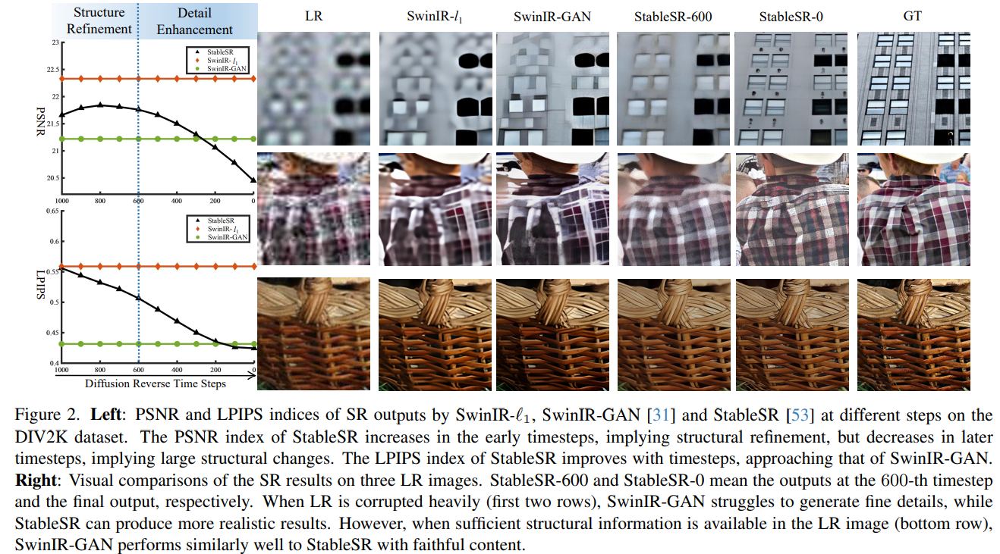

# Improving the Stability of Diffusion Models for Content Consistent Super-Resolution

> "Improving the Stability of Diffusion Models for Content Consistent Super-Resolution" Arxiv, 2023 Dec
> [paper](http://arxiv.org/abs/2401.00877v1) [code](https://github.com/csslc/CCSR) 
> [pdf](./2023_12_Arxiv_Improving-the-Stability-of-Diffusion-Models-for-Content-Consistent-Super-Resolution.pdf)
> Authors: Lingchen Sun, Rongyuan Wu, Zhengqiang Zhang, Hongwei Yong, Lei Zhang

## Key-point

- Task
- Problems
- :label: Label:

## Contributions

## Introduction

从去噪 1k 步中，在 PSNR 角度来看生成结果。在早期去噪步骤中( 600-1k 步) PSNR 上升代表 structural refinement.

## methods

## Experiment

> ablation study 看那个模块有效，总结一下

## Limitations

## Summary :star2:

> learn what & how to apply to our task

