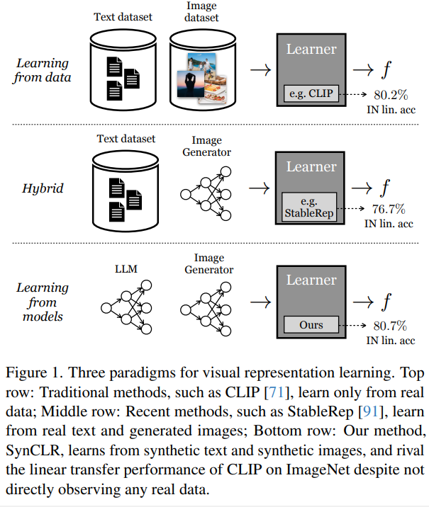
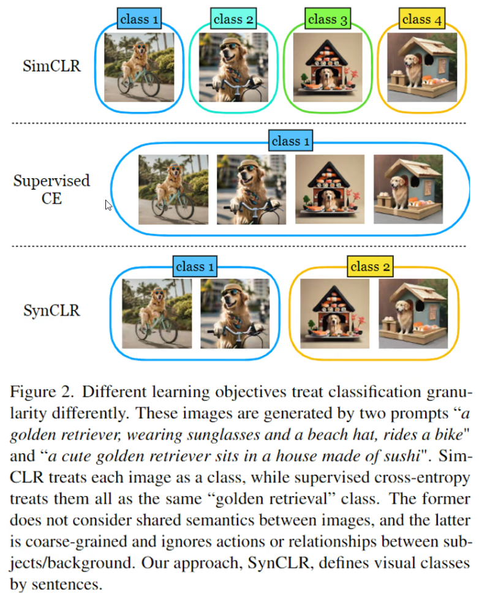

# Learning Vision from Models Rivals Learning Vision from Data

> "Learning Vision from Models Rivals Learning Vision from Data" Arxiv, 2023 Dec
> [paper](http://arxiv.org/abs/2312.17742v1) [code]() 
> [pdf](./2023_12_Arxiv_Learning-Vision-from-Models-Rivals-Learning-Vision-from-Data.pdf)
> Authors: Yonglong Tian, Lijie Fan, Kaifeng Chen, Dina Katabi, Dilip Krishnan, Phillip Isola

## Key-point

- Task
- Problems
- :label: Label:

## Contributions

## Introduction

## methods

3 中生成 caption 的方法

1. 直接用内容
2. 内容 + 背景
3. 内容 + 相对位置

## Experiment

> ablation study 看那个模块有效，总结一下

## Limitations

## Summary :star2:

> learn what & how to apply to our task

