# Motion-Guided Latent Diffusion for Temporally Consistent Real-world Video Super-resolution

> "Motion-Guided Latent Diffusion for Temporally Consistent Real-world Video Super-resolution" Arxiv, 2023 Dec, `MGLD-VSR`
> [paper](http://arxiv.org/abs/2312.00853v1) [code](https://github.com/IanYeung/MGLD-VSR) [note](2023_12_Arxiv_Motion-Guided-Latent-Diffusion-for-Temporally-Consistent-Real-world-Video-Super-resolution_Note.md) [pdf](./2023_12_Arxiv_Motion-Guided-Latent-Diffusion-for-Temporally-Consistent-Real-world-Video-Super-resolution.pdf)
> Authors: Xi Yang, Chenhang He, Jianqi Ma, Lei Zhang

## Key-point

- Task: VideoSR

- Problems

  真实 LR 含有混合退化，很难做 SR。Diffusion 生成逼真的细节，但很难控制时序，空间上一致性

  > the diffusion process has randomness, making it hard to control the contents of restored images

- :label: Label:


提出 motion-guided latent diffusion based VSR （MGLD-VSR），利用 diffusion 细节生成能力做 VideoSR。

使用 StableSR 逐帧做各帧差异太大，为了保持时序一致性：

1. 提出 motion-guided loss 约束 diffusion denoise 过程
2. 在 UNet 和 Decoder 中加入 temporal conv，并提出 2 个 loss 进行训练

> we propose an effective real-world VSR algorithm by leveraging the strength of **pre-trained latent diffusion models**


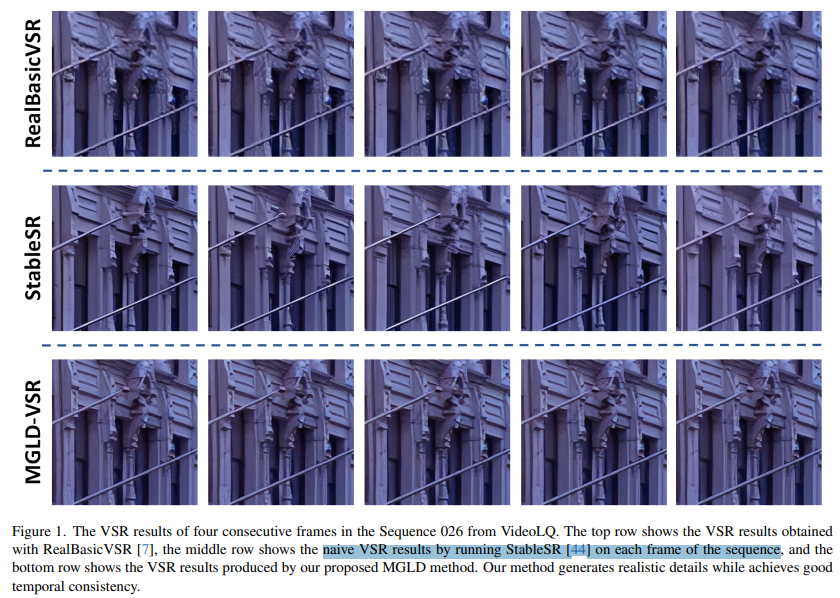


## Contributions

1. 用光流改进 diffusion 采样过程
   propose a diffusion sampling process based on motion-guided loss
2. 提出 temporal-aware sequence decoder 和配合的两个 loss
3. SOTA，闪烁更少


## Introduction

### traditional VSR :star:

先前 VSR 方法模拟的退化太简单，没法用于 real-world

#### **multiple-input single-output (MISO)**

The MISO algorithms are usually sliding-window based, which aggregate information from neighboring frames to generate the super-resolved result of the center frame.

- "Real-Time Video Super-Resolution with Spatio-Temporal Networks and Motion Compensation" 2017 Apr, VESPCN 
  [paper](https://arxiv.org/abs/1611.05250)

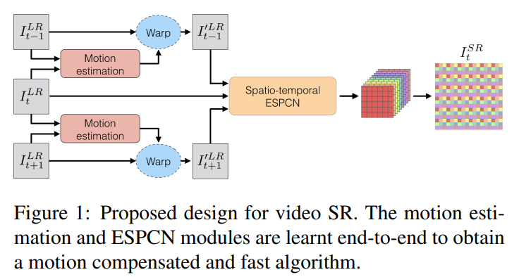


#### **multiple-input multiple-output (MIMO)** :star:

推理消耗更少，能更快，支持更多 frames

> MIMO are able to aggregate information from more frames, and thus improve the performance.

- BasicVSR, BasicVSR++, VRT, RVRT


但这些 traditional VSR 在简单地合成数据上训练，存在 the synthetic-to-real gap, models trained with such data can not perform well on real-world videos


### **real-world VSR**

主要挑战是生成的细节时候，如何避免被退化造成的噪声干扰 :star:

> **The main challenge** lies in how to effectively reproduce video details while suppressing the visual artifacts caused by unknown degradation

- "Real-world video super-resolution: A benchmark dataset and a decomposition based learning scheme" RealVSR

用 iphone 拍摄视频对，但对于其他设备拍的视频效果又不好；


**目前有以下3种常见方法，但受限于训练数据量，限制了模型的能力**

> limited due to the insufficient training data and the limited model capacity

- Laplacian pyramid generative adversarial loss
  - "Real-world Video Super-resolution: A Benchmark Dataset and A Decomposition based Learning Scheme" RealVSR
    [paper](https://www4.comp.polyu.edu.hk/~cslzhang/paper/ICCV21_RealVSR.pdf)

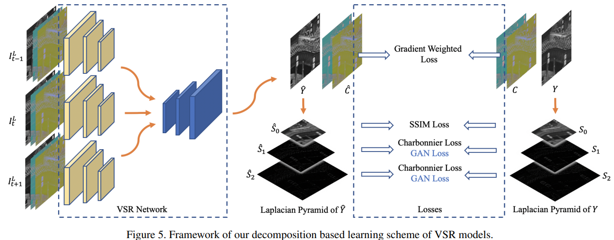

- input pre-cleaning
- hidden state attention

**因此后续工作都在合成更真实的退化，但作者想要利用 diffusion prior 作为先验信息，而不是在提升合成数据质量上来做 VideoSR**


### Generative Prior

很难控制与 LR 的一致性

1. 去噪过程的随机性
2. VAE Decoder 加剧了不一致性

> the latent diffusion models (LDMs) [37] have demonstrated compelling results not only in text-to-image generation, but also in downstream tasks

先前使用 GAN Prior 工作

- "GLEAN: Generative Latent Bank for Image Super-Resolution and Beyond" TAPMI, 2022 Jul :star:
  [paper](https://arxiv.org/abs/2207.14812) [code](https://github.com/open-mmlab/mmagic?utm_source=catalyzex.com) [note](./2022_07_TPAMI_GLEAN--Generative-Latent-Bank-for-Image-Super-Resolution-and-Beyond_Note.md)


- "Gan prior embedded network for blind face restoration in the wild"
- "Towards real-world blind face restoration with generative facial prior"


直接用图像 SR 任务的 StableSR 多帧不一致

- "Exploiting Diffusion Prior for Real-World Image Super-Resolution" Arxiv, 2023 May, **StableSR**
  [paper](https://arxiv.org/abs/2305.07015) [website](https://iceclear.github.io/projects/stablesr/?utm_source=catalyzex.com) [code](https://github.com/IceClear/StableSR) [pdf](./2023_05_Arxiv_Exploiting-Diffusion-Prior-for-Real-World-Image-Super-Resolution.pdf) [note](./2023_05_Arxiv_Exploiting-Diffusion-Prior-for-Real-World-Image-Super-Resolution_Note.md)

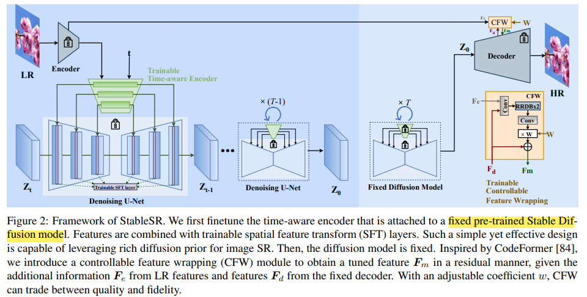


针对上述使用 LDM 不一致问题，提出用 LR 计算的光流，去 warp diffusion 的特征；**并且对于 decoder 加 motion block 用 HR 视频 finetune 一下**；**提出 sequence-oriented loss** to guide the decoder to improve the continuity of the details

> we calculate the optical flows among adjacent LR frames, and use the calculated optical flows to warp the latent features of each frame to align the features of neighboring frames. The l1 norm of the warping error is employed as the motion-guided loss,


## methods

> - zT 怎么得到
> - 如何约束一致性？

使用 StableDiffusion；用 LR 上预测得到光流，在去噪的**每一步**，对各帧的特征 $z^t$ 传播一下；

对 decoder 加几层 temporal module 微调一下；使用 VAE Encoder 特征 $e_{1:N}$ 融入 decoder 中


### Motion-guided Diffusion Sampling

- Q：diffusion 去噪的每一步引入了随机噪声，造成 temporal inconsistencies

用预训练的 RAFT 在 LR 上预测光流，再 downsample 到 latent space 尺寸；当前帧，对前后帧计算光流的误差，类似先前 E2FGVI 的 optical-flow loss

- "Raft: Recurrent all-pairs field transforms for optical flow"


- Q：实验发现当前后帧画面出现遮挡的时候，光流预测受到影响，模型预测结果有噪点

  使用光流时，需要预测前后帧遮挡的 mask（对光流 warp 有影响），这部分区域在去噪每一步的过程中不去更新 latent feature

> We empirically find that the presence of occlusion will pose adverse impact on flow estimation, which in turn causes distraction in the sampling process and leads to artifacts in the final VSR results. To solve this issue, we further estimate the occlusion mask M in each frame


- Q：什么是 mask？如何的得到？:question:

前一帧有，后一帧被挡住的区域，传播到前面帧一些信息就没了？


更新过程参考下图：先用 DDPM 去噪一步得到 $z_i^{t+1} \to z_i^{t}$，再用上一帧的 $z_{i-1}$ 计算 warp loss 对于 $z_{i}$ 的梯度，对 latent feature 更新一下

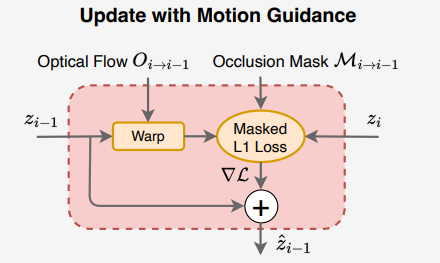

**利用双向光流计算 warping error** ，和常见 flow loss 操作一样，区别只是用于 latent

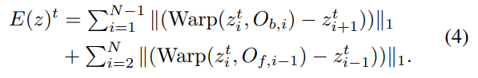

> [code](https://github.com/IanYeung/MGLD-VSR/blob/29fb77ae31f0eaa0b8394df962a6d511f82f507b/ldm/models/diffusion/ddpm.py#L3538)

```python
    def compute_temporal_condition_v4(self, flows, latents, masks):
        # flow_f: [b,t-1,2,h,w], (backward flow, for forward propagation)
        # flow_b: [b,t-1,2,h,w], (forward flow, for backward propagation)
        flow_fwd_prop, flow_bwd_prop = flows
        fwd_occs, bwd_occs = masks
        t = self.num_frames
        # fwd_occ_list, bwd_occ_list = list(), list()
        # for i in range(t-1):
        #     fwd_flow, bwd_flow = flow_bwd_prop[:, i, :, :, :], flow_fwd_prop[:, i, :, :, :]
        #     fwd_occ, bwd_occ = forward_backward_consistency_check(fwd_flow, bwd_flow, alpha=0.01, beta=0.5)
        #     fwd_occ_list.append(fwd_occ)
        #     bwd_occ_list.append(bwd_occ)

        # b,t,c,h//8,w//8
        latents = rearrange(latents, '(b t) c h w -> b t c h w', t=t)
        # compute the forward loss and backward loss
        loss_b = 0
        latent_curr_warp = torch.zeros_like(latents[:, -1, :, :, :])
        # backward propagation
        for i in range(t - 1, -1, -1):
            latent_curr = latents[:, i, :, :, :]
            if i < t - 1:  # no warping required for the last timestep
                flow = flow_bwd_prop[:, i, :, :, :]
                latent_curr_warp = flow_warp(latent_curr, flow.permute(0, 2, 3, 1), interp_mode='bilinear')
                loss_b += F.l1_loss((1 - fwd_occs[:, i, :, :, :]) * latent_prev, (1 - fwd_occs[:, i, :, :, :]) * latent_curr)
            latent_prev = latent_curr_warp
        loss_f = 0
        latent_curr_warp = torch.zeros_like(latents[:, 0, :, :, :])
        # forward propagation
        for i in range(0, t):
            latent_curr = latents[:, i, :, :, :]
            if i > 0:  # no warping required for the first timestep
                flow = flow_fwd_prop[:, i - 1, :, :, :]
                latent_curr_warp = flow_warp(latent_curr, flow.permute(0, 2, 3, 1), interp_mode='bilinear')
                loss_f += F.l1_loss((1 - bwd_occs[:, i-1, :, :, :]) * latent_prev, (1 - bwd_occs[:, i-1, :, :, :]) * latent_curr)
            latent_prev = latent_curr_warp
        return loss_b + loss_f
```


利用光流 warping error $E(z)^t$ 的梯度，去更新 latent feature

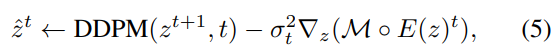

> [code](https://github.com/IanYeung/MGLD-VSR/blob/29fb77ae31f0eaa0b8394df962a6d511f82f507b/ldm/models/diffusion/ddpm.py#L4364)
>
> - Q：这里类似梯度下降？

```python
		latents = model_mean + nonzero_mask * (0.5 * model_log_variance).exp() * noise  # DDPM x_t -> x_t
		if flows is not None:
            with torch.enable_grad():
                latents = latents.detach()
                latents.requires_grad = True
                loss_tempo = self.compute_temporal_condition_v4(flows, latents, masks)
                latents = latents - model_log_variance * torch.autograd.grad(loss_tempo, latents)[0]
                latents = latents.detach()
```


mask 预测参考下面工作

- "UnFlow: Unsupervised Learning of Optical Flow with a Bidirectional Census Loss"
  [paper](https://arxiv.org/pdf/1711.07837.pdf)

将 warp 过去的图和 GT 图比对有差异的区域，重点 loss 约束一下

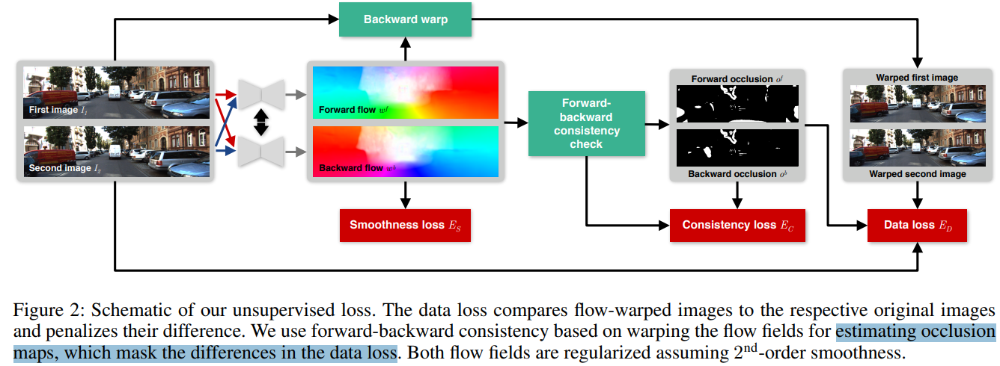


### Temporal-aware Decoder

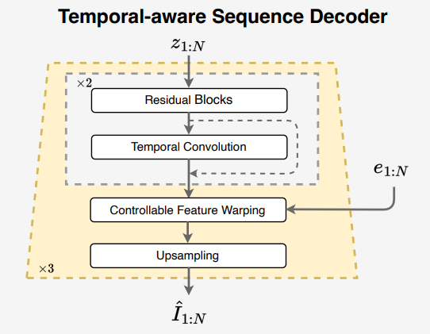

- Q：latent feature 要再升维 8 倍得到图像，还会映入时序上不一致

对 VAE Decoder，固定住原先模块，**只训练加的 1D temporal conv 和 CFW 模块**

> we freeze their original spatial blocks and **only update the parameters in the temporal convolution and CFW module**

使用 StableSR 的 CFW module 去和 VAE Encoder 特征融合


> [Decoder code](https://github.com/IanYeung/MGLD-VSR/blob/29fb77ae31f0eaa0b8394df962a6d511f82f507b/ldm/modules/diffusionmodules/model.py#L926)

#### temporal Conv

temporal 使用用 1 层 3D 卷积处理一下 ok，`kernel=(3,1,1)`

```python
class SpatialTemporalConv(nn.Module):
    def __init__(self, num_feat, num_frames=1):
        super().__init__()

        self.num_frames = num_frames
        # self.norm = nn.LayerNorm(num_feat)
        # self.temporal_conv = conv_nd(3, num_feat, num_feat, (3, 3, 3), padding=(1, 1, 1))
        self.temporal_conv = conv_nd(3, num_feat, num_feat, (3, 1, 1), padding=(1, 0, 0))
        self.temporal_alpha = nn.Parameter(torch.Tensor(1))

    def forward(self, inp, t=None):
        bt, c, h, w = inp.shape
        b = bt // t if t else bt // self.num_frames
        ori = inp
        inp = from_4d_to_5d(inp, b, c, t, h, w)
        res = self.temporal_conv(inp)
        res = from_5d_to_4d(res, b, c, t, h, w)
        out = self.temporal_alpha * res + (1 - self.temporal_alpha) * ori
        # out = torch.sigmoid(self.temporal_alpha) * res + (1 - torch.sigmoid(self.temporal_alpha)) * ori
        return out
```


#### CFW

```python
class Fuse_sft_block_RRDB(nn.Module):
    def __init__(self, in_ch, out_ch, num_block=1, num_grow_ch=32):
        super().__init__()
        self.encode_enc_1 = ResBlock(2*in_ch, in_ch)
        self.encode_enc_2 = make_layer(RRDB, num_block, num_feat=in_ch, num_grow_ch=num_grow_ch)
        self.encode_enc_3 = ResBlock(in_ch, out_ch)

    def forward(self, enc_feat, dec_feat, w=1):
        enc_feat = self.encode_enc_1(torch.cat([enc_feat, dec_feat], dim=1))
        enc_feat = self.encode_enc_2(enc_feat)
        enc_feat = self.encode_enc_3(enc_feat)
        residual = w * enc_feat
        out = dec_feat + residual
        return out
```


## Experiment

> ablation study 看那个模块有效，总结一下

### setting

- trained on 4 NVIDIA A100 GPUs
- Adam optimizer
- 参考 StableSR, 使用 progressive patch aggregation sampling algorithm 实现任意分辨率输出
- diffusion 采样步数选取 50


**两阶段训练**

第一阶段训练 Diffusion UNet 中新加入的 1D temporal conv 和 condition 模块 ，锁住 SDv2.1

condition 模块参考 StableSR 中的 Encoder 和 SFT-layer；`batchsize=24, frameNum=6, imagesize=512x512(latent=64x64)`

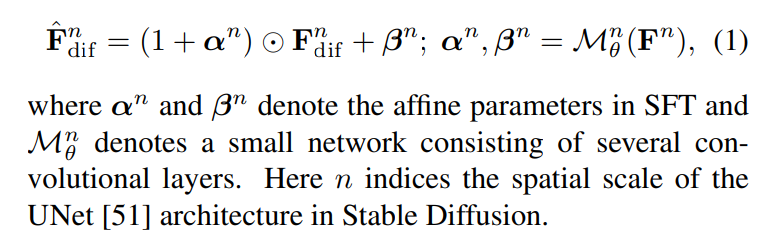

>  training batch size, sequence length and latent image size are set to 24, 6 and 64 × 64


第二阶段微调 VAE Decoder，把 VAE Decoder 冻住，加入 temporal 1D layer 和 CFW module 进行微调；`batchsize=4, frameNum=5, imagesize=512x512`

>  The training batch size, sequence length and image size are set to 4, 5 and 512 × 512


#### data

**training data**

参考先前工作将 REDS training+validation set 整合，留出 4 个视频（REDS4）作为测试

- "Investigating tradeoffs in real-world video super-resolution"

> As in previous works [7, 45, 48], we merge the training set and validation set of REDS [32] in training and leave 4 sequences for test ing (REDS4). 

退化合成用 RealBasicVSR 合成退化的方法

> We follow the degradation pipeline of Re alBasicVSR [7] to synthesize the training sequence pairs, which involves blur, noise, downsampling and compression degradations.


**testing data**

- Synthetic Data

  - REDS4, 4 video sequences, each having 100 frames

  - UDM10,10 sequences, each having 32 frames

  - SPMCS, 30 sequences, each having 31 frames.

> We evaluate our method on both synthetic and real-world datasets. To synthesize LR-HR testing sequence pairs, we apply the RealBasicVSR degradation pipeline on several widely used VSR datasets, including REDS4 [32], UDM10 [53] and SPMCS [41]. REDS4 contains 4 video sequences, each having 100 frames. UDM10 consists of 10 sequences, each having 32 frames. SPMCS has 30 se quences, each having 31 frames.


- RealWorld
  - VideoLQ

> For real-world dataset, we adopt VideoLQ[7]for testing, which contains 50 real-world sequences with complex degradations.


#### metrics

- LPIPS
- DISTS
- PSNR
- SSIM
- NIQE
- BRISQUE
- MUSIQ

> while we per form evaluation on all frames in this work.

- warping error

> averagewarpingerror (WE)[9,22]ofthesequencetoquantitativelymeasurethe temporalconsistency:


**Temporal Consistency**

- average warping error (WE) 指标越低越好

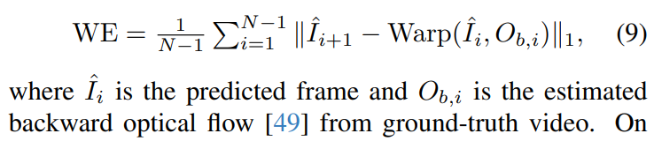

- 选一条线，看多帧拼出来的图和 GT 对比看效果


#### **Loss**

- L1 + perceptual loss 作为重建 loss
- GAN Loss
- frame difference loss $L_{diff}$

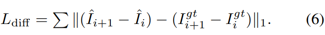

- structure weighted consistency loss

  提出的 loss

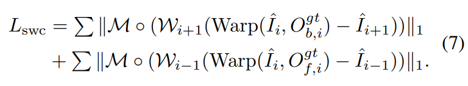

其中 Wi 为基于 GT 使用 sobel 算子预测的边缘，得到的 weighted map

> W = (1 + wS) computed on the ground-truth frames, where w = 3 is a weighting factor and S is a structure (edge) map using the Sobel operator


总体 loss 关注各个部分的权重，GAN loss 权重只有 1/40

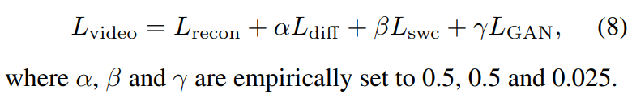


### exp

在合成数据集主要看 **LPIPS，DISTS**；
真实数据集上指标，比较 NIQE, BRISQUE；

PSNR SSIM 在合成数据上不准（主观好，指标差）

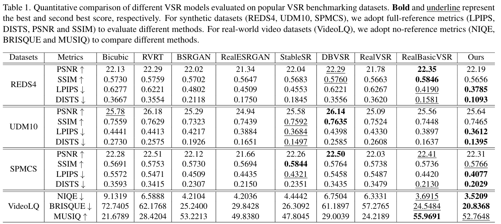


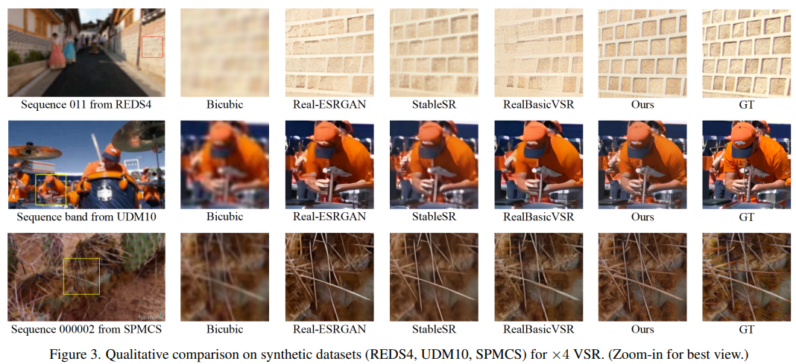


看一条线上的变化，发现提出的方法还是会生成很多不存在的东西

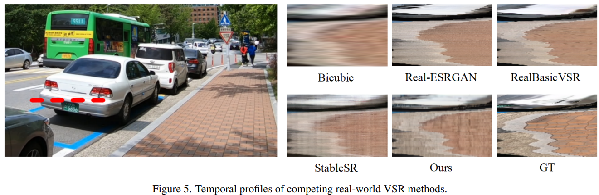

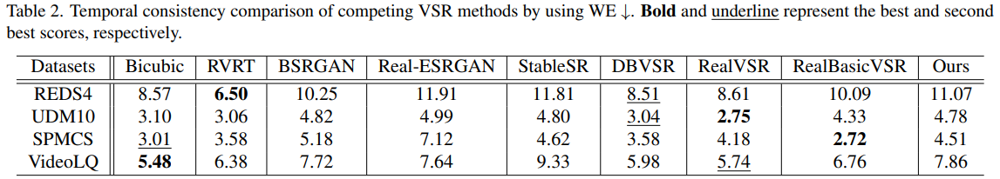


### Ablation

只 finetune decoder 就能够接近最终效果

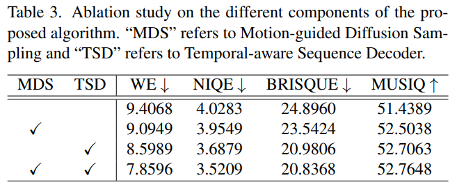


**光流预训练网络的选取 SpyNet 和 RAFT 差异不大**

这个实验看不太出来，因为在 diffusion 每一步都 warp 在去噪，可能中和掉了

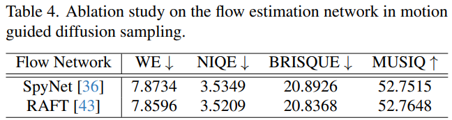


VAE Decoder **加入 temporal layer & 引入 VAE Encoder 特征都用才能够提升效果**！

提出的两个 loss 主观指标影响不是很大，但能提升一些 Warping Error 指标（但说指标又不准。。）

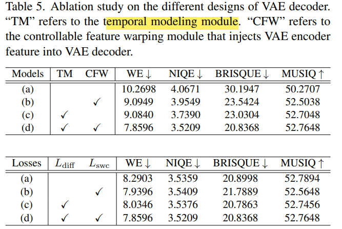


## Limitations

没用具体引导，生成出来形状只要和 LR 差不多，但和 GT 差很多

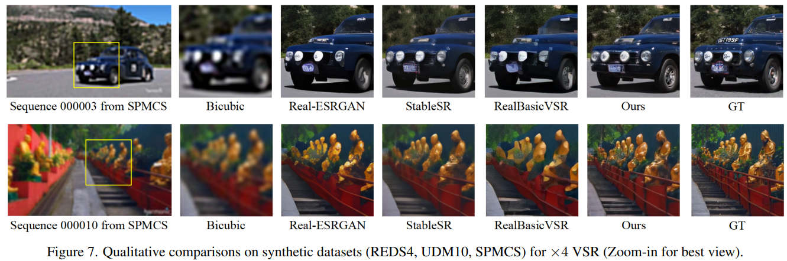


## Summary :star2:

> learn what & how to apply to our task

1. 总体 loss 关注各个部分的权重，GAN loss 权重只有 1/40

2. VideoSR 训练数据用 REDS 足够（整合 train + val）

3. 使用光流时，需要预测前后帧遮挡的 mask，这部分遮挡在对光流 warp 有影响 

4. average warping error (WE) 指标不准，当视频很模糊，会导致 WE 指标很好，但主观效果并不好；

5. 对于 VSR, 对 SD VAE Decoder 加 temporal layer 微调很重要；同时引入 VAE Encoder 特征也能够进一步提升时序一致性 :star:

6. 融合 Encoder 特征方法 :star:

   参考 StableSR CFW module  融合 VAE Encoder 特征 e

   
