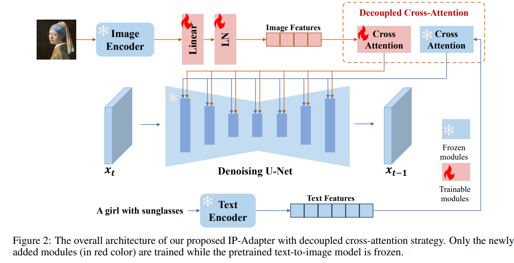
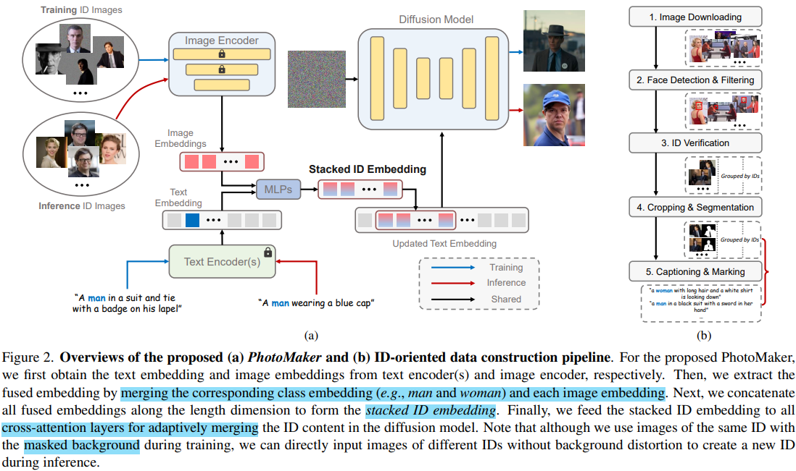
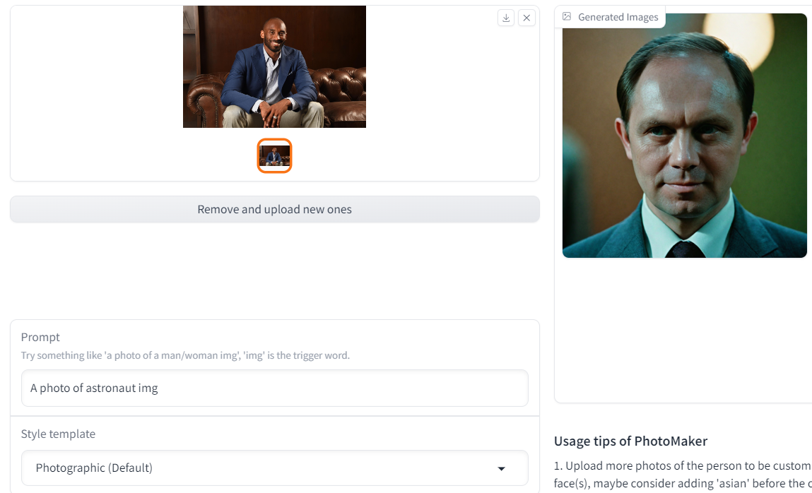
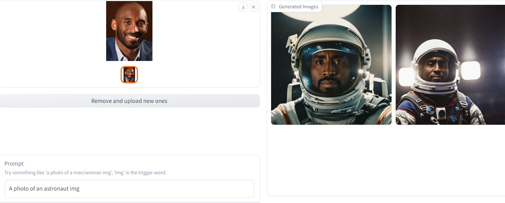

# PhotoMaker: Customizing Realistic Human Photos via Stacked ID Embedding

> "PhotoMaker: Customizing Realistic Human Photos via Stacked ID Embedding" Arxiv, 2023 Dec, `PhotoMaker`
> [paper](http://arxiv.org/abs/2312.04461v1) [website](https://photo-maker.github.io/) [code](https://github.com/TencentARC/PhotoMaker) [online_test](https://huggingface.co/spaces/TencentARC/PhotoMaker) 
> [pdf](./2023_12_Arxiv_PhotoMaker--Customizing-Realistic-Human-Photos-via-Stacked-ID-Embedding.pdf)
> Authors: `TencentARC ` Zhen Li, Mingdeng Cao, Xintao Wang, Zhongang Qi, Ming-Ming Cheng, Ying Shan

## Key-point

- Task: personalized generation

- Problems

  existing personalized generation methods cannot simultaneously satisfy the requirements of high efficiency, promising **identity (ID) fidelity**, and **flexible text controllability**. 

  生成出来是否还是同一个人 & 文本控制风格的多样性

  neither DreamBooth nor SDXL can achieve **identity mixing**

  

- :label: Label:

1. mainly encodes an arbitrary number of input ID images into a stack ID embedding for **preserving ID information**

   Such an embedding, serving as a unified ID representation, can not only encapsulate the characteristics of the same input ID comprehensively, but also **accommodate the characteristics of different IDs for subsequent integration.** 

2. propose an **ID-oriented data construction pipeline** to assemble the training data.

   提升训练数据质量，ID 特征提取的特征更好

看效果生成的人像，即使迁移风格，还保留了很多原始 ID 特征，效果很惊艳！

## Contributions

## Introduction

- "IP-Adapter: Text Compatible Image Prompt Adapter for Text-to-Image Diffusion Models" Arxiv, 2023 Aug, `IP-Adapter` 
  [paper](https://arxiv.org/abs/2308.06721) 

  Tencent AI Lab

## methods

- Q：如何训练使得 ID feature 能够具有区分度？

1. We first obtain the text embedding and image embeddings from text encoder(s) and image encoder, respectively. Then, we extract the fused embedding by merging the corresponding class embedding (e.g., man and woman) and each image embedding. Next, we concatenate all fused embeddings along the length dimension to form the **stacked ID embedding**.
2. feed the stacked ID embedding to **all cross-attention layers** for adaptively merging the ID content in the diffusion model.

训练数据： use images of the same ID with the masked background during training, we can directly input images of different IDs without background distortion to create a new ID during inference. 去除掉冗余的背景信息

## Experiment

> ablation study 看那个模块有效，总结一下

## Limitations

- 推理时间很长！单图生成要 > 30s

- 输入图像人脸区域很小的时候出图很烂；对应文本不好

  

  

- 某些人脸效果不好，例如只提取到了肤色&胡子的特征，但脸型，比例并不像；没训练过？

## Summary :star2:

> learn what & how to apply to our task

