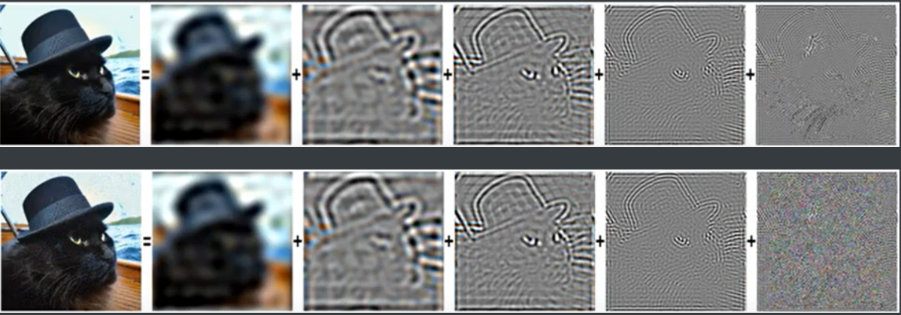
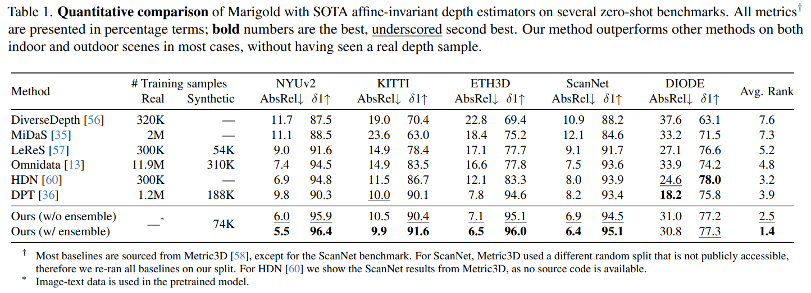

# Repurposing Diffusion-Based Image Generators for Monocular Depth Estimation

> "Repurposing Diffusion-Based Image Generators for Monocular Depth Estimation" CVPR-oral, 2023 Dec 4, `Marigold`
> [paper](http://arxiv.org/abs/2312.02145v2) [code](https://github.com/prs-eth/Marigold) [web](https://marigoldmonodepth.github.io) [pdf](./2023_12_CVPR-oral_Repurposing-Diffusion-Based-Image-Generators-for-Monocular-Depth-Estimation.pdf) [note](./2023_12_CVPR_Repurposing-Diffusion-Based-Image-Generators-for-Monocular-Depth-Estimation_Note.md)
> Authors: Bingxin Ke, Anton Obukhov, Shengyu Huang, Nando Metzger, Rodrigo Caye Daudt, Konrad Schindler
>
> 1. 最佳论文候选！！depth estimator SOTA
> 2. 验证 offset noise 能够大幅提升模型对于暗部细节的生成能力！！

## Key-point

- Task: depth estimator for images in the wild
- Problems
- :label: Label:

## Contributions

- 利用 SD 先验，微调一个单目深度估计模型

> We present Marigold, a diffusion model and associated fine-tuning protocol for monocular depth estimation. Its core principle is to leverage the rich visual knowledge stored in modern generative image models.

- 微调 SD，泛化性超好

> Our model, derived from Stable Diffusion and fine-tuned with synthetic data, can zero-shot transfer to unseen data, offering state-of-the-art monocular depth estimation results.


## Introduction

## methods

基于 SDv2，使用原图 RGB 作为 condition，zT 为 depth 特征 >> 后面 VAE 出来就是 depth 图

> Therefore, we base our model on a pretrained text-to-image LDM (Stable Diffusion v2 [38]), which has learned very good image priors from LAION-5B [46]. With minimal changes to the model components, we turn it into an imageconditioned depth estimat

zT 把图像的特征 zx & depth 特征 zd **concat 起来组成 zT 输入 Unet，微调 UNet 第一层 Conv** :star:


### depth VAE & 1st conv

- Q：使用 Depth 作为 condition，对应的 VAE 咋搞？

> We take the frozen VAE to encode both the image and its corresponding depth map into a latent space for training our conditional denoiser.

直接把 C=1 的 depth map 复制 3 份凑为类似 RGB C=3

> Given that the encoder, which is designed for 3-channel (RGB) inputs, receives a single-channel depth map, we replicate depth map into three channels to simulate an RGB ima


- Q：zT 是两个特征的 concat， Cx2 后第一层 conv 初始权重咋搞？

复制一份权重，并把 weight value 除以 2

> To prevent inflation of activations magnitude of the first layer and keep the pretrained structure as faithfully as possible, **we duplicate weight tensor of the input layer and divide its values by 2** 


### finetune


#### **Affine-invariant depth normalization**


- Q：为啥对 depth GT 做归一化？

由于用 VAE 对 depth 提取特征，**为了匹配 VAE 输入的取值范围 [-1,1] （预训练的 VAE 要求 RGB range [-1,1]），把 GT depth 归一化到 [-1,1] :star:** && 并且保证 depth 特征对于不同数据独立！（每个数据有自己的 far-near plane）

> For the ground truth depth maps d, we implement a linear normalization such that the depth primarily falls in the value range **[−1,1], to match the designed input value range of the VAE**

1. working with the original Stable Diffusion VAE
2. 确保 depth 表示的数据分布独立！对于不同数据，要规定一个 near & far plane

> it enforces a canonical affine-invariant depth representation independent of the data statistics -- any scene must be bounded by near and far planes with extreme depth values


#### Training on synthetic data

真实的 depth 数据受限于传感器，细节很垃圾

> Real depth datasets suffer from missing depth values caused by the physical constraints of the capture rig and the physical properties of the sensors.

解释了下为啥有 Real depth 有 noise

> Specifically, the disparity between cameras and reflective surfaces diverting LiDAR laser beams are inevitable sources of ground truth noise and missing pixels [21, 51]

所以用合成的，认为得到的梯度更干净 :star:

> If our assumption about the possibility of finetuning a generalizable depth estimation from a text-to-image LDM is correct, then **synthetic depth gives the cleanest set of examples and reduces noise in gradient updates** during the short fine-tuning protocol.


### Annealed multi-resolution noise :star:

ablation 里面发现提升明显！！！

- Q：咋搞？

> [Multi-Resolution Noise for Diffusion Model Training | multires_noise – Weights & Biases (wandb.ai)](https://wandb.ai/johnowhitaker/multires_noise/reports/Multi-Resolution-Noise-for-Diffusion-Model-Training--VmlldzozNjYyOTU2?s=31)
>
> - "On the Importance of Noise Scheduling for Diffusion Models" 
>   [paper](https://arxiv.org/abs/2301.10972)
> - "Simple diffusion: End-to-end diffusion for high resolution images" Arxiv, 2023 Jan 26
>   [paper](http://arxiv.org/abs/2301.11093v2) [code]() [pdf](./2023_01_Arxiv_Simple-diffusion--End-to-end-diffusion-for-high-resolution-images.pdf) [note](./2023_01_Arxiv_Simple-diffusion--End-to-end-diffusion-for-high-resolution-images_Note.md)
>   Authors: Emiel Hoogeboom, Jonathan Heek, Tim Salimans

> Adding the same amount of noise to images at different resolution illustrates how resolution affects the 'signal-to-noise' ratio and thus how rapidly information is destroyed
>
> Adjusting the noise schedule to shift the signal-to-noise ratio fixes part of the problem, but a core issue remains: high-frequency details are destroyed far faster than low-frequency details.

#### offset noise:star:

> https://www.crosslabs.org/blog/diffusion-with-offset-noise
>
> The solution Nicholas came up with is to re-write the noising function from noise = torch.randn_like(latents) to noise = torch.randn_like(latents) + 0.1 * torch.randn(latents.shape[0], latents.shape[1], 1, 1).

- 使用 offset noise 能够提升模型对于暗部细节的学习！！！！


> The offset noise trick addresses part of the issue by effectively combining very high-frequency noise with extremely low-frequency noise (the offset)


- Q：为什么 SD 对于细节很好，但对于粗略的区域（纯黑，纯白很垃圾）？？

低频信息在加噪过程中被破坏地更慢，高频细节加一点噪声就完全不一样了！！！:star: 反过来在 reverse process，由于训练时候低频信息没怎么被破坏。。预训练的 SD 会认为图像的低频信息来自初始化的 random seed。。。所以偏差会很大。。。:star: 

> Instead, those things which noise destroys **last** are in turn most **weakly** altered by the reverse process - those things are instead inherited from the latent noise sample that is used to start to process. 
>
>  the longer wavelength features take longer for the noise to destroy:star: 
>
> 低频信息损坏的比高频慢，但是在 reverse process 低频就恢复不出来了！！！:star:

看下可视化原理的解释

https://www.crosslabs.org/blog/diffusion-with-offset-noise 看下视频，里面第一帧的高频信息本来是灰色的，加了一次噪声就变成高斯噪声了。。而低频却没怎么变!!



- Q：这里用 wavelength 表示特征？？是啥？？

> https://www.youtube.com/watch?v=cVxQmbf3q7Q&t=145s 讲解 blog

可以用 sin wave 表示图像，把波形映射到 0，1 像素值，出来一条线，组成一张图；一张图像可以用多个 frequency components 叠加！！！:star:

> https://www.youtube.com/watch?v=D9ziTuJ3OCw :star: 演示图像由 frequency wave 组成
>
>  At [2:30](https://www.youtube.com/watch?v=D9ziTuJ3OCw&t=150s) we speed up the video, as the last 20,000 frequency components have pretty small magnitudes (and end up only changing brightness and smoothness). 


低频信息在加噪过程中被破坏地更慢，高频细节加一点噪声就完全不一样了！！！:star: 反过来在 reverse process，由于训练时候低频信息没怎么被破坏。。预训练的 SD 会认为图像的低频信息来自初始化的 random seed。。。所以偏差会很大。。。:star: 

- 一句话总结就是，noising function 没怎么改变图像的低频信息，导致模型学不好低频！！进一步导致模型推理的时候对于低频预测的很垃圾
- 模型训练时候，输入的 noise 有超级多 mean，loss 约束都是一样的，**模型倾向于学习输出的 mean 都和原来保持一样**，原始输入的 mean 来自分布 `rand(0,1)` 就是 0.5，模型在预测的时候也倾向于预测 mean=0.5 的图！！！看下面作图那么亮就是这个道理
- 使用 noise-offset，模型就有了更多 mean 的选择空间，从而能生成更高对比度的图像


> 也许解释了为啥自己训练的灰度图模型，一会出来的背景纯黑还好，一会就很垃圾。。。


> https://www.youtube.com/watch?v=D9ziTuJ3OCw :star: 演示一张图，加噪 64steps 的均值变化，还是在 0.3 左右没怎么变化


- Q：咋解决？

图像的低频信息，主要是亮度！

```python
#noise = torch.randn_like(latents)
noise = torch.randn_like(latents) + 0.1 * torch.randn(latents.shape[0], latents.shape[1], 1, 1)
```

> This would make it so that the **model learns to change the zero-frequency of the component freely,** because that component is now being randomized ~10 times faster than for the base distribution (the choice of 0.1 there worked well for me given my limited data and training time - if I made it too large it’d tend to dominate too much of the model’s existing behavior, but much smaller and I wouldn’t see an improvement).

效果惊人！！修改一下，**只用 40 个图像微调个 1k step 就很好了！！**

> ine-tuning with noise like this for a thousand steps or so on just **40 hand-labeled images** is enough to significantly change the behavior of Stable Diffusion, without making it get any worse at the things it could previously generate. Here are the results of the four prompts higher up in the article for comparison:


#### pyramid noise:star:

上面 offset noise 只对 mean 调整，能够进一步优化！

- "https://arxiv.org/abs/2301.10972"


### inference

- 推理 Depth 特征 zd 用标准高斯噪声代替
- DDIM


- Q：VAE 有随机的 noise 项，造成生成结果随机性咋搞。。。

预测 N 次取加权平均！模型预测 $\set{\hat{d1}, \dots, \hat{dN},}$ ，**用最优化的方式得到权重&偏置**，$\hat{d^`} = \hat{di} * s_i + t_i$，最后对一堆更新完的 depth **取中位数**

> Test-time ensembling. The stochastic nature of the inference pipeline leads to varying predictions depending on the initialization noise in z (d) T . 
>
> Capitalizing on that, we propose the following test-time ensembling scheme, capable of combining multiple inference passes over the same input. For each input sample, **we can run inference N times.**


## setting

- SDv2, 参考原始 SD 微调为 depth 的方式，用 v-prediction 作为了 loss 训练

- 训练：不用 text，DDPM 1k steps，只训练 18K iteration （1w8)

  > Training our method takes 18K iterations using a batch size of 32. To fit one GPU, we accumulate gradients for 16 steps
  >
  > We use the Adam optimizer with a learning rate of 3 · 10−5
  >
  > Training our method to convergence takes approximately 2.5 days on a single Nvidia RTX 4090 GPU card :star:

- infer: DDIM 50 steps

  - 推理 N=10 次取平均。。。


## Experiment

> ablation study 看那个模块有效，总结一下

- AbsRel 指标，越小越好

Absolute Mean Relative Error (AbsRel)，M 为像素数, a 为预测的 depth
$$
Absolute Mean Relative Error (AbsRel) = \frac{1}{M}\sum_{i=1}^{M}\abs{a_i - d_i}/d_i
$$

- $\delta1$ accuracy 越大，每个depth 的差距越小

> The second metric, δ1 accuracy, measures the proportion of pixels satisfying **max(ai/di , di/ai) < 1.25**


指标出奇地好了很多。。。




按法向量上色


### ablation

- 推理 N 次，**N 取 10 还可以，与 N=1 单次出来相比 AbsReal差距 0.7 ........** ????????
- DDIM 去噪 10 步后面就差不多
- 训练的 noise 初始化，使用多尺度的 noise & anneal 提升明显啊。。。


## Limitations


## Summary :star2:

> learn what

- Q：要使用 Depth 作为 condition 用 VAE 提取特征，**没有 depth VAE 咋办？**

1. 直接把 C=1 的 depth map 复制 3 份凑为类似 RGB C=3，**实验发现 ok 可以这么搞！**
2. 由于用 VAE 对 depth 提取特征，**为了匹配 VAE 输入的取值范围 [-1,1] （预训练的 VAE 要求 RGB range [-1,1]），把 GT depth 归一化到 [-1,1] :star:** && 并且保证 depth 特征对于不同数据独立！（每个数据有自己的 far-near plane）


- Q：zT 是两个特征的 concat， Cx2 后第一层 conv 初始权重咋搞？

复制一份权重，并把 weight value 除以 2

> To prevent inflation of activations magnitude of the first layer and keep the pretrained structure as faithfully as possible, **we duplicate weight tensor of the input layer and divide its values by 2** 


- Q：VAE 有随机的 noise 项，造成生成结果随机性咋搞。。。**（有的垃圾有的好）**

预测 N 次取加权平均！模型预测 $\set{\hat{d1}, \dots, \hat{dN},}$ ，**搞一个模型预测权重&偏置**，$\hat{d^`} = \hat{di} * s_i + t_i$，最后对一堆更新完的 depth **取中位数**


- 训练没有假象地那么重，人家用 1 个 4090 做出 CVPR oral....

训练：不用 text，DDPM 1k steps，只训练 18K iteration （1w8)

> Training our method takes 18K iterations using a batch size of 32. To fit one GPU, we accumulate gradients for 16 steps
>
> We use the Adam optimizer with a learning rate of 3 · 10−5
>
> Training our method to convergence takes approximately 2.5 days on a single Nvidia RTX 4090 GPU card :star:


- depth 指标

- AbsRel 指标，越小越好

Absolute Mean Relative Error (AbsRel)，M 为像素数, a 为预测的 depth
$$
Absolute Mean Relative Error (AbsRel) = \frac{1}{M}\sum_{i=1}^{M}\abs{a_i - d_i}/d_i
$$

- $\delta1$ accuracy 越大，每个depth 的差距越小

> The second metric, δ1 accuracy, measures the proportion of pixels satisfying **max(ai/di , di/ai) < 1.25**


- Diffusion 训练 trick :star:
  - 推理 N 次，**N 取 10 还可以，与 N=1 单次出来相比 AbsReal差距 0.7 ........**
  - 训练的 noise 初始化，使用多尺度的 noise & anneal 提升明显啊。。。


### how to apply to our task

- 多张图搞个深度图，noise 的地方检测出来？？？

  把 depth 最浅的 & 多张图不一致的 >> 作为可疑区域？


- 使用 offset noise 能够提升模型对于暗部细节的学习！！！！

暗部细节的效果好了超级超级多！！！


https://www.crosslabs.org/blog/diffusion-with-offset-noise 看下视频，里面第一帧的高频信息本来是灰色的，加了一次噪声就变成高斯噪声了。。而低频却没怎么变!!


- 低频信息在加噪过程中被破坏地更慢，高频细节加一点噪声就完全不一样了！！！:star: 反过来在 reverse process，由于训练时候低频信息没怎么被破坏。。预训练的 SD 会认为图像的低频信息来自初始化的 random seed。。。所以偏差会很大。。。:star: 

- 模型训练时候，输入的 noise 有超级多 mean，loss 约束都是一样的，**模型倾向于学习输出的 mean 都和原来保持一样**，原始输入的 mean 来自分布 `rand(0,1)` 就是 0.5，模型在预测的时候也倾向于预测 mean=0.5 的图！！！看下面作图那么亮就是这个道理

  > 也许解释了为啥自己训练的灰度图模型，一会出来的背景纯黑还好，一会就很垃圾。。。


- 多个patch 不一致也许是每个 patch 分别加 noise 造成的？？


