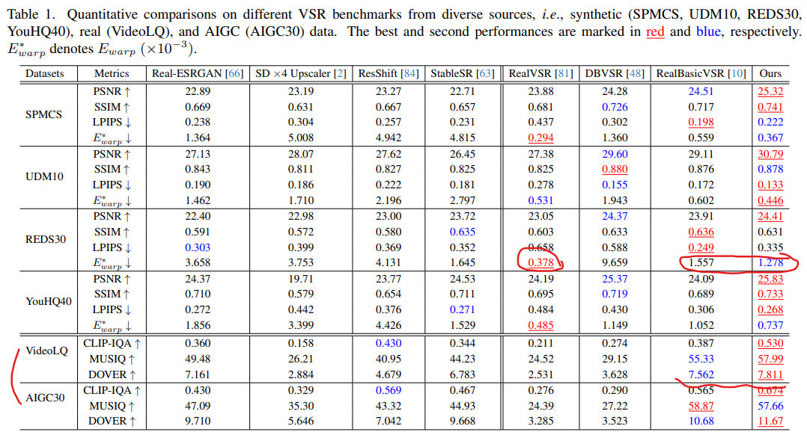
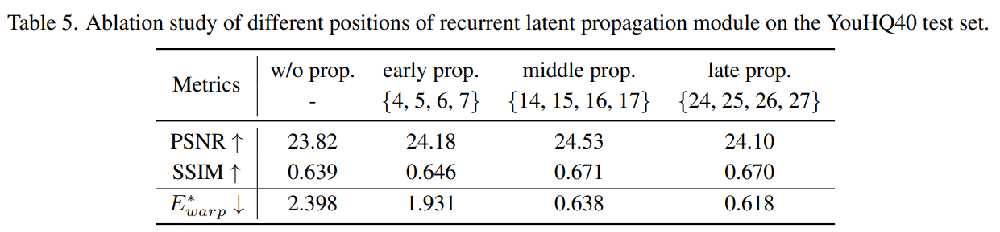
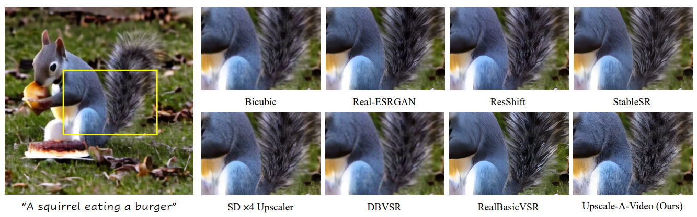

# Upscale-A-Video: Temporal-Consistent Diffusion Model for Real-Wrld Video Super-Resolution

> "Upscale-A-Video: Temporal-Consistent Diffusion Model for Real-World Video Super-Resolution" Arxiv, 2023 Dec, `Upscale-A-Video`
> [paper](http://arxiv.org/abs/2312.06640v1) [code](https://github.com/sczhou/Upscale-A-Video) [website](https://shangchenzhou.com/projects/upscale-a-video/) [pdf](./2023_12_CVPR_Upscale-A-Video--Temporal-Consistent-Diffusion-Model-for-Real-World-Video-Super-Resolution.pdf)
> Authors: Shangchen Zhou, Peiqing Yang, Jianyi Wang, Yihang Luo, Chen Change Loy

## Key-point

- Task: VSR

- Problems

  applying Text-based diffusion models to video super-resolution remains challenging due to the **high demands for output fidelity and temporal consistency**;

  temporal instability and the emergence of flickering artifacts: localized segments, but also in preserving coherence throughout the entire video

- :label: Label:


提出使用 latent diffusion model 作为先验信息进行 VSR 视频超分。

如何保证 temporal coherence？

1. 在 SD UNet 中加入 temporal layer & 3D Conv，微调这个 temporal layer；对 VAE Decoder 第一层增加 SFT Layer & 3D Conv 进行微调；每次 UNet 进 8 帧作为 local clip 

   locally, it **integrates temporal layers into U-Net** and 增加 SFT layer 微调 VAE-Decoder (VAE Decoder 本身会引入闪烁),

2. 整个视频的所有 local clips 过 diffusion 得到各个 clip 的 $z_0$ 特征，将这些特征用光流传播一遍
   globally, without training, a flow-guided recurrent latent propagation module is introduced to enhance overall video stability by propagating and fusing latent

由于使用 SD x4 模型，支持使用 prompt 作为条件；支持使用 noise level 控制修复效果


## Contributions


## Introduction

exploiting robust and extensive generative prior encapsulated in a pretrained image diffusion model


使用光流维持整个视频的连续性

- "RAFT: Recurrent all-pairs field transforms for optical flow"


### diffusion 加速

>[blog](https://zhuanlan.zhihu.com/p/651180944)

- "Progressive distillation for fast sampling of diffusion models"

v-prediction perameterization 本文使用的


### Video Diffusion

> - VGen is an open-source video synthesis codebase developed by the Tongyi Lab of Alibaba Group
>   [code](https://github.com/damo-vilab/i2vgen-xl)

从头训练

- "Progressive distillation for fast sampling of diffusion models"
- "Imagen Video: High definition video generation with diffusion models" Arxiv, 2022
- "Video diffusion models" NeurIPS, 2022
- "Structure and content-guided video synthesis with diffusion models" ICCV, 2023
- "LaMD: Latent motion diffusion for video generation" Arxiv, 2023


> 控制方式参考 Stable Diffusion + ControlNet
>
> - "High-resolution image synthesis with latent diffusion models" CVPR, 2022
> - "Adding conditional control to text-to-image diffusion models" ICCV, 2023

- "FLATTEN: optical flow-guided attention for consistent text-to-video editing" Arxiv, 2023 Oct
- "Tokenflow: Consistent diffusion features for consistent video editing" Arxiv, 2023 Oct
- "FateZero: Fusing attentions for zero-shot text-based video editing" ICCV, 2023


- "Tune-A-Video: One-Shot Tuning of Image Diffusion Models for Text-to-Video Generation" ICCV, 2022 Dec
  [paper](https://arxiv.org/abs/2212.11565) [code](https://github.com/showlab/Tune-A-Video) [website](https://tuneavideo.github.io/)
  [note](./2022_12_ICCV_Tune-A-Video--One-Shot-Tuning-of-Image-Diffusion-Models-for-Text-to-Video-Generation_Note.md)


Video2Video 框架，对 LDM 的 UNet 改为时序的：2D inflate 为 3D（时间上步长=1），原来的 attention layer 后面增加几个 temporal attention layer（framework 里面右边小图），训练里面的 MLP 就行

1. 视频帧先用 VAE 映射到 latent space，**用 DDIM 加噪到 zt 作为开始点**，以目标编辑的文本作为 condition 开始去噪；

2. **One-shot 训练**，只对当前视频微调一下就行：We sample 32 uniform frames at resolution of **512 × 512 from input video**, and **finetune the models with our method for 500 steps on a learning rate 3 × 10−5 and a batch size 1**；

   在一个 A100 上使用时候对于一个视频微调 10min，测试 1min 实现编辑


> - 如何设置只训练其中几层？
>
> ```python
> unet = UNet3DConditionModel.from_pretrained_2d(pretrained_model_path, subfolder="unet")
> unet.requires_grad_(False)
> for name, module in unet.named_modules():
>     if name.endswith(tuple(trainable_modules)):
>         for params in module.parameters():
>             params.requires_grad = True
> ```
>
> - Inflated Conv3d
>
>   ```python
>   class InflatedConv3d(nn.Conv2d):
>       def forward(self, x):
>           video_length = x.shape[2]
>               
>           x = rearrange(x, "b c f h w -> (b f) c h w")
>           x = super().forward(x)
>           x = rearrange(x, "(b f) c h w -> b c f h w", f=video_length)
>               
>           return x
>   ```


问题：suffer from limited generalizability and the selection of hyperparameters can be tricky


#### 3D 卷积

- "Video Diffusion Models" CVPR, 2022 Apr
  [paper](https://arxiv.org/abs/2204.03458v2) [website](https://video-diffusion.github.io/) [blog](https://zhuanlan.zhihu.com/p/585009571)

>  To generate long and higher resolution videos we introduce a new conditional sampling technique for spatial and temporal video extension;
> **the first results on a large text-conditioned video generation task**

1. 第一个使用扩散模型进行视频生成任务的论文工作，这里的视频生成任务包括无条件和有条件两种设定。

2. 提出了3D UNet，该架构使用到了space-only 3D卷积和时空分离注意力

   将原UNet中的2D卷积替换成了**space-only 3D卷积**（space-only 3D convolution）3x3卷积替换为1x3x3卷积 （T维度步长1）；

3. 为了生成比训练时帧数更多的视频，论文还展示了如何使用梯度条件法进行重构指导采样，从而可以自回归地将模型扩展到更长的时间步长和更高的分辨率 :question:

The input is a noisy video $z_t:~(b,t,h,w,c)$, conditioning c, and the log SNR $\lambda_t$. 使用 3D UNet
显存不够，only train on a small subset of say 16 frames at a time


- "Imagen Video: High Definition Video Generation with Diffusion Models" CVPR, 2022 Oct
  [paper](https://arxiv.org/pdf/2210.02303.pdf)

级联结构：scales up the Video Diffusion Model with a cascade of spatial and temporal video super-resolution models


- "Align your Latents: High-Resolution Video Synthesis with Latent Diffusion Models" CVPR, 2023 Apr, **VideoLDM** :star: :warning:
  [paper](https://arxiv.org/abs/2304.08818) [website](https://research.nvidia.com/labs/toronto-ai/VideoLDM/) [code: unofficial implementation](https://github.com/srpkdyy/VideoLDM.git)
  [note](./2023_04_CVPR_Align-your-Latents--High-Resolution-Video-Synthesis-with-Latent-Diffusion-Models_Note.md)

  > diffusion 用于 text2video 生成，用预训练的 stable-diffusion，对 U-net 加 temporal layer 实现时序一致性


后续工作

- "Dreamix: Video Diffusion Models are General Video Editors" CVPR, 2023 Feb :warning:
  [paper](https://arxiv.org/abs/2302.01329) [website](https://dreamix-video-editing.github.io/)

微调确保模型了解原始视频的高分辨率属性。对输入视频的简单微调会促成相对较低的运动可编辑性，这是因为模型学会了更倾向于原始运动而不是遵循文本 prompt。（训练视频运动信息有限，学的不好，会限制编辑后的物体运动）

> 仅利用输入视频进行视频扩散模型的微调会限制物体运动变化，相反，该研究使用了一种混合目标，即除了原始目标（左下角）之外，本文还对无序的帧集进行了微调，这是通过「masked temporal attention」来完成的，以防止时间注意力和卷积被微调（右下）。这种操作允许向静态视频中添加运动。
>
> 视频编辑任务，想训练出更多的 motion，之后在看。


- "AnimateDiff: Animate your personalized text-to-image diffusion models without specific tuning" CVPR, 2023 Jul :statue_of_liberty:, `AnimateDiff v1`
  [paper](https://arxiv.org/abs/2307.04725) [code](https://github.com/guoyww/animatediff/) [website](https://animatediff.github.io/)

训练一个 motion modeling module 就是在 Text2image 模型上**加几层时序 atten layer，只不过这个时序 attention layer 可以迁移到不同 Diffusion 模型**（例如动画，油画版本的 SD）；输入 5D tensor `batch × channels × frames × height × width`，**只训练增加的 temporal transformer**

> 有一系列工作，出到了 v3


we transform each 2D convolution and attention layer in the original image model into spatialonly pseudo-3D layers by **reshaping the frame axis into the batch axis**；

**使用原始的 Transformer 作为 motion module 足够**：consists of several selfattention blocks operating along the temporal axis；将 HW 维度和 Batch 维度合并，**剩下 `(bhw, t, c)` be projected and go through several self-attention blocks**

Trick：为了增大感受野，insert it at every resolution level of the U-shaped diffusion network；&& add sinusoidal position encoding [30] to the self-attention blocks； **zero initialize** the output projection layer of the temporal transformer；对于文本 prompt，没有用通用的 prompt，因为不同风格的 SD 有各自的 trigger word。就手动去对每个视频定制一下；


- AnimateDiff V2 [code](https://github.com/guoyww/animatediff/?tab=readme-ov-file#202309-animatediff-v2) 
  1. the motion module is trained upon larger resolution and batch size.
  2. we support **MotionLoRA** for eight basic camera movements. 支持镜头移动作为 condition :question:

- "SimDA: Simple diffusion adapter for efficient video generation" Arxiv, 2023

- " Compositional video synthesis with motion controllability" Arxiv, 2023 Jun
- "Preserve Your Own Correlation: A noise prior for video diffusion models" ICCV, 2023 May
  [paper](https://arxiv.org/abs/2305.10474)
- "Latent Video Diffusion Models for High-Fidelity Long Video Generation" CVPR, 2022 Nov, `LVDM`
  [paper](https://arxiv.org/abs/2211.13221) [website](https://yingqinghe.github.io/LVDM/) [code](https://github.com/YingqingHe/LVDM)

自己训练一个 ddpm


#### temporal attn

- "VideoComposer: Compositional Video Synthesis with Motion Controllability" Arxiv, 2023 Jun, **VideoComposer**
  [](https://github.com/damo-vilab/videocomposer) [](https://arxiv.org/abs/2306.02018) [](https://videocomposer.github.io/)
  [note](./2023_06_VideoComposer--Compositional-Video-Synthesis-with-Motion-Controllability_Note.md)


- "LaVie: High-quality video generation with cascaded latent diffusion models" CVPR, 2023 Sep
  [paper](https://arxiv.org/pdf/2309.15103.pdf) [website](https://vchitect.github.io/LaVie-project/) [code](https://github.com/Vchitect/LaVie ) 
  [note](./2023_09_CVPR_LAVIE--High-Quality-Video-Generation-with-Cascaded-Latent-Diffusion-Models_Note.md)

  > text2video

augmenting a pre-trained Stable Diffusion model with an efficient temporal module and jointly fine-tuning the entire model on both image and video datasets


generating videos with 16 frames at a resolution of 320 × 512

1. inflate 2D -> 3D Conv
2.  we extend the original transformer block to a Spatio-Temporal Transformer (ST-Transformer) by including a temporal attention layer after each spatial layer
3. Rotary Positional Encoding (RoPE) from the recent LLM (Touvron et al., 2023) to integrate the temporal attention layer
4. Through various experiments with different designs of the temporal module, such as spatio-temporal attention and temporal causal attention, we observed that increasing the complexity of the temporal module only marginally improved the results while significantly increasing model size and training time


- "SEINE: Short-to-Long Video Diffusion Model for Generative Transition and Prediction" Arxiv, 2023 Oct
  [paper](https://arxiv.org/abs/2310.20700) [code](https://github.com/Vchitect/SEINE)

  > image2video, improved LaVie


#### **cross-frame Attn**

- "Tune-A-Video: One-shot tuning of image diffusion models for text-to-video generation" ICCV, 2023 Dec
  [paper](https://arxiv.org/abs/2212.11565) [code](https://github.com/showlab/Tune-A-Video)

- "Text2Video-Zero: Text-to-Image Diffusion Models are Zero-Shot Video Generators" CVPR, 2023 Mar
  [paper](http://arxiv.org/abs/2303.13439v1) [code](https://github.com/Picsart-AI-Research/Text2Video-Zero) 
  [note](./2023_03_CVPR_Text2Video-Zero--Text-to-Image-Diffusion-Models-are-Zero-Shot-Video-Generators_Note.md)

- "VideoBooth: Diffusion-based Video Generation with Image Prompts" CVPR, 2023 Dec
  [paper](https://arxiv.org/abs/2312.00777) [code](https://github.com/Vchitect/VideoBooth) [website](https://vchitect.github.io/VideoBooth-project/)
  [note](./2023_12_CVPR_VideoBooth--Diffusion-based-Video-Generation-with-Image-Prompts_Note.md)
- "Rerender A Video: Zero-shot text-guided video-to-video translation" SIGGRAPH, 2023 Jun
  [paper](https://arxiv.org/pdf/2306.07954.pdf) [code](https://github.com/williamyang1991/Rerender_A_Video)
  [note](./2023_06_SIGGRAPH_Rerender-A-Video--Zero-Shot-Text-Guided-Video-to-Video-Translation_Note.md)


**Temporal Embedding**

- "LLaMA: Open and efficient foundation language models"


**color shifts**

a Spatial Feature Transform (SFT) allows the input videos to provide low-frequency information

- "Recovering realistic texture in image super-resolution by deep spatial feature transform." CVPR, 2018, `SFTGAN`
  [paper](https://arxiv.org/pdf/1804.02815.pdf) [blog](https://zhuanlan.zhihu.com/p/314620956)

class-conditional image super-resolution 基于类别信息的先验的超分，当一副图像中存在多个语义类时也要实现SR

**已有的超分模型没办法识别出LR图片是哪个类别的。**把**分割的图(语义图)**传入模型就行了，这个分割的图，我们就叫做categorical prior，这里就解释了前面提到的prior的含义。这个patch是sky，是building，是plant等等，都可以通过分割的图来知晓。由此看来，分割的图(categorical prior)很重要呀。

SFT层以语义分割概率图为条件，基于语义分割概率图，它生成一对调制参数，以在空间上对网络的特征图应用仿射变换。SFT层有3点好处：

- 节约参数。
- 即插即用，很容易与先有模型结合。
- 可扩展，prior不仅仅可以是语义图，也可以是深度图等等。


SFT 公式，类似 AdaIN


问题：语义分割图也不够好，实际场景中，物体类别的分隔界限通常并不十分明显，比如图9中的植物和草的区域，它们之间的过渡是“无缝”且连续的；sftgan的segmentation 模型只支持8个类别，当然我们可以训练更多的类别，这没问题。我的问题是，对于实际场景来说，不同纹理的类别会非常多，比如几百种甚至更多，这个训练数据的收集简直是要了命啊。而且即便是墙壁，也有不同的纹理特征。

分割图实际用的时候，很可能会不准

**如何不去用分割模型的先验，而是用我们指定的先验信息？**


### Whole video Consistency

- "Investigating tradeoffs in real-world video super-resolution"
- BasicVSR++
- "Spatio-temporal filter adaptive network for video deblurring"
- "ProPainter: Improving propagation and transformer for video inpainting"


### Color Shift

- "Perception prioritized training of diffusion models"
- "Exploiting diffusion prior for real-world image super-resolution."


## methods

> - 输入如何映射到 feature
>
>   SD x4 upscaler ，VAE Encoder 下采样 1/4 而 LR 也为 HR 的 1/4，因此直接将 LR 加噪后作为 SD latent feature
>
> - 输入尺寸，如果 crop patch 怎么保证 SD 生成没有问题
>
>   training data is cropped to 320 × 320 的 patch 的 GT。因为是 SR 任务，对应的 LR 是 80x80 的 patch， with a length of 8.
>
> - UNet 如何加 temporal layer
>
> - Encoder，Decoder 结构，如何实现控制，ControlNet？
>
> - Global recurrent layer 有效性

将输入视频片段，按 8 帧切为各个 clip (例如：100 帧视频，按32帧为一大段为单位输入模型。32帧再分解为 8 帧为一小段。)；
模仿 `SD x4 upscaler` 将输入 LR 加噪作为 SD latent space 特征。改造了一下 UNet 加了一点 temporal layer 微调了一下，然后对 z0 对于不同clip 传播一下。更新后的 diffusion 特征 $z_0$ 和原始输入作为 condition （使用 SFT layer）输入 VAE decoder 得到 x4 的 HR。这里的 VAE Decoder 加入了 conv3d 微调了一下作为 decoder.

> We employ a pretrained **image ×4 upscaling model** (SD x4 upscale) as generative prior and propose a novel local-global temporal strategy and propose a novel **local-global temporal strategy**. 
> U-Net that includes **temporal layers** to ensure consistency within each segment. 

1. **整个视频各个 clip，**If the current time step falls within the user-specified global refinement steps (T ∗ ), a recurrent latent propagation module is employed.
2. 微调 VAE Decoder 降低闪烁，a finetuned VAE-Decoder is used to reduce remaining flickering artifacts


### Pretrained SD image

built upon the pretrained text-guided SD ×4 Upscaler

**Conditioned on the low resolution images x**, it learns to generate the high-quality counterparts via iterative denoising in the latent space.

初始 $z_t$ 从图像的 VAE encoder 出来的特征加噪得到
$$
z \sim p_{data} = VAE(x),~~\text{x is LR image} \\
z_t = \alpha_t*z + \sigma*\epsilon , \text{where $\epsilon \sim \mathbb{N}(0,1)$}
$$
**Training Acceleration**

v-prediction perameterization 直接预测图像，$f_\theta$ 为 UNet, 


To process video data, we first modify its network structure by inflating the 2D convolutions into 3D convolutions, and then initialize our network with this upscaler to inherit its enhancement capbilities


### **Finetuning Temporal U-Net**

参考这两篇，增加 temporal attn 和 3D 卷积 去 finetune SD

- "Align your Latents: High-resolution video synthesis with latent diffusion models"
- "VideoComposer: Compositional video synthesis with motion controllability"

VideoLDM 中的 temporal layer


VideoComposer 中直接在 spatial layer 后加入 temporal layer；


`class TemporalTransformer(nn.Module):` [code](https://github.com/damo-vilab/videocomposer/blob/5c14d4f2846029026e91ed4b68fea1704c2bb3e5/tools/videocomposer/unet_sd.py#L886)

```python
	   # forward
	   if not self.use_linear:
            x = rearrange(x, 'b c f h w -> (b h w) c f').contiguous()
            x = self.proj_in(x)
        if self.only_self_att:
            x = rearrange(x, 'bhw c f -> bhw f c').contiguous()
            for i, block in enumerate(self.transformer_blocks):
                x = block(x)
            x = rearrange(x, '(b hw) f c -> b hw f c', b=b).contiguous()
        if self.use_linear:
            x = self.proj_out(x)
            x = rearrange(x, 'b (h w) f c -> b f c h w', h=h, w=w).contiguous()
         
		x = x + x_in
```


 add Rotary Position Embedding (RoPE) into the temporal layers to provide the model with positional information for time.

```
self.rotary_emb = RotaryEmbedding(min(32, head_dim))

if exists(self.rotary_emb):
    q = self.rotary_emb.rotate_queries_or_keys(q)
    k = self.rotary_emb.rotate_queries_or_keys(k)
```

> "LLaMA: Open and efficient foundation language models"


### **Finetuning Temporal VAE-Decoder**

 still tends to produce flickering artifacts when decoding a latent sequence

问题：denoising process in the U-Net often introduces color shifts

> - " Exploiting diffusion prior for real-world image super-resolution"
> - "ResShift: Efficient diffusion model for image super-resolution by residual shifting"
>
> a Spatial Feature Transform (SFT) allows the input videos to provide low-frequency information
>
> - "Recovering realistic texture in image super-resolution by deep spatial feature transform." CVPR, 2018

Add SFT layer as first layer of the VAE-Decoder

Loss: L1 loss, LPIPS perceptual loss [87], and an adversarial loss


### Whole video Consistency

对于一个小 clip 8 帧，无法对整个视频处理；提出 Recurrent Latent Propagation 用光流做双向传播

> Given an input low-resolution video, we first adopt RAFT [59] to estimate optical flow, with its resolution exactly matching the latent resolution,


光流特征的尺度和 latent 一样大，不需要再 resize。但预测的光流有噪声，因此模仿 UnFlow, E2FGVI 对 RAFT 修复一下

- "UnFlow: Un-supervised learning of optical flow with a bidirectional census loss" AAAI, 2018


没有用 GT 的光流，而是视频本身前后帧做一下 Loss

> 有较大 or 连续统一位置的缺失区域咋办？


flow-guided recurrent latent propagation. Only latent positions with low consistency errors will be propagated, while those with high errors, marked with a red dot, are not **which can be thought of as an occlusion mask, M** 

默认设置阈值 $\delta =0.5$ 


对 diffusion 每一步预测的 $\hat{z_0}$ 用光流更新一下，光流出错（模糊的区域）用前后帧光流修一下

> 这个 Mask 很可能没用上，也就是没用到传播，造成帧间 diffusion 的特征差异大，有闪烁


It is not necessary to apply this module at each diffusion step during the inference process. Instead, we can choose T ∗ steps for latent propagation and aggregation.

也不是每一步都做这个传播，只在预先设置了指定的时间步集合 $T^*$ 预测完 z0 做一下传播。做实验发现针对不同闪烁情况，在一开始的时间步 or 


### Additional Conditions

文本很重要！能够提示 SD 生成一些细节毛发等纹理，参考下图


also adopt **Classifier-Free Guidance (CFG)** [24] during inference, which can significantly enhance the impact of both text prompts and noise levels, helping produce high-quality videos with finer detail


## Experiment

> ablation study 看那个模块有效，总结一下

### setting

- **Loss**

  L1 loss, LPIPS perceptual loss [87], and an adversarial loss

- Metrics

  PSNR, SSIM, LPIPS; flow warping error [36] $E^∗_{warp}$

  无 GT 的视频，使用 CLIP-IQA， MUSIQ，DOVER


**Dataset**

**training data**

1. The subset of WebVid10M, 335K 个视频, 336×596, which is commonly used in training video diffusion models :star:

   [VideoCrafter1](https://github.com/AILab-CVC/VideoCrafter)

2. YouHQ dataset (1080 × 1920), 37K video clips with diverse scenarios, i.e., street view, landscape, animal, human face, static object, underwater, and nighttime scene.

    Due to the lack of high-quality video data for training, we additionally collect a large-scale high-definition (1080×1920) dataset from YouTube, containing around 37K video clips with diverse scenarios

3. 合成 LR-HR pair 训练，直接 follow RealBasicVSR

**test_data**

1.  synthetic
   we construct four synthetic datasets (i.e., SPMCS [82], UDM10 [58], REDS30 [46], and YouHQ40),

    split the **YouHQ40（作者自己收集的）** test set from the proposed YouHQ dataset, containing 40 videos.

2. real-world dataset

   1. VideoLQ [RealBasicVSR github](https://github.com/ckkelvinchan/RealBasicVSR) 提出的数据集

   2. AIGC dataset: collects 30 AI-generated videos by popular text-to-video generation models

      从下面几个网站调接口得到的

      https://www.pika.art/

      [anotherjesse/zeroscope-v2-xl – Run with an API on Replicate](https://replicate.com/anotherjesse/zeroscope-v2-xl)


### Training Details

For GPU, Our Upscale-A-Video is trained on 32 NVIDIA A100-80G GPUs with a batch size of 384

`370000 / 384 == 963.5` iterations, 如果是 x4 SR，输入 `[1080,1920,336, 596] -> [270.0, 480.0, 84.0, 149.0]`

如果是 DDP 训练，总共 batch=384, 每张 80 G 的卡 batch 可以到 `384 / 32 == 12`

-  We train our model on the video **patches of size 320 × 320 with 8 frames**
- The learning rate is set to 1 × 10−4 using the Adam [35] optimizer


**模型结构直接参考 SD x4 upscale 一样**

> [SD x4 upscale code](https://huggingface.co/stabilityai/stable-diffusion-x4-upscaler)

> We train our model on the video patches of size 320 × 320 with 8 frames.

这里的输入指的是 GT crop 的尺寸，任务是做 x4 ，所以 LR patch 就是 80x80. 以收集的数据 YouHQ 为例，GT 尺寸`1920x1080` >> LR 为 `480x270`。 GT crop `320x320` 对应 LR 为 `80x80` 的 patch

- :grey_question: 这个和 Stable Diffusion x4 原先训练数据一样吗？

  不一样，所以是微调过才 ok 的。若是数据尺寸不一样，输入 SD 预训练模型，出来图像很烂。

> - `x4-upscaling-ema.ckpt`: Trained for 1.25M steps on a 10M subset of LAION containing images `>2048x2048`. The model was trained on crops of size `512x512` and is a text-guided [latent upscaling diffusion model](https://arxiv.org/abs/2112.10752). In addition to the textual input, it receives a `noise_level` as an input parameter, which can be used to add noise to the low-resolution input according to a [predefined diffusion schedule](https://huggingface.co/stabilityai/stable-diffusion-x4-upscaler/blob/main/configs/stable-diffusion/x4-upscaling.yaml).


- noise level 就是随机取一个时间步，在输入图像上加噪这么多步

  ```python
  class ImageConcatWithNoiseAugmentation(AbstractLowScaleModel):
      def __init__(self, noise_schedule_config, max_noise_level=1000, to_cuda=False):
          super().__init__(noise_schedule_config=noise_schedule_config)
          self.max_noise_level = max_noise_level
  
      def forward(self, x, noise_level=None):
          if noise_level is None:
              noise_level = torch.randint(0, self.max_noise_level, (x.shape[0],), device=x.device).long()
          else:
              assert isinstance(noise_level, torch.Tensor)
          z = self.q_sample(x, noise_level)
          return z, noise_level
  ```


We divide the training of the U-Net model into two phases. 

1. **In the first stage**, we train the U-Net using both the Web-Vid10M [5] and our introduced YouHQ datasets for 70k iterations.

   先训 UNet

   1. We first train the U-Net model on both WebVid10M [5] and YouHQ for 70K iterations
   2. another 10K iterations on YouHQ only
      no text prompts for YouHQ, we use the null prompts

2. In the second stage, to eliminate the impact of watermarks in the WebVid10M data on the results, we conduct an additional 10k iterations

   再训练 Decoder

   we follow StableSR [63] to first generate 100K synthetic LQ-HQ **video pairs** on WebVid10M [5] and YouHQ,

   **the finetuned U-Net（stage1训好的）** model is adopted to generate the corresponding latent codes for the LQ videos


**Inference**

由于按 patch 训练，类似卷积核一样学习，测试时候作者说不需要考虑输入的分辨率和视频长度。显存限制角度，将整个视频在时间上分解为重叠的段，逐片段处理。(例如：100 帧视频，按32帧为一大段为单位输入模型。32帧再分解为 8 帧为一小段。)

> Our model can perform inference on videos of arbitrary scales and lengths. This is achieved by training our model in a patch-wise manner and using the input video as a strong condition.  As a result, our model effectively retains its inherent convolutional characteristics. Therefore, it does not impose strict input resolution requirements.
>
> Regarding the temporal dimension, at each diffusion step, **we cut the video into clips with overlapping frames for inference.** The latent features from these overlapping frames are averaged and then passed to the next diffusion step.

按文中理解，是对测试图划分 patch 逐个预测 Diffusion 每一步的 $z_0$，重叠区域**在 latent space 特征取平均**，再做下一步去噪。最终再拼起来

> Considering memory constraints, we crop the input video into multiple overlapping patches, process them separately, and finally combine the enhanced patches together.


**Diffusion 存在 color shift**

1. finetune the VAE-Decoder using the input as a condition 来获取输入 LR 的低频信息例如颜色（真的有效吗）

2. have observed that incorporating a training-free **wavelet color correction module** [63] can further enhance color consistency in the results

   参考先前 image diffusion 方法，**根据实验结果，这个 color fix 很重要！**


---

### Ablation Study

**Quantitative Evaluation**

Upscale-A-Video 时序一致性，对于移动较大的 REDS 数据，效果没有 RealVSR 好，其他对比的都是图像逐帧的方法。

> 没比较这种在去噪中间步骤对 z0 传播会增加多少计算时间，但这种传播不需要学习，推理的时候做就行




**Qualitative Evaluation**

合成数据


真实数据


**时序一致性对比**

1. Finetune VAE Decoder 能够显著降低 Ewarp 指标（降低闪烁），**说明逐帧的 VAE Decoder 存在噪声，逐帧使用容易造成偏移**

   就是 VAE Decoder 原封不动，后面加一层 Conv3D 模块，维持时序性

2. Latent Prop 模块用处不是很大，finetune VAE Decoder 和 Latent Prop 选一个就行 
   分析：因为光流不太行，判断为 occlusion 的策略由于光流有噪声不行


**Text Prompt**

不加 prompt 效果和 StableSR 逐帧做的差不多


**Recurrent Latent Propagation Module 使用位置**

传播能提升很多 Ewarp 指标；

when propagation happens later in the diffusion denoising steps during inference, the warping loss tends to decrease, suggesting better temporal consistency. However, the restoration fidelity also decreases. （虽然提升了时序一致性，但降低了可信度，即和原始输入的相似程度。生成出来很多假的细节）




### Effectiveness of Text Prompt

when employing the classifier-free guidance approach [24], utilizing proper text prompts as guidance can noticeably enhance the visual quality


**主观效果对比**

第二，三行效果很明显


相较于 StableSR，**多使用了文本 prompt**




## Code

> [SD v2 x4 upscale](https://huggingface.co/stabilityai/stable-diffusion-x4-upscaler)
> [model](https://github.com/Stability-AI/stablediffusion/blob/cf1d67a6fd5ea1aa600c4df58e5b47da45f6bdbf/ldm/models/diffusion/ddpm.py#L1358)

`python scripts/gradio/superresolution.py configs/stable-diffusion/x4-upscaling.yaml <path-to-checkpoint>`

`class ImageConcatWithNoiseAugmentation(AbstractLowScaleModel)`

输入 LR 图像直接和 noise concat 拼接送入 UNet。因为autoencoder将高分辨率图像压缩为原来的1/4，而低分辨率图像也为高分辨率图像的1/4，所以低分辨率图像的空间维度和latent是一致的

SD 模型可以用来生成 512x512 图像，加上这个超分模型，就可以得到2048x2048大小的图像。


## Limitations

1. 推理速度比较慢

2. 占显存，整个视频一起进，分为多个 clip 逐步去噪，在中间步骤融合

3. 推理的时候，当输入图像很大的时候 crop patch，patch 之间没有交互，只依赖是同一个模型，来保持一致。

   此类 crop patch 推理的通病？

4. 无法做任务 scale 超分，受限于 SD x4

5. 使用文本才有惊艳的效果，但展示出来的图像基本上都是简单场景，主体物体不多。

   对于复杂场景，无法简单地用几个单词 or 一句话描述好。

   


## Summary :star2:

> learn what & how to apply to our task

1. 闪烁原因
   1. 多帧之间整体亮度不一致：引入多帧之间的整体亮度
   2. 物体扭曲

2. 初始噪声直接从图像加噪得到，能否分解为低频+高频的形式

3. 根据实验结果，这个 diffusion 输出有 color shift 问题，使用 color fix 很重要，能提点！

4. 在去噪中间步骤对 z0 传播会增加计算时间，但这种**结合光流的传播不需要学习（光流预测需要学习下，修复下光流），推理的时候做就行**

   > 此类传播存在 bug，只比较前后帧无法对的上的区域，容易把噪声和真实移动较大的物体一起考虑。同时没法处理同一位置存在划痕的情况。

5. Finetune VAE Decoder 能够显著降低 Ewarp 指标（降低闪烁），**说明逐帧的 VAE Decoder 存在噪声，逐帧使用容易造成偏移**
   就是 VAE Decoder 原封不动，后面加一层 Conv3D 模块，维持时序性
   
6. Latent Prop 模块用处不是很大，finetune VAE Decoder 和 Latent Prop 选一个就行 
   分析：因为光流不太行，判断为 occlusion 的策略由于光流有噪声不行

- Diffusion 可以辅助去划痕哦
- 视频中本身的闪烁是否会被错误消除掉？例如镜面被手电筒照射了一下


