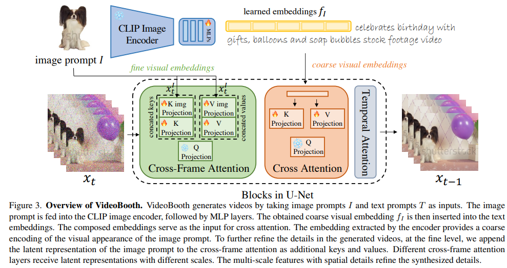
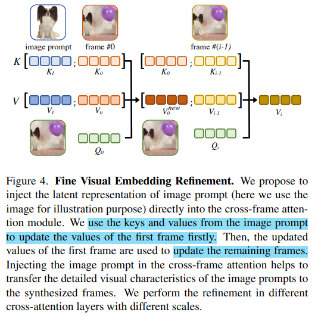

# VideoBooth: Diffusion-based Video Generation with Image Prompts

> "VideoBooth: Diffusion-based Video Generation with Image Prompts" CVPR, 2023 Dec
> [paper](http://arxiv.org/abs/2312.00777v1) [code]() 
> [pdf](./2023_12_CVPR_VideoBooth--Diffusion-based-Video-Generation-with-Image-Prompts.pdf)
> Authors: Yuming Jiang, Tianxing Wu, Shuai Yang, Chenyang Si, Dahua Lin, Yu Qiao, Chen Change Loy, Ziwei Liu

## Key-point

- Task
- Problems
- :label: Label:

## Contributions

## Introduction

## methods

1. To handle video data and capture the temporal correlation, 2D conv in the Stable Diffusion model is inflated to 3D conv

2. Cross-Frame attention

   参考图像使用 CLIP Image Encoder 得到的特征，过几层 MLP 得到和 text-embedding 尺度匹配的特征

   先将参考图像和 F0 融合

## Experiment

> ablation study 看那个模块有效，总结一下

## Limitations

## Summary :star2:

> learn what & how to apply to our task

