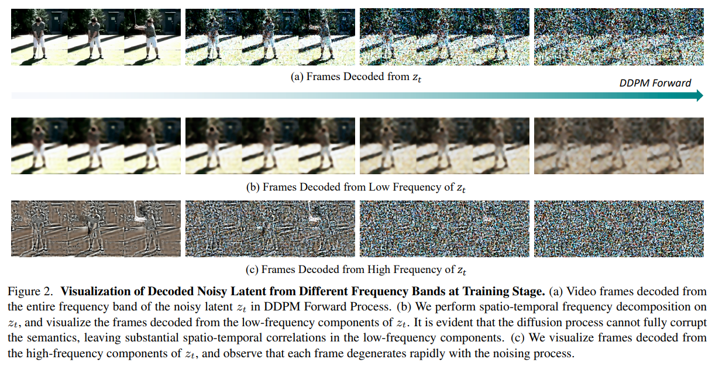
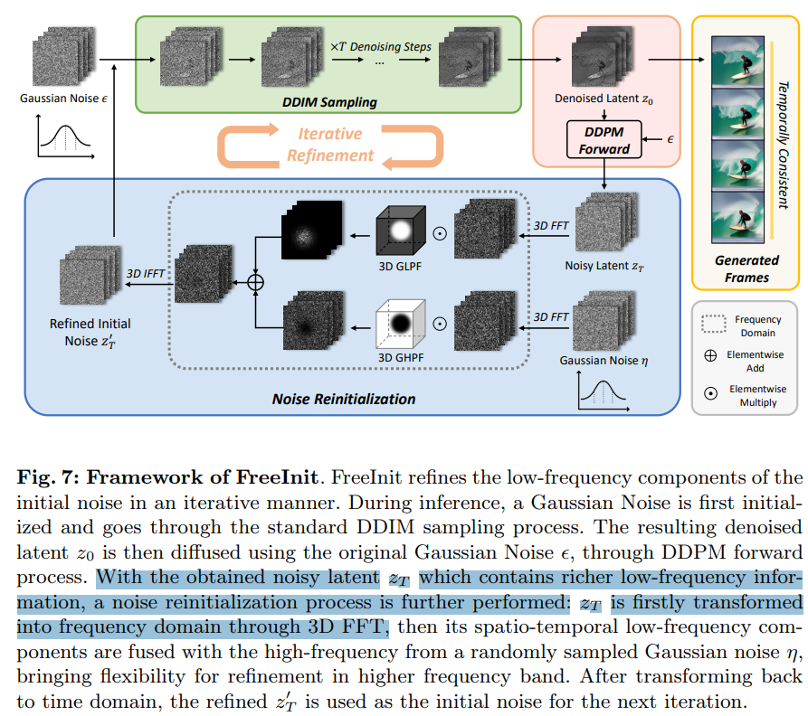
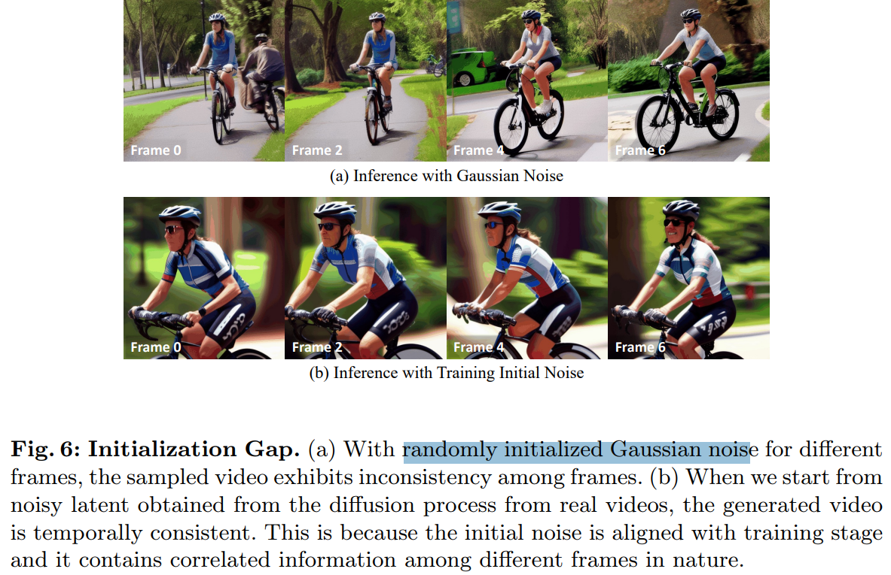

# FreeInit: Bridging Initialization Gap in Video Diffusion Models

> "FreeInit: Bridging Initialization Gap in Video Diffusion Models" ECCV, 2023 Dec 12
> [paper](http://arxiv.org/abs/2312.07537v2) [code](https://github.com/TianxingWu/FreeInit/blob/master/freeinit_utils.py#L98) [pdf](./2023_12_ECCV_FreeInit--Bridging-Initialization-Gap-in-Video-Diffusion-Models.pdf) [note](./2023_12_ECCV_FreeInit--Bridging-Initialization-Gap-in-Video-Diffusion-Models_Note.md)
> Authors: Tianxing Wu, Chenyang Si, Yuming Jiang, Ziqi Huang, Ziwei Liu

## Key-point

- Task
- Problems
- :label: Label:

## Contributions

## Introduction

## methods

Video Diffusion 噪声图 $z_t$ 的**低频部分维持了视频的时序一致性。**

- 怎么加 temporal layer

text2video inference 时候基于随机选取的高斯噪声开始，这里面的**高频信息很乱，造成生成的不一致**。因此先用训练的 text2video 模型得到更新的 z0 特征图（也认为是一种噪声），提取里面比较好的低频特征，高频信息替换为新的高斯噪声，优化初始噪声，重新进行去噪。

对 Video Diffusion 的 noise $z_T$ 用 FFT 分解为低频、高频信息，逐步去掉高频信息后，发现生成的视频主体类似，**生成内容的时序一致性由视频本身的低频信息决定**

Framework

### Code

https://github.com/TianxingWu/FreeInit/blob/master/freeinit_utils.py#L98

## setting

## Experiment

> ablation study 看那个模块有效，总结一下

## Limitations

## Summary :star2:

> learn what

### how to apply to our task

1. 发现原始随机生成的 noise 高频特征很杂乱，先推理一波取低频特征，再随机加上高频特征单独恢复
2. 参考 fft 代码 :star:
