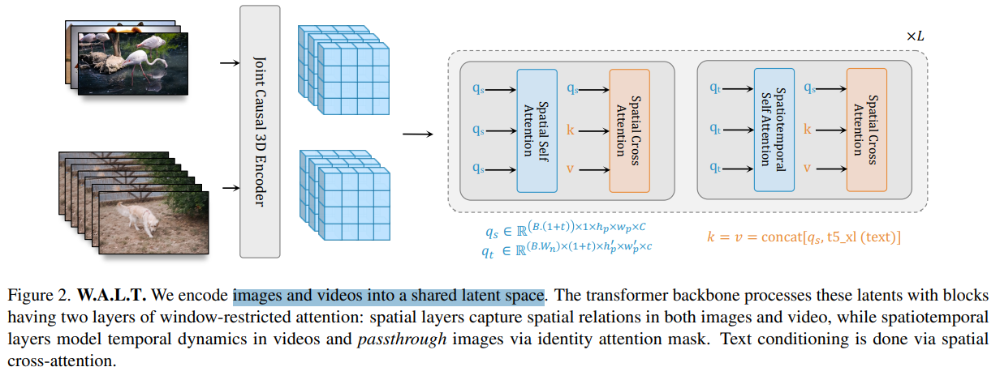
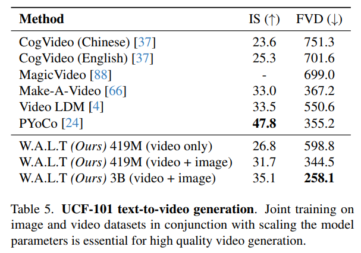

# Photorealistic Video Generation with Diffusion Models

> "Photorealistic Video Generation with Diffusion Models" ECCV, 2023 Dec 11
> [paper](http://arxiv.org/abs/2312.06662v1) [code]() [pdf](./2023_12_ECCV_Photorealistic-Video-Generation-with-Diffusion-Models.pdf) [note](./2023_12_ECCV_Photorealistic-Video-Generation-with-Diffusion-Models_Note.md)
> Authors: Agrim Gupta, Lijun Yu, Kihyuk Sohn, Xiuye Gu, Meera Hahn, Li Fei-Fei, Irfan Essa, Lu Jiang, José Lezama(Stanford)

## Key-point

- Task
- Problems
- :label: Label:

## Contributions

## Introduction

## methods

3D VAE, 用 ViT 提取特征

condition 引入用 cross-attn + AdaLN-LoRA

## setting

## Experiment

> ablation study 看那个模块有效，总结一下

## Limitations

## Summary :star2:

> learn what

### how to apply to our task

