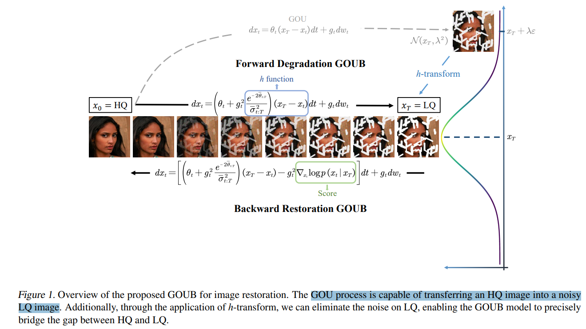

# Image Restoration Through Generalized Ornstein-Uhlenbeck Bridge

> "Image Restoration Through Generalized Ornstein-Uhlenbeck Bridge" ICML, 2023 Dec 16
> [paper](http://arxiv.org/abs/2312.10299v2) [code](https://github.com/Hammour-steak/GOUB) [pdf](./2023_12_ICML_Image-Restoration-Through-Generalized-Ornstein-Uhlenbeck-Bridge.pdf) [note](./2023_12_ICML_Image-Restoration-Through-Generalized-Ornstein-Uhlenbeck-Bridge_Note.md)
> Authors: Conghan Yue, Zhengwei Peng, Junlong Ma, Shiyan Du, Pengxu Wei, Dongyu Zhang

## Key-point

- Task: Image restoration
- Problems
  - **Diffusion 对于 noise mapping to data 很好，但是 image restoration 重点是要 LQ-> HQ 图像的 mapping** :star:

- :label: Label:

## Contributions

- 提出使用 Doob's H-transform + GOU process SDE，**实现加噪的不一定要是纯高斯噪声，可以把 xT = LQ 当作起点** :star: :star:

  > By leveraging the natural mean-reverting property of the generalized OU process and further eliminating the variance of its steady-state distribution through the Doob’s h–transform, we achieve diffusion mappings from point to point enabling the recovery of high-quality images from low-quality ones. 

- GOUB 包含先前 bridge models

  > Moreover, we unravel the fundamental mathematical essence shared by various bridge models, all of which are special instances of GOUB and empirically demonstrate the optimality of our proposed models.

- present the corresponding MeanODE model adept at capturing both pixel-level details and structural perceptions.

## Introduction

### Score-based diffusion 

> Diffusion 加噪 & 去噪是一种随机过程，使用随机微分方程Stochastic Differential Equations（SDE）**刻画随机过程**
>
> [SDE blog](https://www.zhihu.com/question/616179189/answer/3230281054)

- Forward SDE
  $$
  dx = f(x,t)dt + \underbrace{g(t) dw}_{random ~item} \\
  x_{t+\triangle t} = x_t + f(x,t)\triangle t  + g(t)\sqrt{\triangle t} * \epsilon
  $$

$dw$ 看作无限小的噪声，$f(x,t)$ 为 drift coefficient

推导：把 $d_x$ 换为 $x_{t+\triangle t} - x_t$，写出来 $p(x_{t+\triangle t} | x_t)$，Bayes 公式转为 $p(x_t | x_{t+\triangle t})$

- Reverse SDE

$$
d\boldsymbol{x}=\begin{bmatrix}\boldsymbol{f}_t(\boldsymbol{x})-g_t^2\nabla_\boldsymbol{x}\log p_t(\boldsymbol{x})\end{bmatrix}dt+g_td\boldsymbol{w}
$$

这里 $f(x,t),g(t)$ 已知，但 **$\nabla_\boldsymbol{x}\log p_t(\boldsymbol{x})$ 是 score，** 模型去预测

**SDE 框架统一 NCSN，DDPM** :star:

- 对于NCSN，作者起名为**Variance Exploding (VE) SDE**
  $$
  x_t = x_0 + \sigma_t * \epsilon 
  $$
   这里 $ \sigma_t$ 非常大，才能让 xt 为纯高斯噪声，variance exploding

- 对于DDPM，起名为**Variance Preserving (VP) SDE**
  $$
  x_t = \sqrt{\bar\alpha_t} x_0 + \sqrt{1 - \bar\alpha_t} * \epsilon
  $$
  

  DDPM 依赖 $\sqrt{\bar\alpha_t}$ 超级小，使得 $x_t$ 以 $\epsilon$ 为主导，所以叫 variance preserving

- **DDPM 和 NCSN 是 SDE 的特例**，看下 f，g 分别是啥

$$
NCSN: ~f(x,t) = 0,~g(t)=\sqrt{\frac{d{\sigma^2_t}}{dt}} \\
DDPM:  ~f(x,t) = -\frac12\beta(t)x_t ,~g(t)=\sqrt{\beta(t)} \\
$$

- Q：我们在DDPM中从来没有估计过score，那怎么在SDE框架下训练? **DDPM, SDE, NCSN 等价？？？**

DDPM 和 NCSN 是等价的！NCSN 预测 score，DDPM 预测 noise
$$
s_\theta(x_t,t) = \nabla_{x_t}\log (x_t) = -\frac{x_t - \sqrt{\bar{\alpha_t}} * x_0}{1-\bar{\alpha_t}} \\
\epsilon_\theta(x_t, t) = \frac{x_t - \sqrt{\bar{\alpha_t}} x_0}{\sqrt{1-\bar{\alpha_t}}} \\

\therefore s_\theta(x_t,t) = \epsilon_\theta(x_t, t) * (\frac{-1}{\sqrt{1-\bar{\alpha_t}}})
$$
**noise的方向其实就是score的反方向，故score-based model的score[预测模型](https://zhida.zhihu.com/search?q=预测模型&zhida_source=entity&is_preview=1)和DDPM预测的噪声模型完全可以互相使用**！ :star:

- Q：SDE loss？

### Generalized Ornstein-Uhlenbeck (GOU) process

固定的 Markov process，**均值和方差很稳定**

> It is a stationary Gaussian-Markov process, whose marginal distribution gradually tends towards a stable mean and variance over time

### Doob’s h-transform

2019 年提出来的一种处理随机过程的技巧，**添加一个 h-function 使得随机过程经过一个确定点（xT = LQ）** :star:

> Doob’s h-transform (Sarkk ¨ a & Solin ¨ , 2019) is a mathematical technique applied to stochastic processes. It involves transforming the original process by incorporating a specific h-function into the drift term of the SDE, modifying the process to pass through a **predetermined terminal point**

需要在 SDE 的 drift 项里面额外加一个 drift term 

> More precisely, given the SDE (1), if it is desired to pass through the **given fixed point xT at t = T,** an additional drift term must be incorporated into the original SDE:

- Q：如何保证对任意 x0=HQ, 一定经过 xT=LQ ?? 下面这里没看懂。。:question:

> Intuitively, p(xT | x0, xT ) = 1 at t = T, ensuring that the SDE invariably passes through the specified point xT for any initial state x0.

## methods

- Q：怎么做到 diffusion 加噪，直接加噪成 LQ 图像？

**使用 Doob's h-transform** 使得 SDE x0=HQ, 随机过程下，一定经过 xT=LQ 这一点 :star:

使用 GOU process + h-transform 的 forward SDE

- Q：h-transform 公式咋来的？？

> 见 Appendix 3.1

### Loss

使用 ELBO 训练

> since the analytical form of GOUB is directly obtainable, we will introduce the use of maximum likelihood for training, which yields a more stable loss function

### Mean-ODE

reverse SDE 需要预测均值

> In the reverse process, the value of each sampling step will approximated to the true mean during training. Therefore, we propose a Mean-ODE model, which omits the Brownian drift term:

发现 Mean-ODE 能学习到更多细节

> Our following experiments have demonstrated that the Mean-ODE is more effective than the corresponding Score-ODE at capturing the pixel details and structural perceptions of images, playing a pivotal role in image restoration tasks.

### Diffusion Bridge

发现 Diffusion Bridge，Low-level 任务可以不需要用先验知识，可以直接去学习 degradation :star:

> This segment of work obviates the need for prior knowledge, constructing a diffusion bridge model from high-quality to low-quality images, thereby learning the degradation process. 

## setting

- task: image inpainting, image deraining, and image super-resolution

## Experiment

> ablation study 看那个模块有效，总结一下

### inpaint

看主观效果，人脸还是 DDRM 好一些

### derain

Mean-ODE 恢复毛发的纹理都没了。。

### SR

#### bridge model??

## Limitations

## Summary :star2:

> learn what

- 提出使用 Doob's H-transform + GOU process SDE，**实现加噪的不一定要是纯高斯噪声，可以把 xT = LQ 当作起点** :star:

  需要深入理解 SDE diffusion 公式，才能去改公式 & 找求解随机过程的 h-transform 使得经过一个固定的 xT :star:

- Diffusion 做 Image restoration 有两种思路 :star:

  - 设计 conditional generation，主流工作是使用 prior + 如何学习 condition 去恢复图像，计算量大！
  - Diffusion Bridge，**去学习 LQ->HQ 的映射，从 LQ 作为 zT 出发，直接去学习 degradation**，可以不需要用先验知识:star:

### how to apply to our task

- 可以尝试 Diffusion Bridge 方法
- derain 类似划痕啊。。单张恢复的很好啊。。:star:

