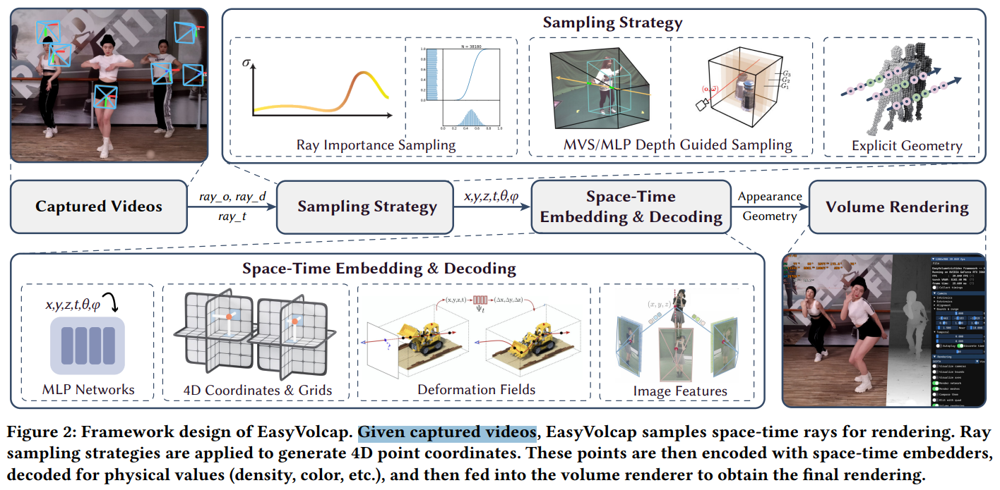

# EasyVolcap: Accelerating Neural Volumetric Video Research

> "EasyVolcap: Accelerating Neural Volumetric Video Research" SIGGRAPH-ASIA, 2023 Dec 11
> [paper](http://arxiv.org/abs/2312.06575v1) [code](https://github.com/zju3dv/EasyVolcap) [pdf](./2023_12_SIGGRAPH-ASIA_EasyVolcap--Accelerating-Neural-Volumetric-Video-Research.pdf) [note](./2023_12_SIGGRAPH-ASIA_EasyVolcap--Accelerating-Neural-Volumetric-Video-Research_Note.md)
> Authors: Zhen Xu, Tao Xie, Sida Peng, Haotong Lin, Qing Shuai, Zhiyuan Yu, Guangzhao He, Jiaming Sun, Hujun Bao, Xiaowei Zhou

## Key-point

- Task
- Problems
- :label: Label:

## Contributions

## Introduction

## methods

发射多个射线，去提取 spatial-temporal 特征 （3D）；**方法没细说。。。**

- 设计**程序 framework**，涉及 CUDA & CPU 信息异步交互的加速；Memory Management

> This design and implementation choice avoids a heavy GPU-CPU-GPU copy chain and their respective synchronization points, greatly enhancing the throughput and reducing the latency and overhead of the viewer.

## setting

## Experiment

> ablation study 看那个模块有效，总结一下

## Limitations

## Summary :star2:

> learn what

### how to apply to our task

