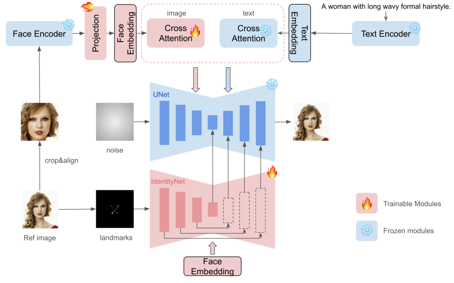
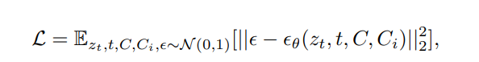
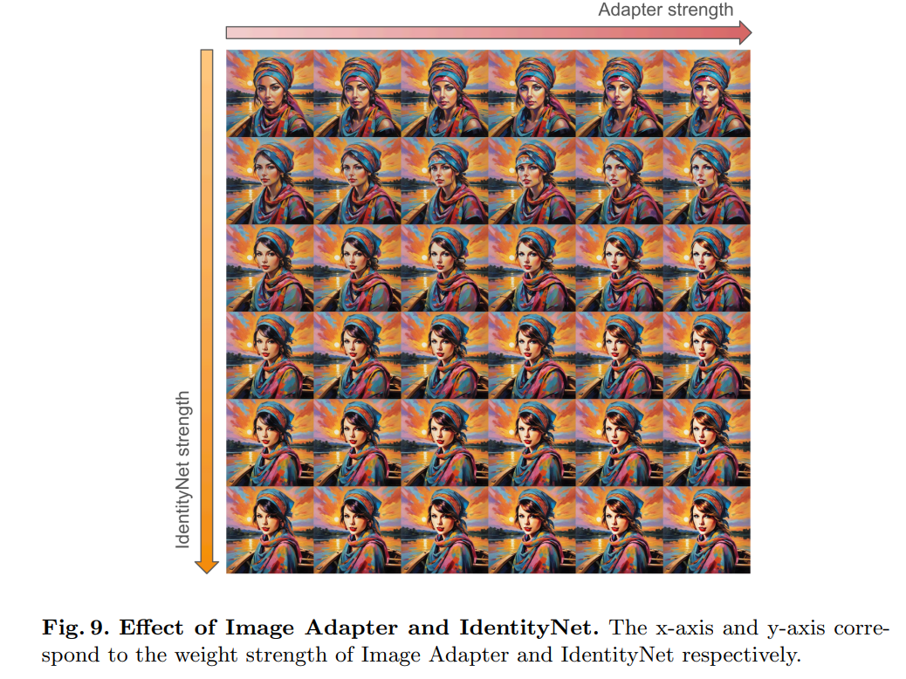

# InstantID: Zero-shot Identity-Preserving Generation in Seconds

> "InstantID: Zero-shot Identity-Preserving Generation in Seconds" Arxiv, 2024 Jan
> [paper](http://arxiv.org/abs/2401.07519v1) [code](https://github.com/InstantID/InstantID) 
> [pdf](./2024_01_Arxiv_InstantID--Zero-shot-Identity-Preserving-Generation-in-Seconds.pdf) [note](./2024_01_Arxiv_InstantID--Zero-shot-Identity-Preserving-Generation-in-Seconds_Note.md)
> Authors: Qixun Wang, Xu Bai, Haofan Wang, Zekui Qin, Anthony Chen

## Key-point

- Task
- Problems
- :label: Label:

## Contributions

## Introduction

### Image Prompt Adapter

**IP-Adapter[24] decoupled cross-attention strategy**

introduces a novel approach to achieving image prompt capabilities in parallel with text prompts without modifying the original text-to-image models

## methods

**结合 IP-Adapter & ControlNet**

### Image Adapter

 adopt a strategy similar to IP-Adapter for image prompting

**IdentityNet**

> argue that these techniques offer only coarse-grained improvements, and such a level of integration is insufficient
>
> - Q：如何证明？

1. directly adding the text and image tokens in cross-attention tends to weaken the control exerted by text tokens
2. address by adopting an alternative feature embedding method, ControlNet

直接用 diffusion 训练来约束

### ID Embdding

- Motivation

  CLIP’s inherent limitation lies in its training on weakly aligned data. 

  CLIP 包含的特征是 high-level 的，例如轮廓，颜色。能当作 prompt 的辅助信息，但没法保留人的 ID 信息；因此需要一个更精细的 embedding

## Experiment

> ablation study 看那个模块有效，总结一下

## Limitations

## Summary :star2:

> learn what & how to apply to our task

