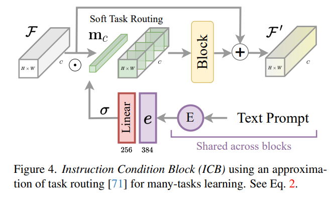

# InstructIR: High-Quality Image Restoration Following Human Instructions

> "InstructIR: High-Quality Image Restoration Following Human Instructions" Arxiv, 2024 Jan
> [paper](http://arxiv.org/abs/2401.16468v3) [code](https://github.com/mv-lab/InstructIR) [pdf](./2024_01_Arxiv_InstructIR--High-Quality-Image-Restoration-Following-Human-Instructions.pdf) [note](./2024_01_Arxiv_InstructIR--High-Quality-Image-Restoration-Following-Human-Instructions_Note.md)
> Authors: Marcos V. Conde, Gregor Geigle, Radu Timofte

## Key-point

- Task
- Problems
- :label: Label:

## Contributions

## Introduction

## methods

- 从 GPT4 生成文本

- 融合 text 到现有模型中

## Experiment

> ablation study 看那个模块有效，总结一下

## Limitations

## Summary :star2:

> learn what & how to apply to our task

