# Lumiere: A Space-Time Diffusion Model for Video Generation

> "Lumiere: A Space-Time Diffusion Model for Video Generation" Arxiv, 2024 Jan 23
> [paper](http://arxiv.org/abs/2401.12945v2) [code](https://lumiere-video.github.io/) [pdf](./2024_01_Arxiv_Lumiere--A-Space-Time-Diffusion-Model-for-Video-Generation.pdf) [note](./2024_01_Arxiv_Lumiere--A-Space-Time-Diffusion-Model-for-Video-Generation_Note.md)
> Authors: Omer Bar-Tal, Hila Chefer, Omer Tov, Charles Herrmann, Roni Paiss, Shiran Zada, Ariel Ephrat, Junhwa Hur, Guanghui Liu, Amit Raj, Yuanzhen Li, Michael Rubinstein, Tomer Michaeli, Oliver Wang, Deqing Sun, Tali Dekel, Inbar Mosseri

## Key-point

- Task: video generation
- Problems
  - video generation 认为之前先生成 keyframe 再做插针（temporal SR）会损害 temporal 一致性

- :label: Label:

## Contributions

- 区别于之前先生成 keyframe 再生成 ；本文提出 Space-Time U-Net，一次出全部的 T 帧，UNet 对 Temporal 和 spatial 都做 downsample 和upsample，加 1D temporal Conv 和 1D attn（只在最小的 scale 做 attn）

> we introduce a Space-Time U-Net architecture that generates the entire temporal duration of the video at once
>
> This is in contrast to existing video models which synthesize distant keyframes followed by temporal super-resolution -- an approach that inherently makes global temporal consistency difficult to achieve

- 只有 user study SOTA 很勉强 & 需要 T 帧一次生成，显存要求很高（文章没说用啥训的）

## Introduction

- Text-to-ImageGeneration
- Text-to-Video Generation

- "Imagen Video: High Definition Video Generation with Diffusion Models" 
  [paper](https://arxiv.org/abs/2210.02303)

级联结构：scales up the Video Diffusion Model with a cascade of spatial and temporal video super-resolution models

## methods

先前方法 `temporal super-resolution (TSR) models`：先生成 keyframes，在做 Temporal SR；

本文直接生成所有帧。。。

- Q：VRAM 要多少啊。。

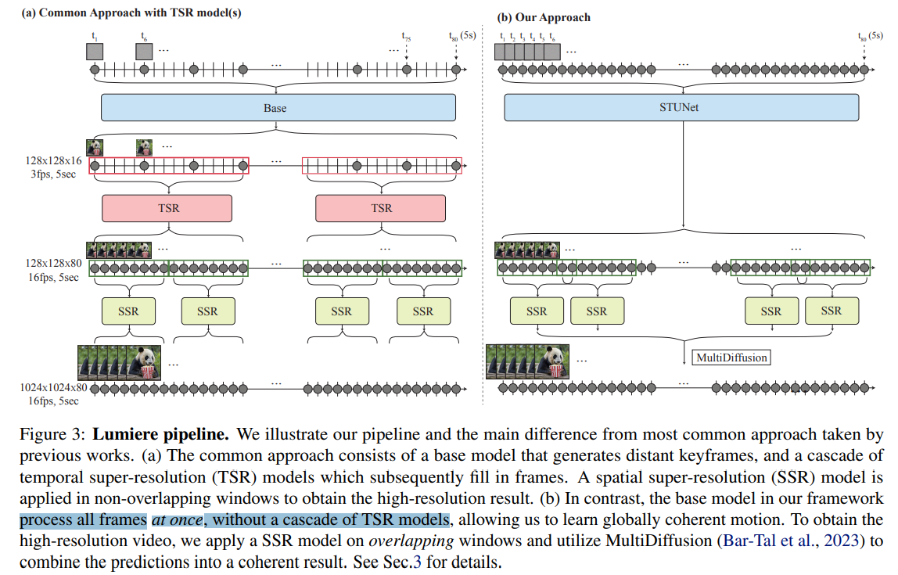

- Q：global T 上的一致性？

> We propose to extend Multidiffusion (Bar-Tal et al., 2023), an approach proposed for achieving global continuity in panoramic image generation, to the temporal domain, where we compute spatial super-resolution on temporal windows, and aggregate results into a globally coherent solution over the whole video clip.

### Space-Time U-Net

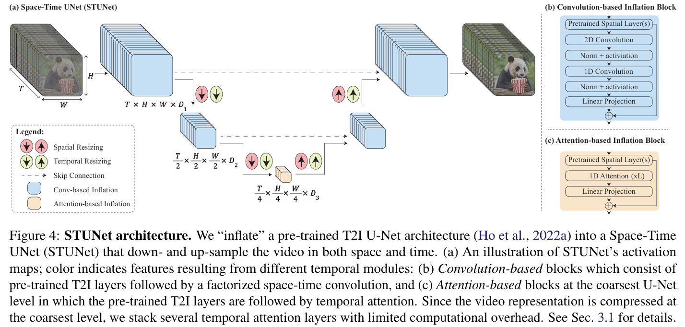

在 `ImagenVideo` 基础上做的

直接在 Spatial & Temporal 维度上都先下采样

> we propose to use a space-time U-Net which downsamples the input signal both spatially and temporally, and performs the majority of its computation on this compact space-time representation

Temporal Block 包含

- temporal convolutions 
- temporal attention

> We interleave temporal blocks in the T2I architecture, and insert temporal down- and up-sampling modules following each pre-trained spatial resizing module 

- Q：一次生成所有帧，计算量？

帧数太多了。。。只在最小的 Scale 用 1D temporal attn

> As the computational requirements of temporal attention scale quadratically with the **number of frames**, **we incorporate temporal attention only at the coarsest resolution**, which contains a space-time compressed representation of the video.

> Specifically, in all levels except for the coarsest, weinsert factorized space-time convolutions (Fig. 4b) which allow increasing the non-linearities in the network compared to full-3D convolutions while reducing the computational costs, and increasing the expressiveness compared to 1D convolutions (Tran et al., 2018)

### new conv initialize

- Q：全部都要训练？

参考 AnimateDiff 只训练新加入的层，但又不太一样，本文提出一次出所有帧

>  Similarly to (Blattmann et al., 2023b; Guo et al., 2023), we **train the newly added parameters**, and keep the weights of the pre-trained T2I fixed.

AnimateDiff 只训练新加入的层的方式，需要保证模型是一样的，然后去初始化。。**但没法直接用于本文模型，因为设计的模型对 T 和 HxW 都下采样了。。**

> Notably, the common inflation ap proach ensures that at initialization, the T2V model is equiv alent to the pre-trained T2I model, i.e., generates videos as a collection of independent image samples.
>
> However, in our case, it is impossible to satisfy this property due to the temporal down- and up-sampling modules.

MLP 和 inflation block 可以直接用 pretrained 的初始化

- Q：咋初始化  temporal down- and up-sampling modules？

T 上 upsample，先复制几帧，在做1D 卷积，**这里对于新的帧的 1D conv 用 identity 方式初始化 还是标准随机初始化？**

> In more detail, the temporal downsampling is implemented as a 1D temporal convolution (identity initialized) followed by a stride, and the temporal upsampling is implemented as frame duplication followed by a 1D temporal convolution (identity initialized)

做了 ablation study 看 Loss 和 feature map，发现 1D conv 用 identity 复制效果更好

> Appendix B
>
> However, as mentioned in Sec. 3.1, due to the temporal down- and up- sampling modules, the overall inflated network cannot be equivalent at initialization to the pre-trained T2I model due to the temporal compression. 
>
> We empirically found that initializing the temporal down- and up-sampling modules such that they perform nearest-neighbor down- and up- sampling operations (i.e., temporal striding or frame duplication) is better than a standard initialization (He et al., 2015)
>
> We **ablate our choice of temporal down- and up- sampling initialization** on the UCF-101 (Soomro et al., 2012) dataset in Fig. 12

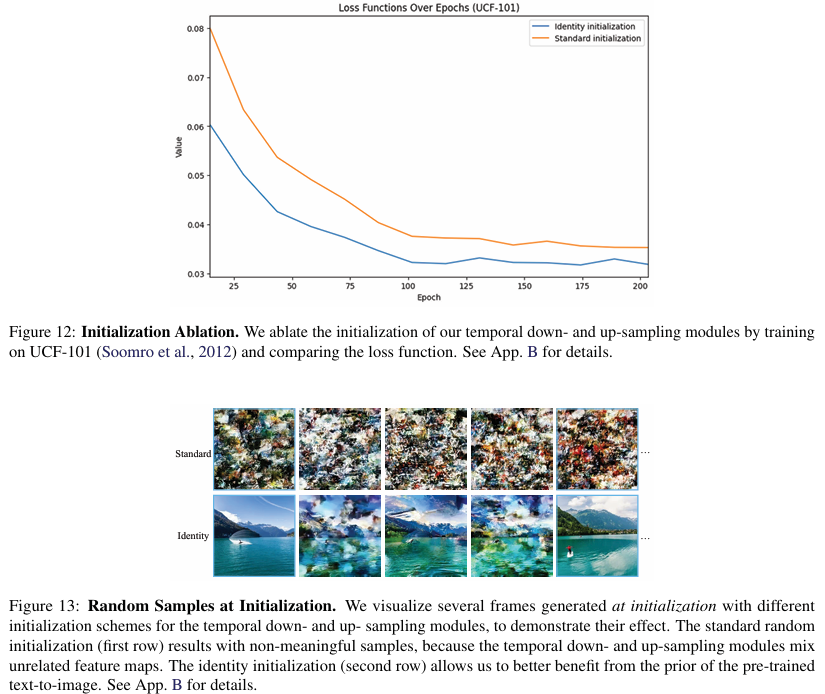

### multidiffusion

参考 multidiffusion 实现 T 上一致性

> Due to memory constraints, the inflated SSR network can operate only on short segments of the video. To avoid temporal boundary artifacts, we achieve smooth transitions between the temporal segments by employing Multidiffusion (Bar-Tal et al., 2023) along the temporal axis.

- Q：咋优化的？:question:

给了一个 multidiffusion 的公式。。

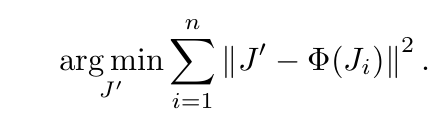

> Toreconcile the per-segment SSR predictions, {Φ(Ji)}N i=1, we define the result of the denoising step to be the solution of the optimization problem

overlap 的 T 取平均

> Specifically, the temporal windows have an overlap of 2 frames, and **at each denoising step we average the predictions of overlapping pixels** MultiDiffusion allows us to avoid temporal boundary artifacts between segments of the video (see Fig. 14)

做了 ablation study

计算相邻帧的 MSE，发现不用 overlap 的方式存在 peak error **（突然有一帧和前面不一致，后面一小段和这个新的不一致类似，导致 error 又下去了）**

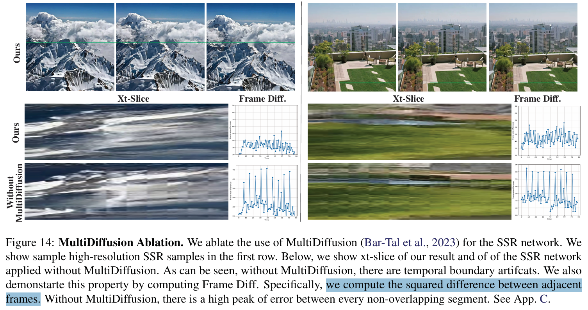

### subtask(Condition)

- Stylized Generation

> Recall that we only train the newly-added temporal layers and keep the pre-trained T2I weights fixed. 

finetune 一下，**对微调完的权重和原始权重，加权平均一下**

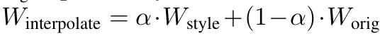

- Conditional Generation :star:，对于 video inpaint，需要输入 **C=3 原始视频 & C=1 的 mask，和初始 noise C=3 concat 到一起输入模型**

> Similarly to Blattmann et al. (2023b); Wang et al. (2023b), we extend our model to video generation conditioned on additional input signals (e.g., image or mask)
>
> We achieve this by modifying the model to take as input two signals in addition to the noisy video J ∈ RT×H×W×3 andthedriving text prompt.
>
> Specifically, we add the masked conditioning video C ∈ RT×H×W×3 andits corresponding binary mask M∈RT×H×W×1,suchthat the overall input to the model is the concatenated tensor ⟨J,C,M⟩ ∈ RT×H×W×7

这样可以做 image2video 和 video inpaint

## setting

## Experiment

> ablation study 看那个模块有效，总结一下

效果没 SVD 好。。。

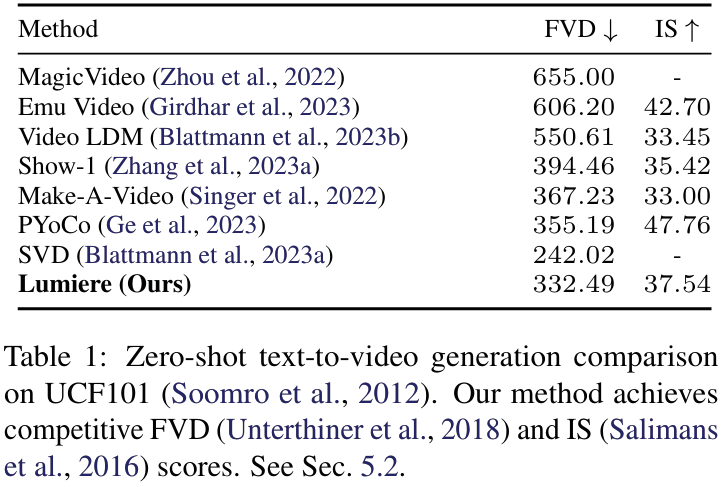

做了 user study 证明好一丢丢

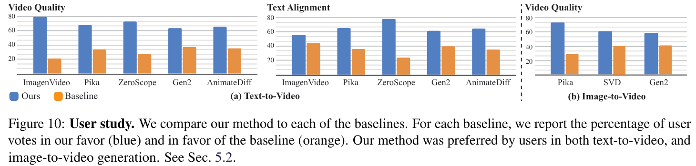

### T-consistency :zap:

- 时序一致性，**找一些单一简单结构的物体 & 背景单一，看起来更明显！**，例如腿的前后运动

使用 Image2Video 生成的视频，取首帧用本文 Lumiere 做 Image2Video

> We apply Lumiere image-to-video generation, conditioned on the first frame of a video generated by ImagenVideo

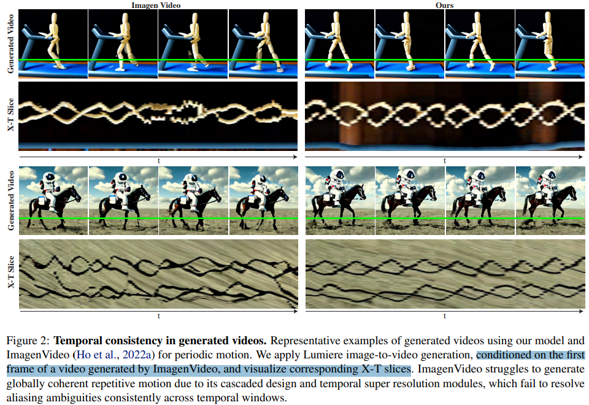

### Video Inpainting

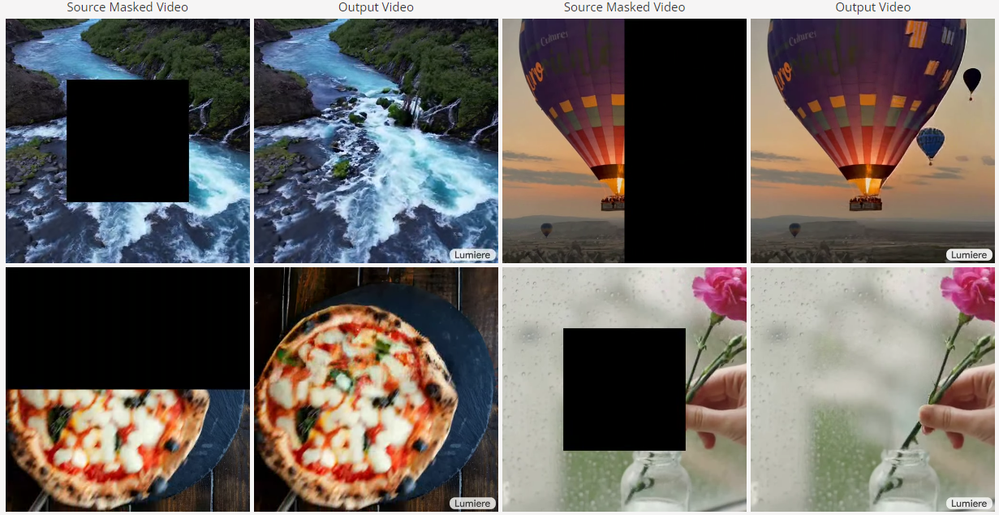

- Q：咋搞的？

> Here, the conditioning signals are a user provided video C and a mask M that describes the region to complete in the video. 

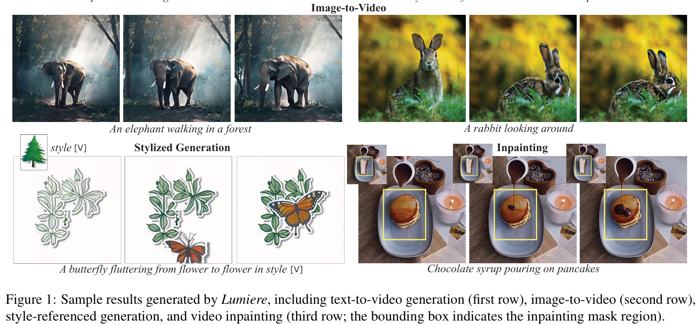

## Limitations

- 看下展示出来的视频，https://lumiere-video.github.io/

法拉利左边路沿，video stylization 生成身上的花，在跳动起来以后闪烁明显，**一致性比之前方法好了一些，但还是不足。。**

- FVD 指标没 SVD 好。。。

## Summary :star2:

> learn what

### how to apply to our task

- Conditional Generation :star:，对于 video inpaint，需要输入 **C=3 原始视频 & C=1 的 mask，和初始 noise C=3 concat 到一起输入模型**

> Similarly to Blattmann et al. (2023b); Wang et al. (2023b), we extend our model to video generation conditioned on additional input signals (e.g., image or mask)
>
> We achieve this by modifying the model to take as input two signals in addition to the noisy video J ∈ RT×H×W×3 andthedriving text prompt.
>
> Specifically, we add the masked conditioning video C ∈ RT×H×W×3 andits corresponding binary mask M∈RT×H×W×1,suchthat the overall input to the model is the concatenated tensor ⟨J,C,M⟩ ∈ RT×H×W×7

- 时序一致性，**找一些单一简单结构的物体 & 背景单一，看起来更明显！**，例如腿的前后运动

使用 Image2Video 生成的视频，取首帧用本文 Lumiere 做 Image2Video

> We apply Lumiere image-to-video generation, conditioned on the first frame of a video generated by ImagenVideo

