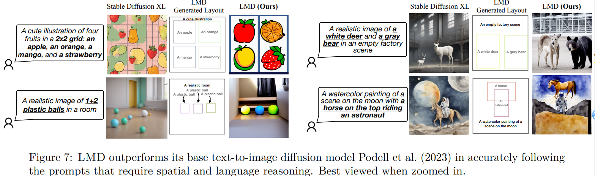
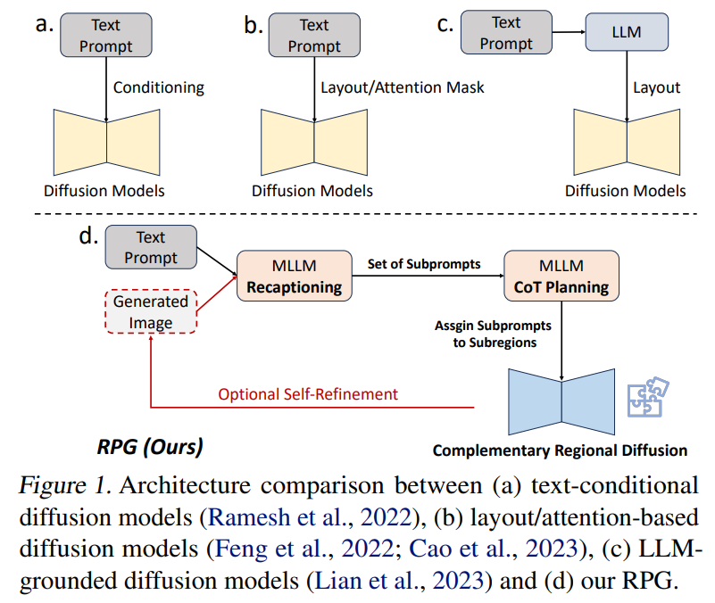
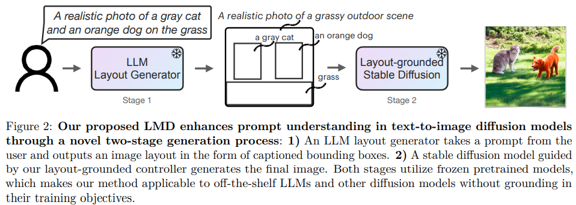
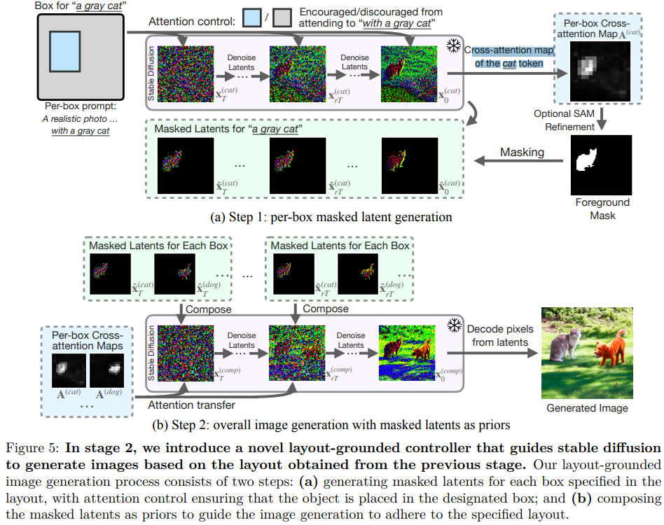
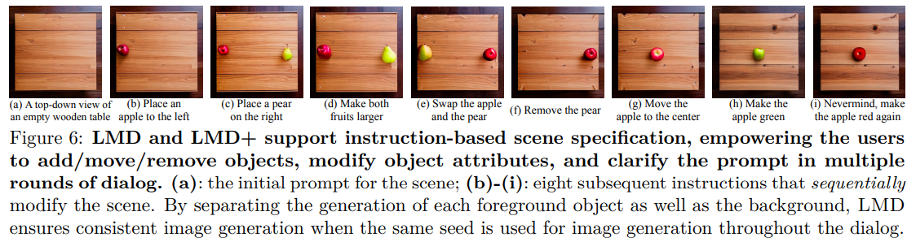

# Mastering Text-to-Image Diffusion: Recaptioning, Planning, and Generating with Multimodal LLMs

> "Mastering Text-to-Image Diffusion: Recaptioning, Planning, and Generating with Multimodal LLMs" Arxiv, 2024 Jan 22, `RPG`
> [paper](http://arxiv.org/abs/2401.11708v2) [code](https://github.com/YangLing0818/RPG-DiffusionMaster) [pdf](./2024_01_Arxiv_Mastering-Text-to-Image-Diffusion--Recaptioning--Planning--and-Generating-with-Multimodal-LLMs.pdf) [note](./2024_01_Arxiv_Mastering-Text-to-Image-Diffusion--Recaptioning--Planning--and-Generating-with-Multimodal-LLMs_Note.md)
> Authors: Ling Yang, Zhaochen Yu, Chenlin Meng, Minkai Xu, Stefano Ermon, Bin Cui

## Key-point

- Task: Text2Image

- Problems

  现有 diffusion 对于复杂的 prompt（含有相互关系，多物体）处理不好

- :label: Label:

> brand new **training-free text-to-image generation/editing framework**, namely Recaption, Plan and Generate (RPG)

利用 LLM 的 chain-of-thought reasoning ability 去优化 prompt，将一张大图分解为 subfigure 去生成

> harnessing the powerful chain-of-thought reasoning ability of multimodal LLMs to enhance the compositionality

提出互补的 regional diffusion

> propose complementary regional diffusion to enable region-wise compositional generation.

能够做 editing；与大多数 LLM 和 diffusion backbone 兼容

> wide compatibility with various MLLM architectures (e.g., MiniGPT-4) and diffusion backbones (e.g., ControlNet).

## Contributions

## Introduction

- Q：为什么要改进 text2image？

以此工作里面的图为例，prompt 里面出现 1+1=2 等复杂关系的时候，diffusion学不出来，所以要引入 LLM 对复杂 prompt 分解一下

- "Llm-grounded diffusion: Enhancing prompt understanding of text-to-image diffusion models with large language models" `LMD`
  [paper](https://arxiv.org/pdf/2305.13655.pdf) 

- Q：和之前 diffusion text2image 有啥区别？

**先看一下先前利用 LLM 生成 layout 的工作 LMD**

- "Llm-grounded diffusion: Enhancing prompt understanding of text-to-image diffusion models with large language models" Arxiv, `LMD`
  [paper](https://arxiv.org/pdf/2305.13655.pdf)

**能够对 diffusion latent feature 用分割图！** 

工作着重在确定物体指定位置即可，之前初始去噪步数做一下 ok，**通过 score-based diffusion 来实现修改位置？？**

> Since diffusion models tend to generate the object placement in the initial denoising steps and then object details in later steps (Bar-Tal et al., 2023),

支持使用 **text 不断修正**，但修改前后不需要变得物体细节变了

- Q：什么是 score-based diffusion？
- Q：training-free，但是测试数据里面文本怎么来？

- Q：先前 diffusion 如何接收多种 condition?

"Gligen: Open-set grounded text-to-image generation" CVPR :star:

## methods

## Experiment

> ablation study 看那个模块有效，总结一下

## Limitations

## Summary :star2:

> learn what & how to apply to our task

