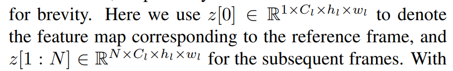
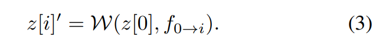

# Motion-I2V: Consistent and Controllable Image-to-Video Generation with Explicit Motion Modeling

> "Motion-I2V: Consistent and Controllable Image-to-Video Generation with Explicit Motion Modeling" Arxiv, 2024 Jan 29
> [paper](http://arxiv.org/abs/2401.15977v2) [code](https://xiaoyushi97.github.io/Motion-I2V/.) [pdf](./2024_01_Arxiv_Motion-I2V--Consistent-and-Controllable-Image-to-Video-Generation-with-Explicit-Motion-Modeling.pdf) [note](./2024_01_Arxiv_Motion-I2V--Consistent-and-Controllable-Image-to-Video-Generation-with-Explicit-Motion-Modeling_Note.md)
> Authors: Xiaoyu Shi, Zhaoyang Huang, Fu-Yun Wang, Weikang Bian, Dasong Li, Yi Zhang, Manyuan Zhang, Ka Chun Cheung, Simon See, Hongwei Qin, Jifeng Dai, Hongsheng Li

## Key-point

- Task
- Problems
- :label: Label:

## Contributions

## Introduction

## methods

- 1-stage 先基于文本 & 首帧预测一个光流（视频中物体移动的基础），**先去预测每一帧与 ref 图像的 motion 差异，来简化难度（减负 SD, 直接预测既有 motion & 细节的太难了）**；

- 2-stage 设计 motion-augmented temporal layer  融合 motion

  > motion-augmented temporal layer 

### Stage1 Training a motion field predictor

1-stage 基于 ref 图像预测 optical flow，通过 warp 的方式确定目标点新的位置

> sequence of 2D displacement maps $\mathcal{R}^{(2 \times H\times W)}$

- Q：SD 如何改成去预测光流？:star:

1. tune a pre-trained LDM to predict a single displacement field conditioned on the reference image and text prompt
2. training the temporal modules
   freeze the tuned LDM parameters and integrate the vanilla temporal layer
3.  finetune the entire VLDM model to obtain the final motion fields predictor

**GT 使用 FlowFormer++ [53] and DOT**

### Encoding motion fields and conditonal image

融合 1-stage 预测的光流，光流使用 optical flow VAE encoder 编码为 C=4 特征

- Q：optical flow VAE encoder？

> The optical flow autoencoder mirrors the LDM image autoencoder’s structure, except that it receives and outputs 2-channel optical flow map rather than 3-channel RGB

SDv1.5 输入改为 `concat([ref_img_fea(c=4), optical_flow(c=2)])` 6 channel，将 conv_in 多出来的几个通道参数改成 0

> set weights for the newly added 4 input channels to zero

将 FPS 也编码输入 :star: ？？？

> frame stride i is embedded using a two-layer MLP and is added to the time embeddings, serving as a motion strength

### Stage2 Video Rendering with Predicted Motion

提出新加一个 motion-augmented temporal attention 融合 stage1 预测得到的光流，提升 AnimateDiff temporal 1D atten 的时序性

> propose a motion-augmented temporal attention to enhance the vanilla 1-D temporal attention, guided by the predicted motion fields from the first stage

1 帧 ref 帧 + N 帧后续帧

用 stage1 预测的光流，resize 到一样大小，对特征进行 warp :star:

> otion fields {f0→i |i = 1, . . . , N} (assuming resized to align the spatial shape) 

- Q：如何实现 warp 特征？参考 Deformable

得到 N 帧特征后，把 HxW 合并入 Batch 维度，输入temporal attention

#### selective noising

> At each timestep t of the denoising process, we always concatenate the clean reference image’s latent code zref ∈ R 1×4×h×w with other noisy latent codes z0:N,t ∈ R N×4×h×w along the temporal axis

## setting

## Experiment

> ablation study 看那个模块有效，总结一下

## Limitations

## Summary :star2:

> learn what & how to apply to our task

