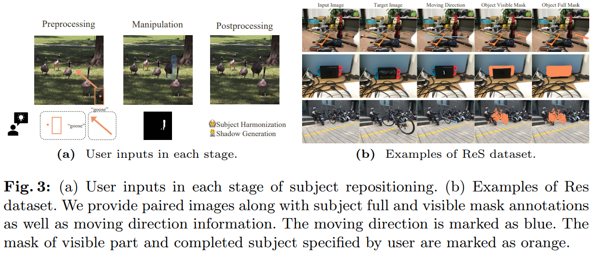

# Repositioning the Subject within Image

> "Repositioning the Subject within Image" Arxiv, 2024 Jan 30 :warning:
> [paper](http://arxiv.org/abs/2401.16861v2) [code]() [website](https://yikai-wang.github.io/seele/) [pdf](./2024_01_Arxiv_Repositioning-the-Subject-within-Image.pdf) [note](./2024_01_Arxiv_Repositioning-the-Subject-within-Image_Note.md)
> Authors: Yikai Wang, Chenjie Cao, Ke Fan, Qiaole Dong, Yifan Li, Xiangyang Xue, Yanwei Fu

## Key-point

- Task: image edit
- Problems
- :label: Label:

针对物体移动的编辑操作

> subject removal, completion, and harmonization through a unified prompt-guided inpainting process

提出一个图像物体编辑（移动物体）的数据集

## Contributions

## Introduction

## methods

## Experiment

> ablation study 看那个模块有效，总结一下

## Limitations

## Summary :star2:

> learn what & how to apply to our task

