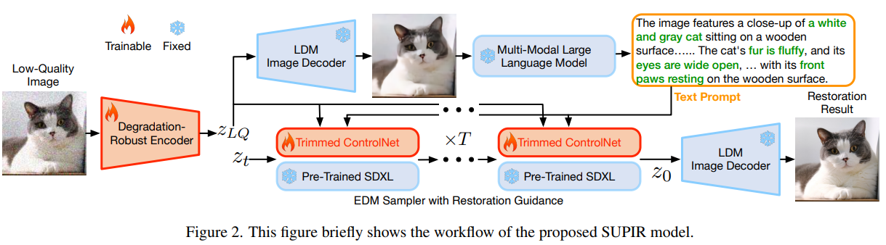
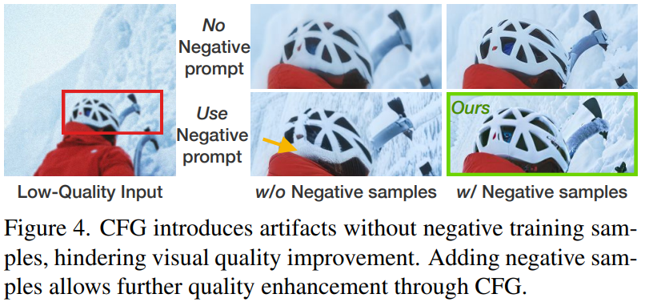

# Scaling Up to Excellence: Practicing Model Scaling for Photo-Realistic Image Restoration In the Wild

> "Scaling Up to Excellence: Practicing Model Scaling for Photo-Realistic Image Restoration In the Wild" Arxiv, 2024 Jan
> [paper](http://arxiv.org/abs/2401.13627v1) [code]() 
> [pdf](./2024_01_Arxiv_Scaling-Up-to-Excellence--Practicing-Model-Scaling-for-Photo-Realistic-Image-Restoration-In-the-Wild.pdf)
> Authors: Fanghua Yu, Jinjin Gu, Zheyuan Li, Jinfan Hu, Xiangtao Kong, Xintao Wang, Jingwen He, Yu Qiao, Chao Dong

## Key-point

- Task
- Problems
- :label: Label:

## Contributions

## Introduction

- "SDXL: Improving Latent Diffusion Models for High-Resolution Image Synthesis" Arxiv, 2023 Jul :statue_of_liberty:
  [paper](https://arxiv.org/abs/2307.01952) [code](https://github.com/stability-ai/generative-models) [blog_explanation](https://zhuanlan.zhihu.com/p/643420260)
  [pdf](./2023_07_Arxiv_SDXL--Improving-Latent-Diffusion-Models-for-High-Resolution-Image-Synthesis.pdf)


## methods




### Degradation-Robust Encoder

- motivation

  since the original encoder has not been trained on LQ images, using it for encoding will affect the model’s judgment of LQ image content, and then misunderstand artifacts as image content

**fine-tune the encoder** to make it robust to the degradation，使用 SDXL 预训练的 Image Encoder 基础上微调

**把 Decoder 固定住，去训练 Encoder 的特征**


- Q：Image Encoder 结构？VAE？
- Q：为什么不把 Decoder 一起训练？


### Condition Fusion

现有 img2img 控制方式

- LoRA [32], T2I adaptor [59], and ControlNet

  - LoRA limits generation but struggles with LQ image control
  - T2I lacks capacity for effective LQ image content identificatio

  LoRA & T2I 控制不住，和 LQ 差距很远

  - ControlNet’s direct copy is challenging for the SDXL model scale 控制得好，但 **SDXL 模型太大训练困难**


1. ControlNet but employ network trimming. **simply trim half of the ViT blocks from each encoder block**
2. 使用 attention 方式融入 diffusion 中


### Restoration-Guided Sampling

- motivation

  SD 生成太多不存在的东西，和 LQ 差距太大

  too much generation capacity will in turn affect the fidelity of the recovered image

 hope to selectively guide the prediction results zt−1 to be close to the LQ image zLQ in each diffusion step


### Prompt 生成

- LLaVA-v1.5-13B

  Describe this image and its style in a very detailed manner


- **fixed portion of the prompt** strategy provides a **positive description** of quality, including words like

```
“cinematic,
High Contrast, highly detailed, unreal
engine, taken using a Canon EOS R
camera, hyper detailed photo-realistic
maximum detail, 32k, Color Grading,
ultra HD, extreme meticulous detailing,
skin pore detailing, hyper sharpness,
perfect without deformations, Unreal
Engine 5, 4k render”
```


## Experiment

> ablation study 看那个模块有效，总结一下

预测出来太多不存在的东西，但很清晰，导致指标不高；因此不仅仅要比较指标，要把其他方法放在一起比较


### Ablation

有无 negative prompt

```
oil painting, cartoon, blur, dirty, messy, low quality, deformation, low resolution, oversmooth
```





**训练数据的影响**

1. condition 信息太少，依赖 SD 生成
2. SD 内部一些概念没有，例如：没见过类似形状的砖瓦


**Encoding & 锁住 Decoder  LQ 重建 GT的效果**


negative prompt 有副作用

当输入没有一定语义信息（看不出来是啥），negative prompt 反而会降质量


## Limitations


## Summary :star2:

> learn what & how to apply to our task

1. 预测出来太多不存在的东西，但很清晰，导致指标不高；因此不仅仅要比较指标，要把其他方法放在一起比较看主观结果
2. 缺少 condition 信息，生成出来的纹理和 GT 差距较多。
   1. 考虑用 GT 类似的纹理找一张图做 condition？
   2. 直接找视频中**较为清晰**的其他帧来做 condition？如何衡量清晰？

