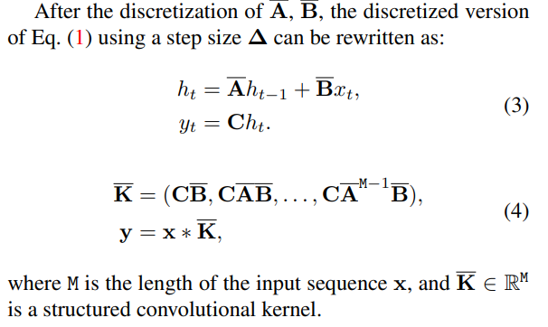
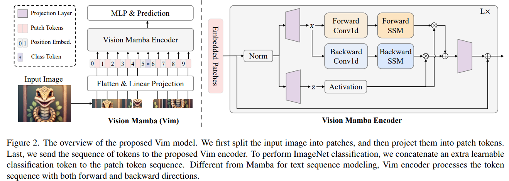
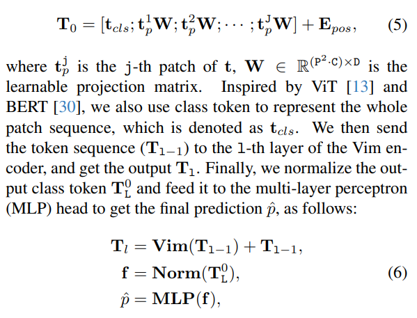
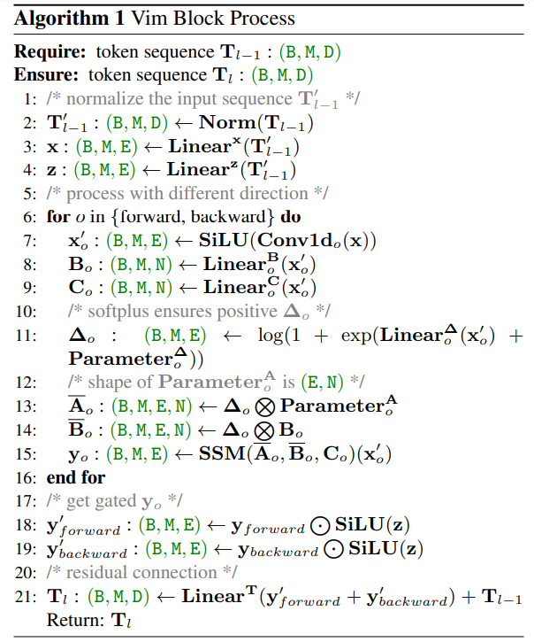
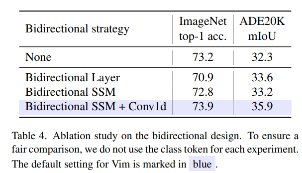

# Vision Mamba: Efficient Visual Representation Learning with Bidirectional State Space Model

> "Vision Mamba: Efficient Visual Representation Learning with Bidirectional State Space Model" Arxiv, 2024 Jan
> [paper](http://arxiv.org/abs/2401.09417v2) [code](https://github.com/hustvl/Vim.) [pdf](./2024_01_Arxiv_Vision-Mamba--Efficient-Visual-Representation-Learning-with-Bidirectional-State-Space-Model.pdf) [note](./2024_01_Arxiv_Vision-Mamba--Efficient-Visual-Representation-Learning-with-Bidirectional-State-Space-Model_Note.md)
> Authors: Lianghui Zhu, Bencheng Liao, Qian Zhang, Xinlong Wang, Wenyu Liu, Xinggang Wang

## Key-point

- Task
- Problems
- :label: Label:

## Contributions

## Introduction

### SSM(S4)




## methods




简化的推理流程

用一层 Conv 得到 non-overlapping **patch embedding** ，再 flatten 得到 1D `[B=1, L=196, C=192]` 序列

> Following ViT [13] and DeiT [60], we first employ 16×16 kernel size projection layer to get a 1-D sequence of nonoverlapping patch embeddings. 


- Q：Vim 模型 tiny 和 small 的区别

tiny 在于 Vim Block 将 hidden_state 通道数从 $C=192\to 2*192 = 394$；

small $C=192\to 4*192 = 768$；

> To align with the model sizes of DeiT series, we set the hidden state dimension D to 192 and expanded state dimension E to 384 for the tiny-size variant. For the small-size variant, we set D to 384 and E to 768.




S4 里的 $\bar{K}$ 使用 Vim Block 实现


### Vim Block 



对输入 token 序列 norm，再用 MLP 映射到 x，z 序列

> The input token sequence Tl−1 is first normalized by the normalization layer. Next, we linearly project the normalized sequence to the x and z with dimension size E

在 2 个方向 forward and backward directions 处理 x

> Then, we process the x from the forward and backward directions. For each direction, we first apply the 1-D convolution to the x and get the x ′ o .


- Q：先前 S4 $y=x*\bar{K}$ 用傅里叶变化实现 Conv，为什么目前 Mamba 中 SSM 方法改成了 MLP

> Traditional SSM-based methods leverage the fast Fourier transform to boost the convolution operation

为了实现高效 IO 和降低显存，写 CUDA 实现

> Mamba and the proposed Vim choose a modern-hardware-friendly way to ensure efficiency. The key idea of this optimization is to avoid the IO-bound and memory-bound of modern hardware accelerators (GPUs).

paper 分析了 IO 降低多少 和 Atten 操作的复杂度，具体细节见 paper


- Q：SSM 设计为 bidirectional design ？




## Code

> `vim_tiny` [model_definition](https://github.com/hustvl/Vim/blob/6143d07b3dd31f904c63840a19e22d95d1124493/vim/models_mamba.py#L551) 使用 `timm.models.registry.register_model` 注册方式调用
>
> pip install 参数 `-e, --editable <path/url>`, Install a project in editable mode (i.e. setuptools “develop mode”) from a local project path or a VCS url.

装 CUDA11.8；**CUDA11.7 也能正常安装后续依赖**

```
wget https://developer.download.nvidia.com/compute/cuda/11.8.0/local_installers/cuda_11.8.0_520.61.05_linux.run
sudo sh cuda_11.8.0_520.61.05_linux.run
```

配项目依赖

```
conda create -n your_env_name python=3.10.13
pip install torch==2.1.1 torchvision==0.16.1 torchaudio==2.1.1 --index-url https://download.pytorch.org/whl/cu118
pip install -r vim/vim_requirements.txt –no-dependencies

# U-Mamba(not necessary)
pip install causal-conv1d==1.1.1
pip install mamba-ssm

# Vim
cd causal-conv1d/
pip install -e .
```


```python
@register_model
def vim_tiny_patch16_224_bimambav2_final_pool_mean_abs_pos_embed_with_midclstok_div2(pretrained=False, **kwargs):
    model = VisionMamba(
        patch_size=16, embed_dim=192, depth=24, rms_norm=True, residual_in_fp32=True, fused_add_norm=True, final_pool_type='mean', if_abs_pos_embed=True, if_rope=False, if_rope_residual=False, bimamba_type="v2", if_cls_token=True, if_devide_out=True, use_middle_cls_token=True, **kwargs)
    model.default_cfg = _cfg()
```


`_init_weights` 对 `nn.Linear, nn.Embedding, nn.Embedding` & `"out_proj.weight", "fc2.weight"` 初始化权重

> [code](https://github.com/hustvl/Vim/blob/6143d07b3dd31f904c63840a19e22d95d1124493/vim/models_mamba.py#L179)

```
        self.apply(
            partial(
                _init_weights,
                n_layer=depth,
                **(initializer_cfg if initializer_cfg is not None else {}),
            )
        )
```


### Mamba Block

> [code](https://github.com/hustvl/Vim/blob/6143d07b3dd31f904c63840a19e22d95d1124493/mamba-1p1p1/mamba_ssm/modules/mamba_simple.py#L34)

学习一下技巧，实现模块的多态 :star:

> ```python
> from functools import partial
> 
> mixer_cls = partial(Mamba, layer_idx=layer_idx, bimamba_type=bimamba_type, if_devide_out=if_devide_out, init_layer_scale=init_layer_scale, 
>                     **ssm_cfg, **factory_kwargs)
>     
> ```


先对当前输入特征 `(B,L,D)` 和 residual 做了 RMSNorm(看下面)


#### SSM

S4 参数初始化

A 设置为序列长度 M=16 (image patch embedding 后为 16x16 特征，再 flatten)，`C=2*192`

```python
        A = repeat(
            torch.arange(1, self.d_state + 1, dtype=torch.float32, device=device),
            "n -> d n",
            d=self.d_inner,
        ).contiguous()  # torch.Size([384, 16])
        A_log = torch.log(A)  # Keep A_log in fp32
        self.A_log = nn.Parameter(A_log)
        self.A_log._no_weight_decay = True

        # D "skip" parameter
        self.D = nn.Parameter(torch.ones(self.d_inner, device=device))  # Keep in fp32
        self.D._no_weight_decay = True
```

- Q: `bimamba_type == "v2"` 使用双向？


foward

```python
        A = -torch.exp(self.A_log.float())  # (d_inner, d_state)
        # In the backward pass we write dx and dz next to each other to avoid torch.cat
        if self.use_fast_path and inference_params is None:  # Doesn't support outputting the states
            if self.bimamba_type == "v1":
                pass
            elif self.bimamba_type == "v2":
                # bidrectional
    			A_b = -torch.exp(self.A_b_log.float())
                out = mamba_inner_fn_no_out_proj(
                    xz,
                    self.conv1d.weight,
                    self.conv1d.bias,
                    self.x_proj.weight,
                    self.dt_proj.weight,
                    A,
                    None,  # input-dependent B
                    None,  # input-dependent C
                    self.D.float(),
                    delta_bias=self.dt_proj.bias.float(),
                    delta_softplus=True,
                )
                out_b = mamba_inner_fn_no_out_proj(
                    xz.flip([-1]),  # bidirectional
                    self.conv1d_b.weight,
                    self.conv1d_b.bias,
                    self.x_proj_b.weight,
                    self.dt_proj_b.weight,
                    A_b,
                    None,
                    None,
                    self.D_b.float(),
                    delta_bias=self.dt_proj_b.bias.float(),
                    delta_softplus=True,
                )
```


`mamba_inner_fn_no_out_proj` >> `class MambaInnerFnNoOutProj(torch.autograd.Function):`

> [code](https://github.com/hustvl/Vim/blob/6143d07b3dd31f904c63840a19e22d95d1124493/mamba-1p1p1/mamba_ssm/ops/selective_scan_interface.py#L155)
>
> tips
>
> `Tensor.stride()` 用于调整内存中数据是否连续 :star:
>
> ```
> >>> xz = torch.randn((1,384,192))
> >>> xz.stride()  # Stride is the jump necessary to go from one element to the next one in the specified dimension dim
> (73728, 192, 1)
> 
> if xz.stride(-1) != 1:
> 	xz = xz.contiguous()
> ```


### **rms_norm** 

重新写了一个 CUDA 算子把上一个 scale 的特征和残差加起来，再做 LayerNorm，

```python
def rms_norm_fn(x, weight, bias, residual=None, prenorm=False, residual_in_fp32=False, eps=1e-6):
    return LayerNormFn.apply(x, weight, bias, residual, eps, prenorm, residual_in_fp32, True)
```

`class LayerNormFn(torch.autograd.Function):` 要学习 $\gamma,\beta$ 可学习参数

> Vim [code](https://github.com/hustvl/Vim/blob/6143d07b3dd31f904c63840a19e22d95d1124493/mamba-1p1p1/mamba_ssm/ops/triton/layernorm.py#L380)
>
> [torch doc: LayerNorm](https://pytorch.org/docs/stable/generated/torch.nn.LayerNorm.html#layernorm) Applies Layer Normalization **over a mini-batch of inputs**
>
> ` torch.nn.functional.linear` 执行 $y=xA^T + b$ 

$$
y = \frac{x-E(x)}{\sqrt{Var{x}+\epsilon}} * \gamma + \beta
$$

加完 LayerNorm 第一项得到 y，再乘以可学习系数`out = F.linear(y.to(linear_weight.dtype), linear_weight, linear_bias)` 执行 $y=xA^T + b$ 得到输出


## Experiment

> ablation study 看那个模块有效，总结一下

## Limitations

## Summary :star2:

> learn what & how to apply to our task

