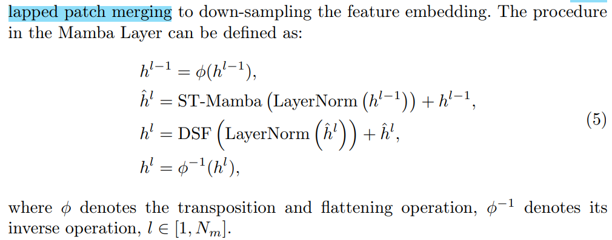

# Vivim: a Video Vision Mamba for Medical Video Object Segmentation

> "Vivim: a Video Vision Mamba for Medical Video Object Segmentation" Arxiv, 2024 Jan
> [paper](http://arxiv.org/abs/2401.14168v2) [code](https://github.com/scott-yjyang/Vivim) [pdf](./2024_01_Arxiv_Vivim--a-Video-Vision-Mamba-for-Medical-Video-Object-Segmentation.pdf) [note](./2024_01_Arxiv_Vivim--a-Video-Vision-Mamba-for-Medical-Video-Object-Segmentation_Note.md)
> Authors: Yijun Yang, Zhaohu Xing, Lei Zhu

## Key-point

- Task: video object segmentation

- Problems

  CNN has limited receptive field.

  Transformer face **computation-complexity problem** in constructing long-term dependency.

- :label: Label:

## Contributions

## Introduction

- Q：quadratic computation complexity impedes the application of the self-attention mechanism to video

> To address the bottleneck concerning long sequence modeling, Mamba [8], inspired by state space models (SSMs) [15], has been developed

Vision Mamba 中验证了不需要依赖 self-attn，可以换成 mamba module 实现高效的 long sequence modeling

> As suggested by them, the reliance on the self-attention module is not necessary, and it can be easily replaced by Mamba to achieve efficient visual representation

设计 Temporal Mamba Block

> Our Vivim is designed to explore the temporal dependency across frames for the advancement of segmentation results with the cheaper computational cost than other video-based methods.
>
> we design a novel **Temporal Mamba Block.**

### SSM

SSM 用于映射时序数据 $x\to y$
$$
y(t) = C*h_t \\
h_{t+1} = A*h_t + B *x_t \\
$$

> State Space Models (SSMs) are commonly considered as linear time-invariant systems, which map a 1-D function or sequence x(t) ∈ R 7→ y(t) ∈ R through differential equations (ODEs),

为了匹配训练过程中的采样率（batch），让模型更好地提取数据中的特征，需要进行 ODE 离散化；

> The discretization is introduced to primarily transform the ODE into a discrete function. This transformation is crucial to **align the model with the sample rate of the underlying signal embodied in the input data**, enabling computationally efficient operations.

通过时序变量 $\triangle$ 对连续变量 A,B 处理为 $\bar{A}, \bar{B}$
$$
y = x * \bar{K}, ~\bar{K} = (C\bar{B}, C\bar{A}\bar{B}, \dots, C\bar{A}^{M-1}\bar{B})
$$
$\bar{K}$ 用一个全局的 convolution 实现

> where M is the length of the input sequence x, and K ∈ R M is a structured convolutional kernel

## methods

- Q: MSA $O(N^2)$ 复杂度，再用到时序上 T 帧，复杂度更大了

> Multi-Head Self Attention (MSA) [23] in vanilla Transformer architectures has quadratic complexity concerning the number of tokens.

### Temporal Mamba block

- Q: sequence reduction process ？

> We leverage the sequence reduction process introduced in [26,24] to improve its efficiency

- Q: 一开始划分 overlaped patches ?

**ST-Mamba**

Detail-specific FeedForward (DSF) 使用 depth-wise conv 3x3x3 保留细节特征

### Segmentation Decoder

UNet Encoder 提取到的多尺度特征，T 维度一样，在 C H W 通道上有差异

### Computational-Efficiency

SSM 的复杂度 $O(N)$ ，而 Attn 为 $O(N^2)$ 复杂度

> self-attention is quadratic to the whole video sequence length (TM), and SSM is linear to that

## Experiment

> ablation study 看那个模块有效，总结一下

### setting

- Our framework is empirically trained for 100 epochs in an end-to-end way
- one NVIDIA RTX 3090 GPU

**training data**

原始 580×600 to 600×800 分辨率的视频，cropped 到 300x200 （原始画面中 $\frac18$ 的信息量）

训练过程中将数据 resize 到 **256x256, T=5 帧，batch=8** 能在 1个 24G显存的 3090 上跑起来

> resize the video frames to 256 × 256, and feed a batch of 8 video clips, each of which has 5 frames

## Limitations

## Summary :star2:

> learn what & how to apply to our task

