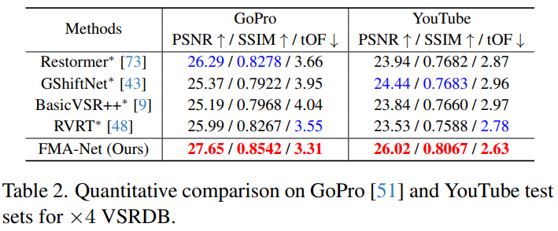

# FMA-Net: Flow-Guided Dynamic Filtering and Iterative Feature Refinement with Multi-Attention for Joint Video Super-Resolution and Deblurring

> "FMA-Net: Flow-Guided Dynamic Filtering and Iterative Feature Refinement with Multi-Attention for Joint Video Super-Resolution and Deblurring" CVPR-oral, 2024 Jan 8 
> [paper](http://arxiv.org/abs/2401.03707v2) [code](https://github.com/KAIST-VICLab/FMA-Net) [web](https://kaist-viclab.github.io/fmanet-site) [pdf](./2024_01_CVPR-oral_FMA-Net--Flow-Guided-Dynamic-Filtering-and-Iterative-Feature-Refinement-with-Multi-Attention-for-Joint-Video-Super-Resolution-and-Deblurring.pdf) [note](./2024_01_CVPR-oral_FMA-Net--Flow-Guided-Dynamic-Filtering-and-Iterative-Feature-Refinement-with-Multi-Attention-for-Joint-Video-Super-Resolution-and-Deblurring_Note.md)
> Authors: Geunhyuk Youk, Jihyong Oh, Munchurl Kim

## Key-point

- Task: VSR+video deblur 一起做(VSRDB)
- Problems
- :label: Label:

## Contributions

- 加入光流先 warp 一下特征，扩大2D fixed kernel filter 的感受野，改进 dynamic filter 实现 large motion 修复

>  our proposed FGDF enables precise estimation of both spatiotemporally-variant degradation and restoration kernels that are aware of motion trajectories through sophisticated motion representation learning.

- Attention 模块

  > The newly proposed multi-attention, consisting of center-oriented attention and degradation-aware attention, enables the FMA-Net to focus on the target frame and utilize the degradation kernels in a globally adaptive manner for VSRDB.

- 提出 temporal anchor Loss

> Additionally, the stacked FRMA blocks trained with our novel temporal anchor (TA) loss, which temporally anchors and sharpens features, refine features in a coarse-to-fine manner through iterative updates

## Introduction

- Q：只做 SR 不实用，真实场景视频涉及 motion blur

>  However, in practical situations, acquired videos are often blurred due to camera or object motions [4, 75, 77], leading to a deterioration in perceptual quality. Therefore, joint restoration (VSRDB) of VSR and deblurring is needed, which is challenging to achieve the desired level of high-quality videos because two types of degradation in blurry LR videos should be handled simultaneously.

先做 SR 在做 deblur，存在累积误差

> A straightforward approach to solving the joint problem of SR and deblurring is to perform the two tasks sequentially, i.e., by performing SR first and then deblurring, or vice versa. However, this approach has a drawback with the propagation of estimation errors from the preceding operation (SR or deblurring) to the following one (deblurring or SR) [55]. 

看下性能

### Image/video SRDB

> posed joint learning methods of image SR and deblurring (ISRDB), and VSRDB methods

HOFER 第一个 VSRDB 方法，参数量才 3M

> - "High-resolution optical flow and frame-recurrent network for video super-resolution and deblurring" NeuralComputing, 2022 Jun 7, `HOFFR`
>   [paper](https://www.sciencedirect.com/science/article/pii/S0925231222002363) [code]() [pdf](./2022_06_NeuralComputing_High-resolution-optical-flow-and-frame-recurrent-network-for-video-super-resolution-and-deblurring.pdf) [note](./2022_06_NeuralComputing_High-resolution-optical-flow-and-frame-recurrent-network-for-video-super-resolution-and-deblurring_Note.md)
>   Authors: Ning Fang, Zongqian Zhan
>
> Since motion blur occurs due to camera shakes or object motions, efficient deblurring requires the use of temporal information over video sequences. Recently, Fang et al. [18] proposed the first deep learningbased VSRDB method, called HOFFR

猜测因为使用的 2D Conv 感受野受限制，对于 large motion 失效，

> Although HOFFR exhibited promising performance compared to the ISRDB methods, it struggled to effectively deblur spatially-variant motion blur due to the nature of 2D convolutional neural networks (CNNs) with spatially-equivariant and input-independent filters.

### Dynamic Filter Network

**根据退化去学习一个 filter**，类似学习一个卷积核

> To fully utilize motion information from adjacent frames, large-sized filters are required to capture large motions, resulting in high computational complexity

- "Spatio-Temporal Filter Adaptive Network for Video Deblurring" ICCV, 2019 Apr 28
  [paper](http://arxiv.org/abs/1904.12257v2) [code]() [pdf](./2019_04_ICCV_Spatio-Temporal-Filter-Adaptive-Network-for-Video-Deblurring.pdf) [note](./2019_04_ICCV_Spatio-Temporal-Filter-Adaptive-Network-for-Video-Deblurring_Note.md)
  Authors: Shangchen Zhou, Jiawei Zhang, Jinshan Pan, Haozhe Xie, Wangmeng Zuo, Jimmy Ren

根据退化去**学习一个 filter**，再用提出的 FAC layer 和特征作用起来；**可以近似理解成学习一个卷积核**

## methods

对于每一帧来说，输入 2N + 1 帧，模型预测中间的一帧 HR sharp center frame 

>  Our goal of VSRDB is set to predict a sharp HR center frame $\hat{Y_c}$

退化学习网络，输出三个特征，提供给修复网络

> The FMA-Net consists of (i) a degradation learning network NetD and (ii) a restoration network NetR

逐帧 RGB 先用 RRDB 提取特征得到 $F^0$，上标代表 iteration 次数，要过后面 recurrent 

### FRMA

预测逐帧的特征、warped 后特征，光流&mask (2N+1 的**每一帧到 center frame 的光流**)

> Fig. 3. The FRMA block aims to refine three tensors: temporally-anchored (unwarped) feature F ∈ R T ×H×W×C at each frame index, warped feature Fw ∈ R H×W×C , and multi-flow-mask pairs f

- 更新特征 $F^{i} \to F^{i+1}$，直接叠 M 个 RRDB
- 更新光流 $f^{i+1}$：center frame 和对应光流 warp 一下更新的特征 & Center Frame 初始特征 $F^c_0$  & 光流，concat 起来过 conv

- warped 后的特征

使用 cross-attention 去对齐每一帧到 center frame

> To better align F˜i w to the center frame index c and adapt to spatio-temporally variant degradation, we enhance F˜i w using center-oriented (CO) attention and degradation-aware (DA) attention

### Flow-Guided Dynamic Filtering (FGDF)

先前方法使用 2D 卷积感受野受限制，large motion 很烂；

**学习一个 optical flow 去提升感受野**，把较远的特征拉过来，还是用原先的 fixed 尺寸 kernel 继续做的同时增大 large motion 修复能力

> FGDF is to perform filtering that is aware of motion trajectories rather than sticking to fixed positions, enabling effective handling of large motions with small-sized kernels.

- Q：这个和 Deformable Conv 可变形卷积不是很相似吗。。。

这里学习的 filter 是和位置相关的参数，而 DCN 学习的参数与位置无关

> Fig. 2 illustrates the concept of our FGDF. The FGDF looks similar to the deformable convolution (DCN) [13] but is different in that it learns positionwise n×n dynamic filter coefficients, while the DCN learns position-invariant n × n filter coefficients.

公式和 DCN 很像啊。。

- 把 image 上的 dynamic filter 公式改到 video 上

- 用光流增加感受野 :joy:

#### HighFreq Recon

上面那个 dynamic Filter 把最后一个 iteration 输出的光流 & filter & 特征融合起来

> Yˆ r is generated by **stacked convolution and pixel shuffle [59]** (High Freq. Recon. Block in Fig. 3).

### Loss

两阶段训练，**先训练 Degradation network；再把两个一起训练**

> We employ a two-stage training strategy to train the FMA-Net. 

**Loss for Degradation network $\to L_D$**

- 光流 loss，用 RAFT 作为 pseudo-GT optical flow :warning: 本来就不准
- warped 逐帧的特征 与 center Frame 做 L1
- deblur GT L1 loss

第二阶段训练的 Loss

#### Temporal Anchor (TA) Loss.

逐帧特征 deblur 完也做一下 L1；图中标着 eq8-9 的地方

## setting

- mini-batch size of 8
- initial learning rate is set to 2 × 10−4 , and reduced by half at 70%, 85%, and 95% of total 300K iterations in each training stage

- 64x64 patch 训练，9 帧一起训练

> The training LR patch size is 64 × 64, the number of FRMA blocks is M = 4, the number of multiflow-mask pairs is n = 9, and the kernel sizes kd and kr are 20 and 5, respectively.

- Attention 模块参考 Restormer

> we adopted the multi-Dconv head transposed attention (MDTA) and Gated-Dconv feed-forward network (GDFN) modules proposed in Restormer [73] for the attention and feed-forward network in our multi-attention block.

### Data

- train 数据集，REDS，REDS4 测试剩下的全部用来训练

> We train FMA-Net using the REDS [52] dataset which consists of realistic and dynamic scenes. Following previous works [45, 50, 70], we use REDS4 1 as the test set, while the remaining clips are for training.

- Test

  - GoPro

    > For the GoPro dataset, we applied bicubic downsampling to its blurry version to evaluate VSRDB. 

  - YouTube

    > As for the YouTube dataset, we selected 40 YouTube videos of different scenes with a resolution of 720 × 1, 280 at 240fps

  - REDS4

  > Also, to evaluate generalization performance, we employ the GoPro [51] and YouTube datasets as test sets alongside REDS4
  >
  > **1Clips 000, 011, 015, 020 of the REDS training set :star:**

把所有视频 **downsample 为 180x320 测试做 x4 SR**

>  Subsequently, we temporally and spatially downsampled them, similar to previous works [23, 55, 58], resulting in blurry 30 fps of 180 × 320 size.

### metric

- PSNR

- SSIM

- tOF [12, 55] to evaluate temporal consistency :star:

  > Learning temporal coherence via selfsupervision for gan-based video generation

## Experiment

> ablation study 看那个模块有效，总结一下

### ablation

使用光流两帧的幅值，评估运动模糊程度！:star:

> Average motion magnitude refers to the average absolute optical flow [63] magnitude between the two consecutive frames.

- kd 为 dynamic filter 的 kernel size；

  - kernel size 越大，越大的 motion 指标提升更显著

  - **Kernel Size = 20**，对于较大程度运动，PSNR 提升 1.9dB

    > FGDF demonstrates better reconstruction and restoration performance than the conventional dynamic filtering for all ranges of motion magnitudes. 

- f 表示是否使用提出的 FGDF，×表示原始 conv 的版本

  - 加入光流可以提升 PSNR 接近 0.7db，**加入光流还有点用**

    > conventional dynamic filtering [33, 35, 38] is not effective in handling large motion, resulting in a significant performance drop as the degree of motion magnitude increases;

  - 对**所有程度的运动**都有提升！

    > FGDF demonstrates better reconstruction and restoration performance than the conventional dynamic filtering for all ranges of motion magnitudes. 

- TA Loss 逐帧做 loss 能提升 0.1dB
- 换成 DCN 效果也没差多少。。。0.3dB

#### TA-Loss

逐帧做 loss 有必要

#### DCN vs FGDF

Dynamic Filter 借助光流更显著地融合了位置信息，**得到的 mask 更精细**

## Limitations

## Summary :star2:

> learn what

### how to apply to our task

- 对比 DCN，Dynamic Filter 借助光流更显著地融合了位置信息，**得到的 mask 更精细** :+1:

  

- REDS 训练数据除去 4 个 REDS4 测试，其余全部用上
  - REDS4，**1Clips 000, 011, 015, 020 of the REDS training set :star:**

