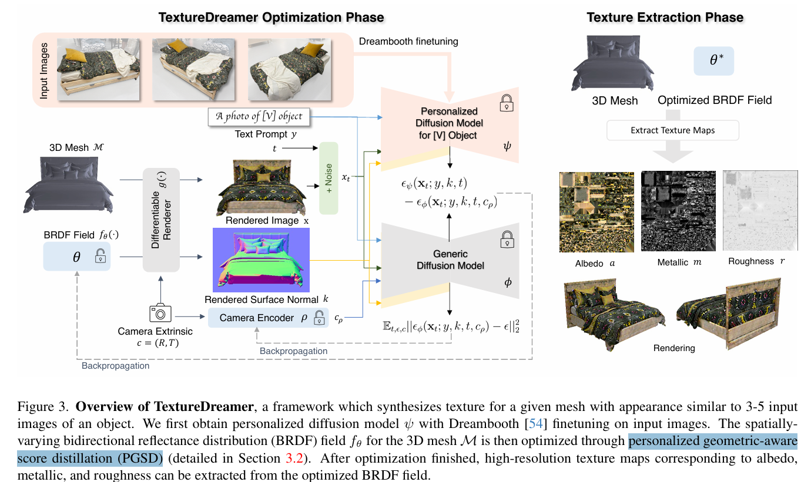

# TextureDreamer: Image-guided Texture Synthesis through Geometry-aware Diffusion

> "TextureDreamer: Image-guided Texture Synthesis through Geometry-aware Diffusion" CVPR, 2024 Jan 17
> [paper](http://arxiv.org/abs/2401.09416v1) [code]() [web](https://texturedreamer.github.io/) [pdf](./2024_01_CVPR_TextureDreamer--Image-guided-Texture-Synthesis-through-Geometry-aware-Diffusion.pdf) [note](./2024_01_CVPR_TextureDreamer--Image-guided-Texture-Synthesis-through-Geometry-aware-Diffusion_Note.md)
> Authors: Yu-Ying Yeh, Jia-Bin Huang, Changil Kim, Lei Xiao, Thu Nguyen-Phuoc, Numair Khan, Cheng Zhang, Manmohan Chandraker, Carl S Marshall, Zhao Dong, Zhengqin Li

## Key-point

- Task: reference texture generate 3D
- Problems
- :label: Label: `reference`, `texture`, `3D`

参考 https://texturedreamer.github.io/ 视频，学习一下如何一步步从 baseline 改进一次后，发现还有问题逐步搭建新的模块 :star:

> creation of high-quality textures is rel atively under-explored.

## Contributions

- explicit geometry guid ance with ControlNet
- personalized modeling for texture information extraction, variational score distillation for de tailed appearance synthesis,

## Introduction

- Q：高质量纹理生成的工作很少

> While substantial atten tion has been devoted to exploring the geometry compo nent [8, 12, 64] and neural implicit representations [44], such as NeRF [40], creation of high-quality textures is rel atively under-explored. 

人工画

> Textures are pivotal in creating re alistic, highly detailed appearances and are integral to vari ous graphics pipelines, where industry has traditionally re lied on professional, experienced artists to craft textures.

提出非对齐物体的纹理（不一定要是同一个 category）

> We present TextureDreamer, a novel framework to create high-quality relightable textures from sparse images. Given 3 to 5 randomly sampled views of an object, we can transfer its texture to an target geometry that may come from a different category.

先前工作要求是同一类物体 & 对齐

>  This is an extremely challenging problem, as previous texture creation methods usually ei ther require densely sampled views with aligned geometry [3, 32, 68], or can only work for category-specific shapes [4, 21, 46, 58].

从文本学习的成本很高，效果还很有限！**图像的信息更确定！**

先前工作使用 SDS 实现 3D 和 2D 的对齐，进行训练

> The Score Distillation Sampling (SDS) [47, 62] is one core element that bridges pre-trained 2D diffusion models with 3D content creation. It is widely used to generate and edit 3D contents by minimizing the discrepancy between the distribution of rendered images and the distribution de f ined by the pre-trained diffusion models [34, 37].

- Q：SDS 训练生成出来结果**超级模糊、平滑**

> First, it tends to create over-smoothed and saturated appearances due to the unusu ally high classifier-free guidance necessary for the method to converge. 
>
> Second, it **lacks the knowledge to generate a 3D-consistent appearance**, often resulting in multi-face ar tifacts and mismatches between textures and geometry.

VSD 把 3D 表征作为随机变了去训练！:star:

> Initially introduced in ProlificDreamer [63], VSD treats the whole 3D representation as a random variable and aligns its distribution with the pre-trained diffusion model.

试验了一下发现效果有限。。**不是不行，只是不够 **:star:

> However, na¨ ıvely applying VSD update does not suffice for generating high-quality textures in our ap plication. 
>
>  We identify a simple modification that can im prove texture quality while slightly reducing the compu tational cost. Additionally, VSD loss alone cannot fully solve the 3Dconsistency issue. 

### exp progress :star:

- 利用 2D diffusion 的先验，锁住 SD 去微调生成 3D 结构的 BRDF field

不训练 Diffusion ，**原始的 SD 对于 visual apperance 很难和 text 对齐；**

利用 input images 的信息去优化 SD

- 用 DreamBooth 去学习单个物体，作为 **personalized SD！**

- Q：unnatural color & artifact?

**把含有 generalize 信息的 pretrained SD 搞回来（**对于单个视频不准，但对于普适的颜色有感知）

2D SD 没有3D 观感信息， **加入 3D 位姿（camera pose）训练一个 pose embedding**

- Q：3D 结构边缘 artifact 还是很严重？

**只是搞一个 camera pose 的 embedding，很难有很强的 3D 位置信息**！类比 CLIP-image embedding 来代替整张参考图像，细看效果都很烂

模型的主体还只是 Pretrained SD！

**进一步融入更多的 3D 信息！**

> - Q：还有什么信息可以提供细致的 3D 结构信息？

搞一个 Rendered Normal 作为额外的 3D 结构特征；上一个实验的输入（主要信息哦）还是图像！

**使用 ControlNet 去引入 `Rendered Normal` 特征 (已经很常见了，用黄色线画出来)**

### texture map

- Q：什么是纹理？？？

### BRDF field

## methods

## setting

## Experiment

> ablation study 看那个模块有效，总结一下

## Limitations

## Summary :star2:

> learn what

### how to apply to our task

