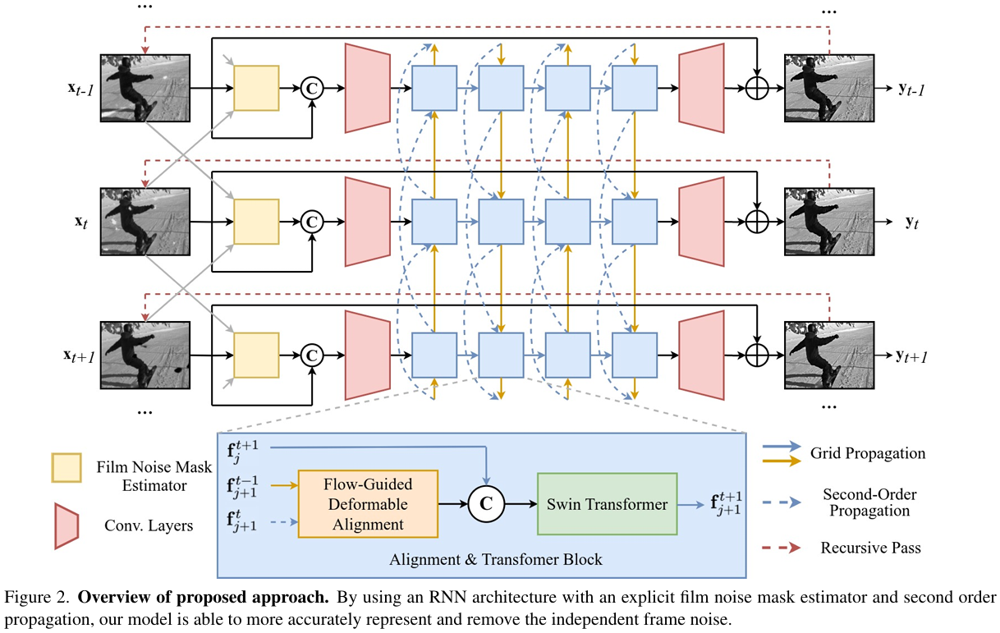
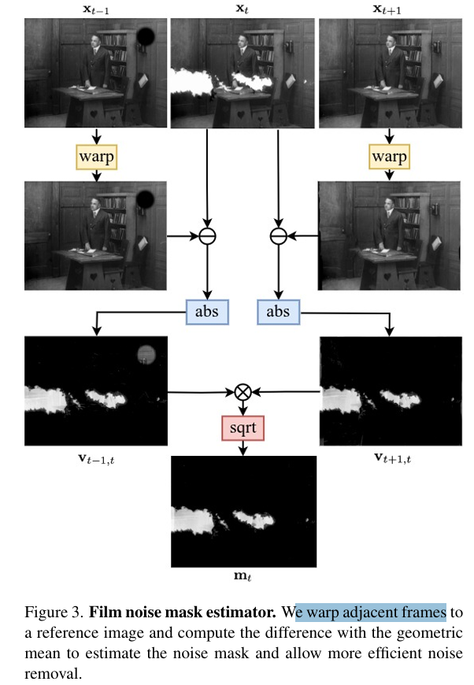
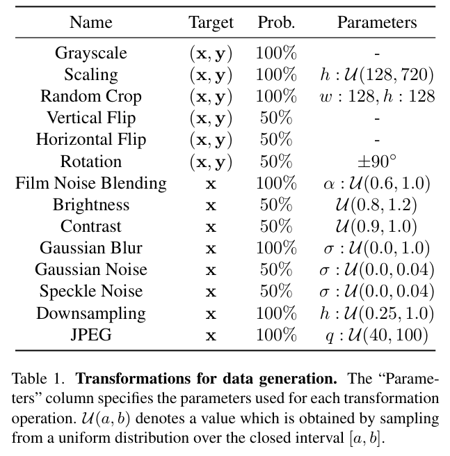
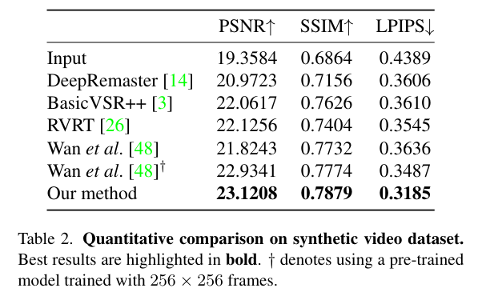
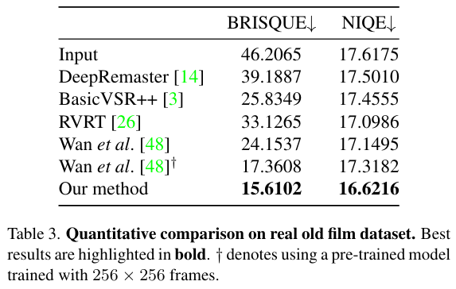
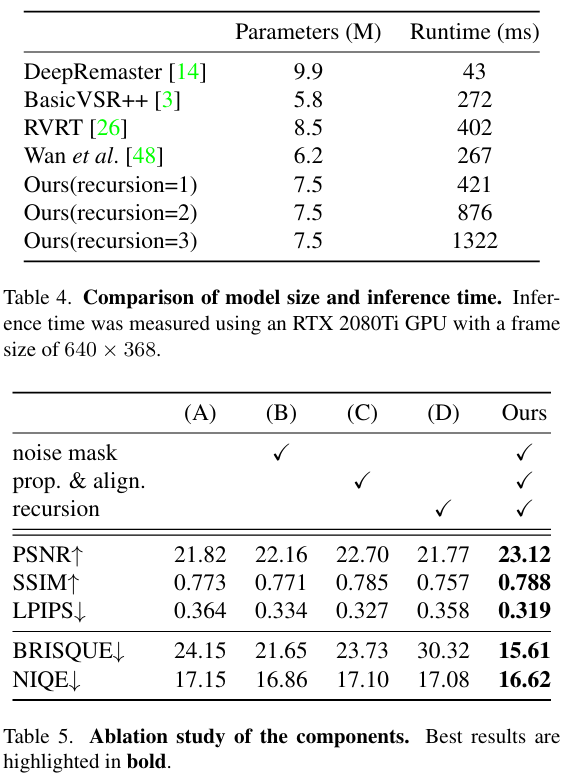

# Restoring Degraded Old Films With Recursive Recurrent Transformer Networks

> "Restoring Degraded Old Films With Recursive Recurrent Transformer Networks" WACV, 2024 Jan 3, `RRTN`
> [paper](https://openaccess.thecvf.com/content/WACV2024/html/Lin_Restoring_Degraded_Old_Films_With_Recursive_Recurrent_Transformer_Networks_WACV_2024_paper.html) [code](https://github.com/mountln/RRTN-old-film-restoration) [pdf](./2024_01_WACV_Restoring-Degraded-Old-Films-With-Recursive-Recurrent-Transformer-Networks.pdf) [note](./2024_01_WACV_Restoring-Degraded-Old-Films-With-Recursive-Recurrent-Transformer-Networks_Note.md)
> Authors: Shan Lin,  Edgar Simo-Serra

## Key-point

- Task
- Problems
- :label: Label:

## Contributions

- 设计了一个划痕预测模块；&& 参考 BasicVSR++ 加上 Second Order 传播模块 && 加上 deformable 做**两帧的对齐**

>  Explicit modelling of film noise mask with second order grid propagation and flow-guided deformable alignment that allows removal of large film artefacts.

- 训练重复修复两次，提升时序一致性

  >  Adaptive recursive architecture that encourages tem poral coherence of the output, reducing flickering and other common film damage.

- SOTA，证明有效性


## Introduction


## methods



- Additionally, inspired by BasicVSR++ [3], we employ **second-order grid propagation and flow-guided deformable alignment** to efficiently leverage the information contained within the different frames of an old film. 
- **重复处理多次**


### noise estimate

用光流 warp 相邻帧。。。光流有噪声的。。。




### Code

> https://pytorch.org/docs/stable/generated/torch.nn.parallel.DistributedDataParallel.html
>
> 1. The set of used and unused parameters will not change during the whole training loop
>
> 2. 支持多次 forward；Reentrant backwards. 2) Activation checkpointing multiple times. 
>
> 3. 支持 forward 时候有些参数不去训练，避免 DDP 去检查，提升效率
>
>    Potentially improve performance when there are unused parameters, as DDP will not search graph in each iteration to detect unused parameters when static_graph is set to be `True`

```python
        if config['distributed']:
            self.netG = DDP(self.netG, device_ids=[opts.local_rank], ) #find_unused_parameters=True)
            self.netD = DDP(self.netD, device_ids=[opts.local_rank])
            self.netG._set_static_graph()  # enable reentrant
```


- Q：accelerate DDP + `gradient_accumulation` 一起用，如何定制 `lr_scheduler`?

> https://github.com/huggingface/accelerate/issues/995
>
> https://github.com/huggingface/accelerate/issues/963#issuecomment-1377708123

gradient_accumulation > 1 的时候，定制 lr scheduler 需要加一行

```python
if accelerator.sync_gradients:
    params_to_clip = list(netD.parameters())
    accelerator.clip_grad_norm_(params_to_clip, args.max_grad_norm)
    # put here
    lr_scheduler_D.step()
```


说使用这个均方根误差，实际用的 L1

```python
def charbonnier_loss(pred, target, eps=1e-12):
    return torch.sqrt((pred - target)**2 + eps).mean()
```


### Data




## setting

- REDS，选 7 帧训练 20w+ iteration. 20w iteration 之后根据 loss 低的来选择模型

  > We utilized the Adam optimizer[21]with a learning rate of 2e-4 for the initial100,000 iterations,andlinearlydecayedthelearning rateafter100,000iterations.

- 参考 RVRT，BasicVSR ++ 训练 SPyNet

- RTN 训练 RAFT


## Experiment

> ablation study 看那个模块有效，总结一下

对比了 3 个方法，BasicVSR++, RVRT, RTN。重新训练的指标没预训练的高。。。






### ablation

传播模块用处还大点



## Limitations

## Summary :star2:

> learn what

### how to apply to our task

- Q：怎么改到 RGB 数据上？


