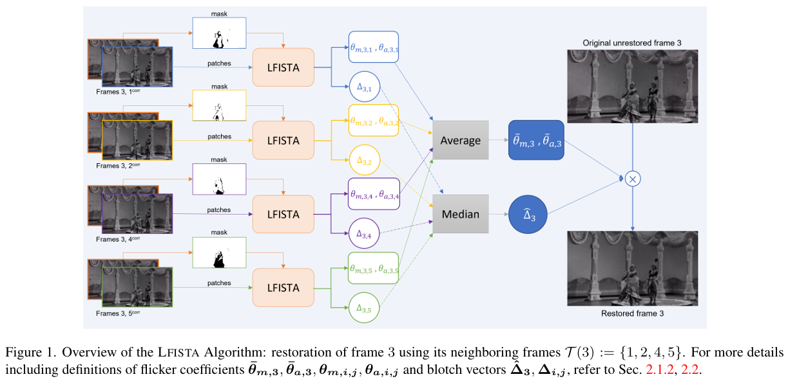

# Unsupervised Model-Based Learning for Simultaneous Video Deflickering and Deblotching

> "Unsupervised Model-Based Learning for Simultaneous Video Deflickering and Deblotching" WACV, 2024 Jan 1
> [paper](https://openaccess.thecvf.com/content/WACV2024/html/Fulari_Unsupervised_Model-Based_Learning_for_Simultaneous_Video_Deflickering_and_Deblotching_WACV_2024_paper.html) [code]() [video](https://www.youtube.com/watch?v=K5uCcAF7RrA) [pdf](./2024_01_WACV_Unsupervised-Model-Based-Learning-for-Simultaneous-Video-Deflickering-and-Deblotching.pdf) [note](./2024_01_WACV_Unsupervised-Model-Based-Learning-for-Simultaneous-Video-Deflickering-and-Deblotching_Note.md)
> Authors: Anuj Fulari, Satish Mulleti, Ajit Rajwade (india IIT)

## Key-point

- Task
- Problems
- :label: Label:

## Contributions

- we adopt an unsupervised and model-based approach for simultaneous flicker and blotch removal
- Our method is interpretable and simple and proposes a novel strategy to jointly deal with flicker and blotches via **convex optimization.** 

## Introduction

## methods

凸优化

## setting

- RTN
- NeatVideo 商用 [Neat Video - best noise and flicker reduction for digital video](https://www.neatvideo.com/)
- "Bringing old photos back to life" 逐帧修 + Temporal 模块 "Learning blind video temporal consistency"

> Onelimitationofourmethodisthat thecomputation, thoughefficient (∼5mins. fora320×480×100video withW=5ona2.8GHzAMDCPUwithA6000GPUs), isnot real time.

## Experiment

> ablation study 看那个模块有效，总结一下

挑出来一帧。。。。

## Limitations

## Summary :star2:

> learn what

### how to apply to our task

