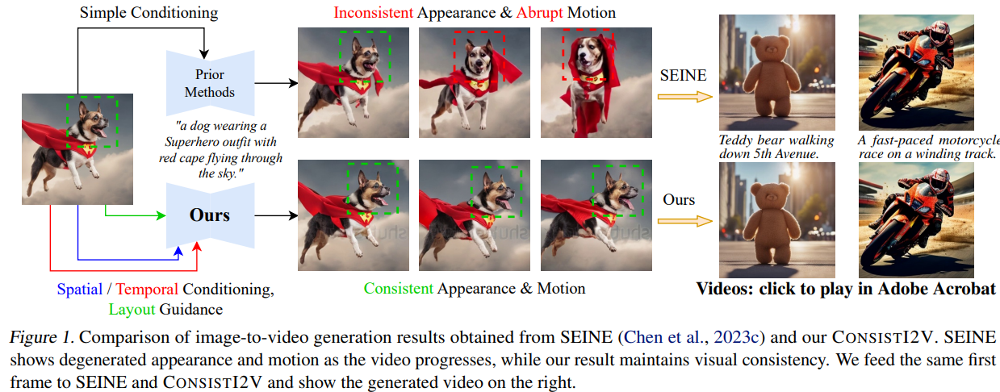
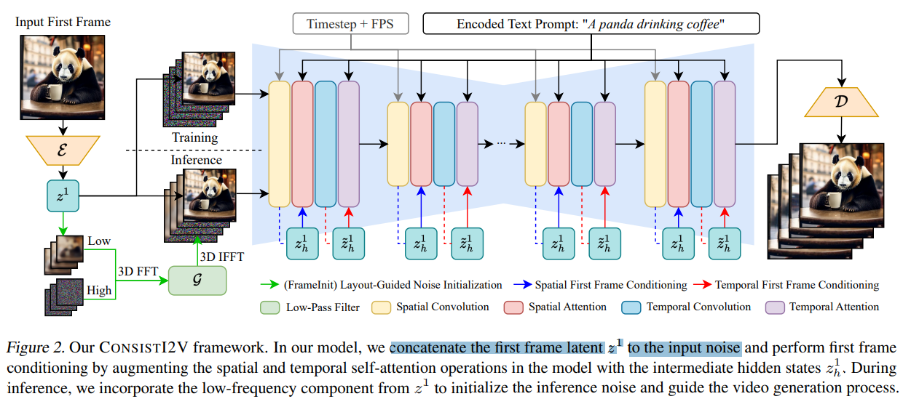
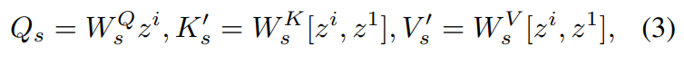
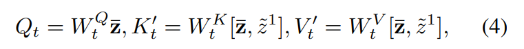
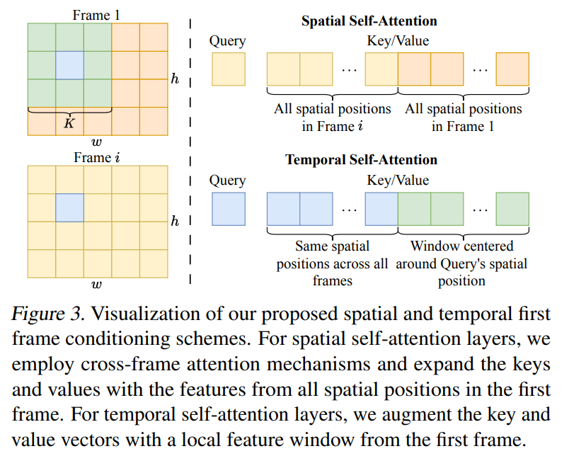
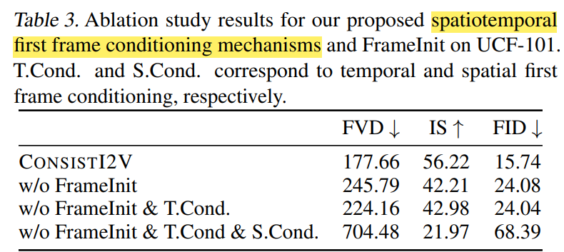
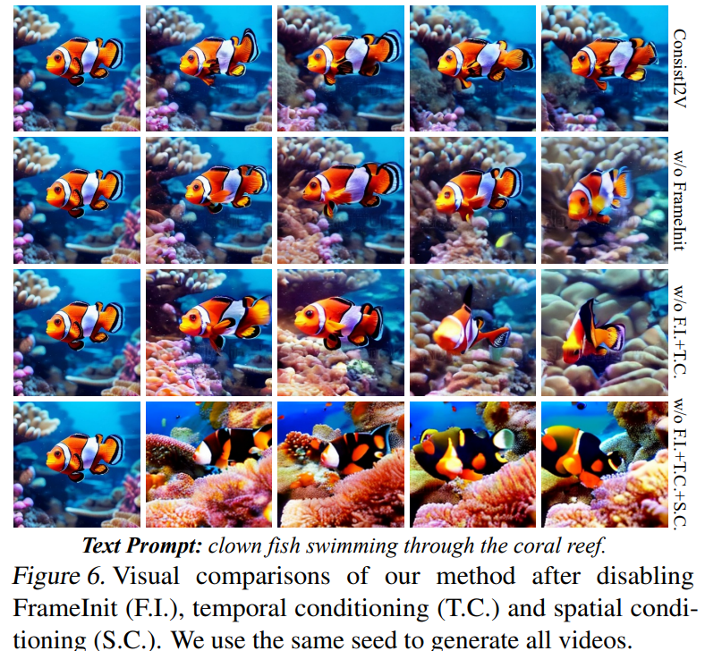

# ConsistI2V: Enhancing Visual Consistency for Image-to-Video Generation

> "ConsistI2V: Enhancing Visual Consistency for Image-to-Video Generation" Arxiv, 2024 Feb 6
> [paper](http://arxiv.org/abs/2402.04324v1) [code]() [pdf](./2024_02_Arxiv_ConsistI2V--Enhancing-Visual-Consistency-for-Image-to-Video-Generation.pdf) [note](./2024_02_Arxiv_ConsistI2V--Enhancing-Visual-Consistency-for-Image-to-Video-Generation_Note.md)
> Authors: Weiming Ren, Harry Yang, Ge Zhang, Cong Wei, Xinrun Du, Stephen Huang, Wenhu Chen

## Key-point

- Task
- Problems
- :label: Label:

## Contributions

- spatiotemporal attention over the first frame to maintain spatial and motion consistency
- noise initialization from the low-frequency band of the first frame to enhance layout consistency
- propose I2V-Bench, a comprehensive evaluation benchmark for I2V generation.

## Introduction

## methods

使用 2D UNet + Temporal Conv; 

- Q：image condition?

首帧提取 VAE 特征，把初始噪声的第一帧换掉

> To inject this signal into our model, we directly replace the first frame noise ϵ 1 with z 1 and construct the 
>
> 
>
> model input as ˆϵ

- Q：如何保持一致性?

spatial attention 和 temporal attention 都优化，把 KV 特征和首帧特征 concat！

Spatial

Temporal 在 spatial 取 KxK window, K=3

> applying FrameInit greatly enhances the model performance for all metrics

> while our model can still generate reasonable results without enabling FrameInit, the output videos also suffer from a higher chance of rendering sudden object movements and blurry frames

- Q：全部 UNet 都要调？

> Our model is trained with the ϵ objective over all U-Net parameters using a batch size of 192 and a learning rate of 5e-5 for 170k steps

>  randomly drop input text prompts with a probability of 0.1 to enable classifier-free guidance

## Experiment

> ablation study 看那个模块有效，总结一下

## Limitations

## Summary :star2:

> learn what & how to apply to our task

