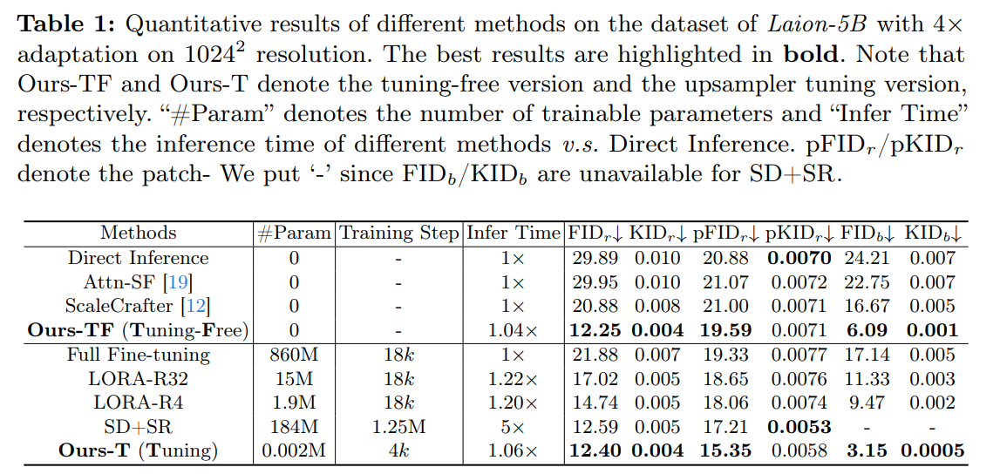

# Make a Cheap Scaling: A Self-Cascade Diffusion Model for Higher-Resolution Adaptation

> "Make a Cheap Scaling: A Self-Cascade Diffusion Model for Higher-Resolution Adaptation" Arxiv, 2024 Feb 16
> [paper](http://arxiv.org/abs/2402.10491v2) [code]() [web](https://guolanqing.github.io/Self-Cascade/) [pdf](./2024_02_Arxiv_Make-a-Cheap-Scaling--A-Self-Cascade-Diffusion-Model-for-Higher-Resolution-Adaptation.pdf) [note](./2024_02_Arxiv_Make-a-Cheap-Scaling--A-Self-Cascade-Diffusion-Model-for-Higher-Resolution-Adaptation_Note.md)
> Authors: Lanqing Guo, Yingqing He, Haoxin Chen, Menghan Xia, Xiaodong Cun, Yufei Wang, Siyu Huang, Yong Zhang, Xintao Wang, Qifeng Chen, Ying Shan, Bihan Wen

## Key-point

- Task
- Problems
- :label: Label:

## Contributions

- We propose a novel **self-cascade diffusion model** for fast-scale adaptation to higher resolution generation, by cyclically re-utilizing the low-resolution diffusion model
- 训练一个小的 upsampler，比全部模型微调快 5 倍，只有 0.002M 参数 :star:

> We further construct a series of plug-and-play, learnable time-aware feature upsampler modules to incorporate knowledge from a few high-quality images for fine-tuning.
>
> This approach achieves a 5× training speed-up compared to full fine-tuning and requires only 0.002M learnable parameters.

- SOTA

## Introduction

只训练 50k iteration 前提下，训练一个小的 upsampler 更快

## methods

多个 stage 用上标 r 表示，用一个模型出图。

## setting

- The proposed method is implemented using PyTorch and trained on two NVIDIA A100 GPUs

> We conduct evaluation experiments on text-to-image models, specifically Stable Diffusion (SD), focusing on two widely-used versions: SD 2.1 [7] and SD XL 1.0 [21], as they adapt to two unseen higher-resolution domains. For the original SD 2.1, which is trained with 5122 images, the inference resolutions are 10242 and 20482 , corresponding to 4× and 16× more pixels than the training, respectively.

## Experiment

> ablation study 看那个模块有效，总结一下

自己全部微调做 baseline, x4 SR

对于不同数据集都训得很快

## Limitations

## Summary :star2:

> learn what

### how to apply to our task

