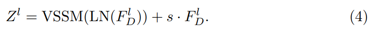

# MambaIR: A Simple Baseline for Image Restoration with State-Space Model

> "MambaIR: A Simple Baseline for Image Restoration with State-Space Model" Arxiv, 2024 Feb
> [paper](http://arxiv.org/abs/2402.15648v1) [code](https://github.com/csguoh/MambaIR) [pdf](./2024_02_Arxiv_MambaIR--A-Simple-Baseline-for-Image-Restoration-with-State-Space-Model.pdf) [note](./2024_02_Arxiv_MambaIR--A-Simple-Baseline-for-Image-Restoration-with-State-Space-Model_Note.md)
> Authors: Hang Guo, Jinmin Li, Tao Dai, Zhihao Ouyang, Xudong Ren, Shu-Tao Xia

## Key-point

- Task
- Problems
- :label: Label:

## Contributions

## Introduction

## methods


MambaIR 分为 3 阶段

> our MambaIR consists of three stages: shallow feature extraction, deep feature extraction, and high-quality reconstruction.


- Q：输入图像如何处理为特征，还是用 patch embedding？

**shallow feature 提取**用一层 3x3 卷积实现，不降低 HxW

> Given a lowquality (LQ) input image ILQ ∈ R H×W×3 , we first employ a 3 × 3 convolution layer from the shallow feature extraction to generate the shallow feature FS ∈ R H×W×C , where H and W represent the height and width of the input image, and C is the number of channels.

**deep feature 提取**

使用 Mamba Block 组成的 Residue State-Space Blocks (RSSBs)

an additional convolution layer is introduced at the end of each group to refine features extracted from RSSB

**重建 HQ**

> element-wise sum to obtain the input of the high-quality reconstruction stage FR = FL + FS


- **Q：发现直接替换 atten 为 SSM 效果并不好**

> we experimentally find that simply replacing Attention with SSM can only obtain sub-optimal results. 

提出 Residual State-Space Block (RSSB) 方式使用 VSSM，对 LQ 特征的残差加一个可学习参数

> we propose the Residual State-Space Block (RSSB) to improve the original SSM block with specific restoration priors




- Q：channel redundancy as well as efficiency？

VSSM 后面的 FeedForward 中的 conv 降低通道，做完再升回去

> convolution layer adapts the bottleneck structure, i.e., the channel is first compressed by a factor γ to obtain features with the shape R H×W× C γ , then we perform channel expansion to recover the original shape. Furthermore, to model the interaction among channels, we introduce the Channel-Attention layer (CA) [22] followed by another tunable scale factor s ′ ∈ R C in residual connection to acquire the final output F l+1 D of the RSSB.


## Code

> [MambaIRUNet](https://github.com/csguoh/MambaIR/blob/5a03c3e007861c5ebfd0f0c5e1100a415dbb7873/realDenoising/basicsr/models/archs/mambairunet_arch.py#L465)


整体为 UNet 框架

图像输入使用一层 3x3 卷积作为 patch embedding，设卷积的 bias=False

```
class OverlapPatchEmbed(nn.Module):
    def __init__(self, in_c=3, embed_dim=48, bias=False):
        super(OverlapPatchEmbed, self).__init__()

        self.proj = nn.Conv2d(in_c, embed_dim, kernel_size=3, stride=1, padding=1, bias=bias)

    def forward(self, x):
        x = self.proj(x)
        x = rearrange(x, "b c h w -> b (h w) c").contiguous()
        return x
```


最后Unet 特征过一层 3x3 2d卷积调整通道数，和全局残差加起来

```
self.output = nn.Conv2d(int(dim * 2 ** 1), out_channels, kernel_size=3, stride=1, padding=1, bias=bias)
```


### UpDownsample

> [torch doc: pixelunshuffle](https://pytorch.org/docs/stable/generated/torch.nn.PixelUnshuffle.html)

Downsample: HxW 各小一半，Cx2l; Upsample HxW 各x2; C 小一半

```python
class Downsample(nn.Module):
    def __init__(self, n_feat):
        super(Downsample, self).__init__()

        self.body = nn.Sequential(nn.Conv2d(n_feat, n_feat // 2, kernel_size=3, stride=1, padding=1, bias=False),
                                  nn.PixelUnshuffle(2))

    def forward(self, x, H, W):
        x = rearrange(x, "b (h w) c -> b c h w", h=H, w=W).contiguous()
        x = self.body(x)
        x = rearrange(x, "b c h w -> b (h w) c").contiguous()
        return x
        
class Upsample(nn.Module):
    def __init__(self, n_feat):
        super(Upsample, self).__init__()

        self.body = nn.Sequential(nn.Conv2d(n_feat, n_feat * 2, kernel_size=3, stride=1, padding=1, bias=False),
                                  nn.PixelShuffle(2))

    def forward(self, x, H, W):
        x = rearrange(x, "b (h w) c -> b c h w", h=H, w=W).contiguous()
        x = self.body(x)
        x = rearrange(x, "b c h w -> b (h w) c").contiguous()
        return x

```


### VSSBlock


## Experiment

> ablation study 看那个模块有效，总结一下

## Limitations

## Summary :star2:

> learn what & how to apply to our task

